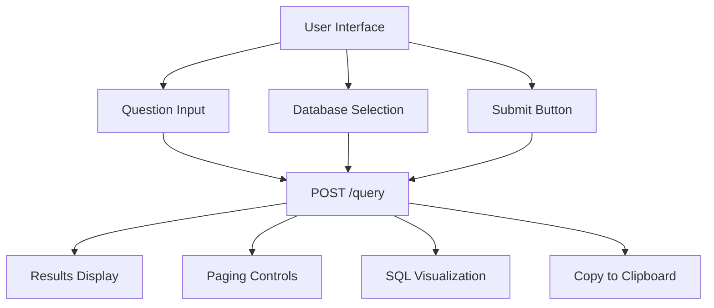
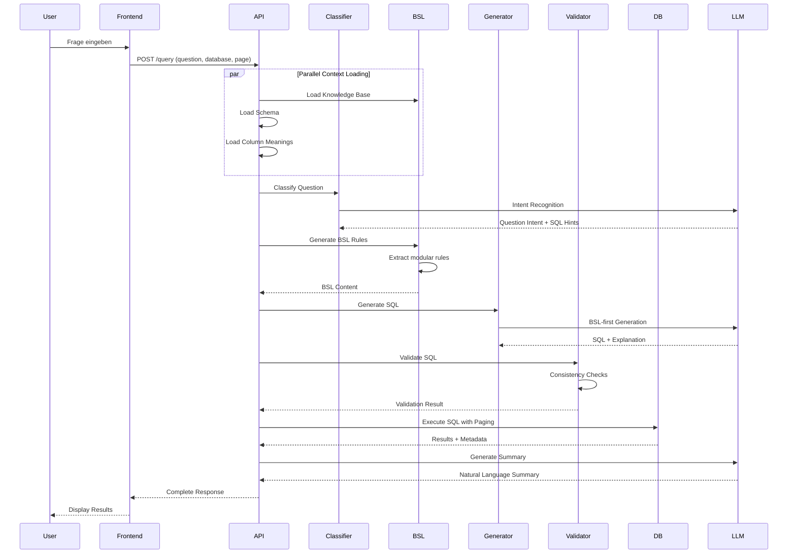
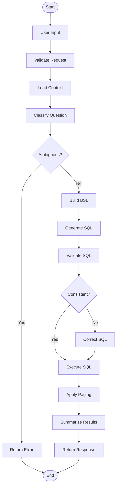

# Architektur & Prozesse - Text2SQL System (BSL-first)

## 📖 Inhaltsverzeichnis
1. [System-Übersicht](#system-übersicht)
2. [Architektur-Historie & ADRs](#architektur-historie--adrs)
3. [Detaillierter Prozessablauf](#detaillierter-prozessablauf)
4. [Komponenten & ihre Rollen](#komponenten--ihre-rollen)
5. [Datenfluss & Pipeline](#datenfluss--pipeline)
6. [Frontend-Backend Kommunikation](#frontend-backend-kommunikation)
7. [Datenmodellierung & -beschreibung](#datenmodellierung---beschreibung)
8. [Limitationen & Ausblick](#limitationen--ausblick)
9. [Testergebnisse & Validierung](#testergebnisse--validierung)
10. [Produktivierungsanforderungen](#produktivierungsanforderungen)
11. [Organisatorisches](#organisatorisches)
12. [Selbstreflektion (Retrospektive)](#selbstreflektion-retrospektive)

---

## System-Übersicht

### Was ist das System?

**Text2SQL** ist ein KI-basiertes System, das **natürliche Sprache in SQL-Abfragen übersetzt** und diese auf einer SQLite-Datenbank ausführt. Ein Nutzer stellt eine Frage in normaler Sprache (z.B. "Zeige mir alle Premium-Kunden mit hoher Finanzstabilität"), und das System generiert automatisch die entsprechende SQL-Query, führt sie aus und präsentiert die Ergebnisse.

### Kerninnovation: Business Semantics Layer (BSL)

Unser System verwendet einen **Business Semantics Layer (BSL)** - eine explizite Regelschicht, die fachliche Logik, Identifier-Systeme und Aggregationsmuster kodifiziert. Dies löst die häufigsten Fehlerklassen in Text2SQL-Systemen:
- Identifier-Verwechslungen (CU vs CS)
- Falsche Aggregationsentscheidungen
- JOIN-Chain-Verletzungen
- Unklare Business-Begriffe

### Architektur auf höchster Ebene

```mermaid
graph TB
    subgraph "Frontend Layer"
        UI[React Frontend]
        UI --> |HTTP/REST| API[FastAPI Backend]
    end
    
    subgraph "Backend Layer"
        API --> |Pipeline| QC[Intent Handling (LLM)]
        API --> |Pipeline| BB[BSL Builder]
        API --> |Pipeline| SG[SQL Generator]
        API --> |Pipeline| CC[Consistency Checker]
        API --> |Pipeline| DM[Database Manager]
    end
    
    subgraph "Data Layer"
        KB[Knowledge Base]
        SCHEMA[Database Schema]
        BSL_FILE[BSL Rules]
        MEANINGS[Column Meanings]
        CACHE[Cache Layer]
    end
    
    subgraph "External Services"
        LLM[OpenAI GPT-5.2]
    end
    
    SG --> LLM
    BB --> KB
    BB --> SCHEMA
    BB --> MEANINGS
    DM --> CACHE
    QC --> LLM
    CC --> LLM
```

### Kernkomponenten

| Komponente | Technologie | Verantwortlichkeit | BSL-Integration |
|------------|-------------|------------------|------------------|
| **Frontend** | React 18+ | Nutzer-Interface, Frage-Input, Ergebnisanzeige | - |
| **Backend API** | FastAPI | Anfrage-Koordination, Pipeline-Orchestrierung | - |
| **Intent Handling** | LLM (SQL Generator) | Intent-Erkennung, SQL-Hints-Generierung, Ambiguity Detection | BSL-first Prompting |
| **BSL Builder** | Modular (6 Module) | Business Semantics Layer Generierung | **Kernkomponente** |
| **SQL Generator** | OpenAI GPT-5.2 | BSL-first SQL-Generierung | **BSL-first Prompting** |
| **Consistency Checker** | Multi-Level Validation | BSL-Compliance, Fehlererkennung | **BSL Validation** |
| **Database Manager** | SQLite | Query-Ausführung, Paging, Caching | - |

### BSL-Sektionen (in generierter `credit_bsl.txt`)

Die BSL-Regeln werden durch `bsl_builder.py` generiert und als **Sektionen in einer Textdatei** gespeichert - nicht als separate Python-Module:

1. **Identity System Rules** - CU vs CS Identifier System
2. **Aggregation Patterns** - GROUP BY vs ORDER BY + LIMIT Erkennung
3. **Business Logic Rules** - Financially Vulnerable, High-Risk, Digital Native
4. **Join Chain Rules** - Strikte Foreign-Key Chain Validierung
5. **JSON Field Rules** - JSON-Extraktionsregeln und Tabellen-Qualifizierung
6. **Complex Query Templates** - Multi-Level Aggregation und CTE-Templates

> **Hinweis**: Diese sind Textblöcke im generierten BSL-File (`credit_bsl.txt`), keine separaten `.py`-Dateien.

---

## Architektur-Historie & ADRs

### ADR-001: Von RAG/ReAct zu BSL-first Migration

**Status**: Accepted  
**Deciders**: Projektteam, Professor-Feedback  
**Date**: 2025-01-14  
**Supersedes**: ADR-001 (RAG/ReAct Architektur)

#### Context and Problem Statement
Die initiale RAG/ReAct-Architektur zeigte kritische Probleme:
- **Nicht-deterministische Ergebnisse**: Gleiche Fragen produzierten unterschiedliche SQL
- **Hohe Komplexität**: Viele Dependencies (ChromaDB, LangChain)
- **Scope-Mismatch**: Projekt nutzt faktisch nur Credit-Datenbank
- **Professor-Feedback**: "Es geht nur um die Credit-DB und BSL wäre ein besserer Ansatz"

#### Decision Drivers
1. **Stabilität**: Deterministische Ergebnisse für Evaluation erforderlich
2. **Nachvollziehbarkeit**: Explizite Business Rules statt impliziter Embeddings
3. **Wartbarkeit**: Weniger Dependencies und Moving Parts
4. **Scope-Fit**: Projekt fokussiert auf Credit-Datenbank
5. **Professor-Feedback**: BSL als "bester Ansatz" empfohlen

#### Considered Options
**Option 1: RAG + ReAct beibehalten**
- Good: Token-Effizienz (~2KB vs 32KB), modern
- Bad: Nicht-deterministisch, hohe Komplexität, schwer debugbar

**Option 2: Hybrid-Ansatz (RAG + BSL)**
- Good: Flexibilität für große Schemas
- Bad: Komplexität bleibt, Fehlerquellen

**Option 3: BSL-first (chosen)**
- Good: Deterministisch, explizite Regeln, wartbar, professor-konform
- Bad: Höherer Token-Verbrauch (~32KB), weniger "modern"

#### Decision Outcome
Chosen option: **BSL-first**, because:
- Erfüllt alle kritischen Anforderungen (Stabilität, Nachvollziehbarkeit, Wartbarkeit)
- Implementiert Professor-Feedback direkt
- Reduziert Komplexität signifikant
- Bessere Grundlage für akademische Verteidigung

#### Positive Consequences
- Deterministische SQL-Generierung
- Explizite, auditierbare Business Rules
- Weniger Dependencies (kein ChromaDB, LangChain)
- Einfachere Wartung und Debugging
- Bessere akademische Argumentation

#### Negative Consequences
- Höhere Token-Kosten (~32KB vs ~2KB pro Prompt)
- Weniger skalierbar für Multi-DB-Szenarien
- Weniger "buzzword-compliant" (keine RAG/Vector Store)

---

### ADR-002: Modularisierung der BSL-Regeln

**Status**: Accepted  
**Deciders**: Projektteam  
**Date**: 2025-01-14

#### Context and Problem Statement
Die BSL-Generierung war monolithisch in einer 595-Zeilen-Datei implementiert. Dies erschwerte Wartung, Testing und Erweiterbarkeit.

#### Decision Outcome
Chosen option: **Modularisierung**, because:
- Bessere Software-Engineering-Prinzipien
- Unabhängige Tests und Wartung möglich
- Klare Verantwortlichkeiten pro Modul

---

### ADR-003: Eliminierung von Hardcoding

**Status**: Accepted  
**Deciders**: Projektteam  
**Date**: 2025-01-14

#### Context and Problem Statement
Die SQL-Generierung enthielt hartcodierte Methoden für spezifische Frage-Typen. Dies widersprach dem Generalisierungsziel.

#### Decision Outcome
Chosen option: **Dynamische Intent-basierte Erkennung**, because:
- Kompatibel mit LLM-basierter Intent-Erkennung im SQL-Generator
- Keine spezifischen Frage-Typen hartcodiert
- Automatische Anpassung an neue Intent-Typen

---

### ADR-004: Implementierung von Consistency Validation

**Status**: Accepted  
**Deciders**: Projektteam  
**Date**: 2025-01-14

#### Context and Problem Statement
Nach BSL-Migration zeigte sich, dass LLMs trotz BSL-Regeln häufig Fehler machten (Identifier, JOINs, Aggregation).

#### Decision Outcome
Chosen option: **Mehrstufige Consistency Validation**, because:
- Bietet umfassende Fehlererkennung
- Enthält BSL-Compliance-Checks
- Liefert klare Fehlermeldungen

---

## Detaillierter Prozessablauf

### Phase 1: Anfrage-Entgegennahme & Context Loading

**Schritt 1.1: Frontend sendet Anfrage**
```
User: "Zeige mir Kunden mit hoher Schuldenlast nach Segment"
     ↓
Frontend POST /query
{
  "question": "Zeige mir Kunden mit hoher Schuldenlast nach Segment",
  "database": "credit",
  "page": 1,
  "page_size": 100
}
```

**Schritt 1.2: Backend lädt Kontext (mit Caching)**

Der Backend lädt vier Kontextdokumente parallel:

1. **Schema** (7,5 KB)
   - CREATE TABLE Statements für alle Tabellen
   - Beispielzeilen von jeder Tabelle (wichtig für JSON-Spalten!)
   - Foreign Key Beziehungen
   - **Caching**: LRU-Cache (unendlich, ändert sich nie)

2. **Knowledge Base** (10 KB) - Domänen-Wissen
   - 51 Einträge mit Definitionen von Metriken
   - Formeln: DTI = debincratio, CUR = credutil, FSI = 0.3×(1-debincratio) + ...
   - Klassifizierungen: "Prime Customer", "Financially Vulnerable", etc.
   - **Caching**: TTL-Cache (1 Stunde, da Metriken stabil sind)

3. **Column Meanings** (15 KB) - Spalten-Definitionen
   - Beschreibung jeder Spalte
   - JSON-Felder und ihre Unterkategorien
   - Datentypen und Beispielwerte
   - **Caching**: TTL-Cache (1 Stunde)

4. **BSL (Business Semantics Layer)** (~10 KB) - **NEU!**
   - Modulare Regeln aus 6 Modulen:
     - Identity Rules: CU vs CS Identifier
     - Aggregation Patterns: GROUP BY vs ORDER BY
     - Business Logic Rules: Financially Vulnerable, High-Risk, etc.
     - Join Chain Rules: Foreign Key Chain
     - JSON Field Rules: Korrekte Tabellen-Qualifizierung
     - Complex Query Templates: Multi-Level Aggregation
   - **Caching**: TTL-Cache (1 Stunde)
   - **Format**: Plain-Text (`credit_bsl.txt`)

### Phase 2: Intent Handling (LLM)

**Schritt 2.1: Intent-Erkennung (im SQL Generator)**
```
Input: "Zeige mir Kunden mit hoher Schuldenlast nach Segment"

LLM (SQL Generator) nutzt BSL + Schema:
- erkennt Aggregationsbedarf ("nach Segment")
- erzeugt GROUP BY passend zur Segmentierung
- wendet passende BSL-Regeln an
```

**Schritt 2.2: Ambiguity Detection (parallel)**
```
LLM prüft:
- Frage mehrdeutig? (false)
- Klare Absicht erkennbar? (true)
- Metriken spezifiziert? (true)

Result: {
  "is_ambiguous": false,
  "reason": "Frage ist klar und spezifisch"
}
```

### Phase 3: BSL-Generierung (modular)

**Schritt 3.1: Modulare Regel-Extraktion**
```python
# BSL Builder lädt Module
from bsl.rules import (
    IdentityRules,
    AggregationPatterns,
    BusinessLogicRules,
    JoinChainRules,
    JSONFieldRules,
    ComplexQueryTemplates
)

# Generiert BSL aus KB + Meanings
bsl_content = bsl_builder.build_bsl(
    knowledge_base=kb_entries,
    column_meanings=meanings
)
```

**BSL-Inhalt (Beispiel):**
```
# IDENTITY SYSTEM RULES
## ⚠️ CRITICAL: Dual Identifier System
- CS Format: coreregistry (for customer_id output and JOINs)
- CU Format: clientref (only when explicitly requested as client reference)

# AGGREGATION PATTERNS
## Aggregation vs Detail Queries
- "by category", "by segment" → GROUP BY
- "top N", "highest" → ORDER BY + LIMIT

# BUSINESS LOGIC RULES
## Financial Vulnerability
- debincratio > 0.5 AND liqassets < mthincome × 3
```

### Phase 4: SQL-Generierung (BSL-first)

**Schritt 4.1: Prompt-Aufbau (BSL-first)**
```
Prompt-Struktur (in dieser Reihenfolge):
  1. BSL Overrides (höchste Priorität)
  2. Business Semantics Layer (modulare Regeln)
  3. Vollständiges Schema + Beispieldaten
  4. Spalten-Bedeutungen (Meanings)
  5. Nutzer-Frage + Question Intent + SQL Hints
```

**Schritt 4.2: SQL-Generierung mit Intent-Integration**
```python
sql_result = generator.generate_sql(
    question=question,
    schema=schema,
    meanings=meanings,
    bsl=bsl_content,
    question_intent=question_intent,
    sql_hints=sql_hints
)
```

**LLM erhält vollständigen Kontext:**
- Schema (7.5 KB): Alle Tabellen, Foreign Keys, Beispieldaten
- Meanings (15 KB): Spalten-Definitionen, JSON-Felder
- BSL (~10 KB): Modulare Business Rules
- Question Intent: Strukturierte Analyse der Frage
- SQL Hints: Generierte Hinweise für korrekte SQL

### Phase 5: Consistency Validation

**Schritt 5.1: Umfassende Validierung**
```python
validation_result = consistency_checker.validate_sql_against_bsl(
    sql=generated_sql,
    question=user_question,
    bsl_content=bsl_content,
    question_intent=question_intent
)
```

**Validierungs-Ebenen:**
1. **Identifier Consistency**: CU vs CS Korrektheit
2. **JOIN Chain Validation**: Foreign Key Chain komplett?
3. **Aggregation Logic**: GROUP BY/HAVING korrekt?
4. **BSL Compliance**: Business Rules befolgt?
5. **JSON Field Rules**: Korrekte Tabellen-Qualifizierung?

**Severity-Level:**
- `critical`: Führt zu Fehlern oder falschen Ergebnissen
- `high`: Verletzt kritische Business Rules
- `medium`: Stil-Probleme, funktioniert aber
- `low`: Minimale Issues

### Phase 6: SQL-Ausführung mit Paging

**Schritt 6.1: Query Execution**
```sql
-- Generierte SQL
SELECT 
    cr.coreregistry AS customer_id,
    cr.clientseg,
    AVG(ei.debincratio) AS avg_debt_ratio,
    COUNT(*) AS customer_count
FROM core_record cr
JOIN employment_and_income ei ON cr.coreregistry = ei.emplcoreref
GROUP BY cr.clientseg
HAVING AVG(ei.debincratio) > 0.5
ORDER BY avg_debt_ratio DESC
LIMIT 100 OFFSET 0
```

**Schritt 6.2: Paging-Logik**
```
Nutzer-Request: page=2, page_size=100
              ↓
Backend berechnet:
  - OFFSET = (page - 1) × page_size = 100
  - LIMIT = 100
              ↓
Paging-SQL:
  SELECT ... LIMIT 100 OFFSET 100
              ↓
Response enthält:
  {
    results: [...],
    page: 2,
    total_pages: 47,
    total_rows: 4650,
    has_next_page: true,
    has_previous_page: true
  }
```

### Phase 7: Ergebniszusammenfassung

**Schritt 7.1: Natürlichsprachliche Zusammenfassung**
```
Input für LLM:
  - Nutzer-Frage: "Schuldenlast nach Segment"
  - Generierte SQL: "SELECT clientseg, AVG(debincratio), ..."
  - Erste 3 Ergebnis-Zeilen (als JSON)
  - Row-Count: 1247

LLM generiert:
  "Die Analyse zeigt, dass Premium-Kunden eine durchschnittliche 
   Schuldenquote von 32% haben, während Standard-Kunden bei 45% liegen. 
   Insgesamt wurden 1247 Kundensätze analysiert..."
```

---

## Komponenten & ihre Rollen

### Frontend (React)

**Datei**: `frontend/src/App.jsx`



**Key Features:**
- Dark/Light Theme
- Responsive Design
- SQL-Visualisierung mit Syntax-Highlighting
- Paging-Steuerung (Seite X von Y)
- Copy-to-Clipboard für SQL
- Error-Handling mit klaren Meldungen

### Backend Pipeline

**Datei**: `backend/main.py`

```mermaid
graph LR
    subgraph "API Layer"
        ENDPOINT[POST /query]
    end
    
    subgraph "Processing Pipeline"
        CLASS[Intent Handling (LLM)]
        BSL[BSL Builder]
        GEN[SQL Generator]
        VAL[Consistency Checker]
        DB[Database Manager]
    end
    
    subgraph "Data Layer"
        CACHE[Cache Layer]
        KB[Knowledge Base]
        SCHEMA[Database Schema]
    end
    
    ENDPOINT --> CLASS
    CLASS --> BSL
    CLASS --> GEN
    GEN --> VAL
    VAL --> DB
    
    BSL --> KB
    BSL --> SCHEMA
    DB --> CACHE
```

**Module im Detail:**

1. **Intent Handling & SQL Generator** (`llm/generator.py`)
   - Intent-Erkennung und Ambiguity Detection (integriert, kein separater Classifier)
   - SQL-Hints-Generierung (Heuristiken + BSL)
   - BSL-first SQL-Generierung
   - Intent-basierte Identifier-Logik
   - BSL Compliance Checks (integriert)

2. **BSL Builder** (`bsl_builder.py`)
   - Generiert BSL als Textdatei mit 6 Regel-Sektionen
   - Dynamische Regel-Extraktion aus Knowledge Base + Column Meanings
   - Output: `credit_bsl.txt`

3. **Database Manager** (`database/manager.py`)
   - Query-Ausführung mit SQLite
   - Paging-Logik (LIMIT/OFFSET)
   - Session-Management für konsistentes Paging

4. **SQL Guard** (`utils/sql_guard.py`)
   - Safety-Validierung (nur SELECT erlaubt)
   - Injection-Prevention

> **Hinweis**: Es gibt kein separates `consistency_checker.py` oder `question_classifier.py` - diese Funktionalität ist in `llm/generator.py` integriert.

---

## Datenfluss & Pipeline

### End-to-End Request Flow



### Datenfluss-Diagramm (BPMN)



---

## Frontend-Backend Kommunikation

### Request Format

```javascript
POST /query HTTP/1.1
Content-Type: application/json

{
  "question": "Zeige Schuldenlast pro Segment",
  "database": "credit",
  "page": 1,
  "page_size": 100,
  "query_id": null  // Für Paging: UUID der Anfrage
}
```

### Response Format

```javascript
{
  // Basis-Info
  "question": "...",
  "generated_sql": "SELECT ...",
  
  // Ergebnisse + Paging
  "results": [
    { "clientseg": "Premium", "avg_dti": 0.32, ... },
    { "clientseg": "Standard", "avg_dti": 0.45, ... }
  ],
  "row_count": 3,
  "page": 1,
  "total_pages": 1,
  "total_rows": 3,
  "has_next_page": false,
  "has_previous_page": false,
  
  // Metadaten + Zusammenfassung
  "summary": "Die Analyse zeigt dass...",
  "explanation": "Diese Query aggregiert...",
  "notice": "Zeige Seite 1 von 1",
  
  // Validierung & Classification
  "ambiguity_check": {
    "is_ambiguous": false,
    "reason": "Frage ist klar und spezifisch"
  },
  "validation": {
    "is_consistent": true,
    "issues": [],
    "suggestions": [],
    "severity": "low"
  },
  "question_intent": {
    "primary_intent": "aggregation",
    "entities": ["Schuldenlast", "Segment"],
    "sql_hints": {
      "requires_group_by": true,
      "identifier_type": "CS"
    }
  },
  
  // Session
  "query_id": "a1b2c3d4..."
}
```

---

## Datenmodellierung & -beschreibung

### Datenbank-Schema (Credit DB)

```mermaid
erDiagram
    CORE_RECORD ||--|| EMPLOYMENT_AND_INCOME : coreregistry = emplcoreref
    EMPLOYMENT_AND_INCOME ||--|| EXPENSES_AND_ASSETS : emplcoreref = exemplref
    EXPENSES_AND_ASSETS ||--|| BANK_AND_TRANSACTIONS : exemplref = bankexpref
    BANK_AND_TRANSACTIONS ||--|| CREDIT_AND_COMPLIANCE : bankexpref = compbankref
    CREDIT_AND_COMPLIANCE ||--|| CREDIT_ACCOUNTS_AND_HISTORY : compbankref = histcompref
    
    CORE_RECORD {
        string coreregistry PK
        string clientref
        string clientseg
        date scoredate
        string risklev
        real custlifeval
        int tenureyrs
    }
    
    EMPLOYMENT_AND_INCOME {
        string emplcoreref PK
        real mthincome
        real debincratio
        real credutil
    }
    
    EXPENSES_AND_ASSETS {
        string exemplref PK
        real totassets
        real totliabs
        real liqassets
        string propfinancialdata JSON
    }
    
    BANK_AND_TRANSACTIONS {
        string bankexpref PK
        string chaninvdatablock JSON
    }
    
    CREDIT_AND_COMPLIANCE {
        string compbankref PK
        int delinqcount
        int latepaycount
    }
```

### Knowledge Base Struktur

```json
{
  "type": "domain_knowledge",
  "knowledge": "Financial Vulnerability Definition",
  "definition": "Customer with high debt ratio and low liquidity",
  "formula": "debincratio > 0.5 AND liqassets < mthincome × 3",
  "examples": ["financially vulnerable customers", "high debt burden"]
}
```

### BSL (Business Semantics Layer) Struktur

```
# IDENTITY SYSTEM RULES
## ⚠️ CRITICAL: Dual Identifier System
- CS Format: coreregistry (for customer_id output and JOINs)
- CU Format: clientref (only when explicitly requested as client reference)

# AGGREGATION PATTERNS
## Aggregation vs Detail Queries
- Pattern indicators for GROUP BY vs ORDER BY + LIMIT
- Multi-level grouping with percentages
- Time-based aggregation patterns

# BUSINESS LOGIC RULES
## Financial Metrics
- Financially Vulnerable: debincratio > 0.5 AND liqassets < mthincome × 3
- High-Risk: risklev = 'High' OR risklev = 'Very High'
- Digital Native: chaninvdatablock.onlineuse = 'High'

# JOIN CHAIN RULES
## Foreign Key Chain
- Strict FK chain: core_record → employment_and_income → expenses_and_assets → ...
- Never skip tables in JOIN chain
- Always use coreregistry for JOINs

# JSON FIELD RULES
## JSON Extraction
- Always qualify JSON fields: table.column->'$.field'
- Correct table mapping for JSON fields
```

---

## Limitationen & Ausblick

### Aktuelle Limitationen

#### Technische Limitationen
1. **Single-Database-Fokus**: Nur Credit-Datenbank unterstützt
2. **Token-Kosten**: ~32KB pro Prompt durch BSL-first Ansatz
3. **SQLite-Skalierung**: Nicht für High-Concurrency-Szenarien optimiert
4. **Kein Real-Time**: Batch-Processing, keine Streaming-Queries

#### Funktionale Limitationen
1. **Einfache JOINs**: Nur komplexe Foreign-Key-Chains, keine Ad-hoc JOINs
2. **Statische Metriken**: Keine dynamische Berechnungen zur Laufzeit
3. **Begrenzte Aggregation**: Keine Window Functions oder CTEs für komplexe Analysen
4. **Keine Prozeduren**: Nur SELECT-Statements, keine Stored Procedures

### Produktivierungsanforderungen

#### Technische Anforderungen
1. **Multi-Database-Support**: Erweiterung auf weitere Datenbanken
2. **Connection Pooling**: Für bessere Performance bei Concurrency
3. **Query Optimization**: Index-Strategie, Execution Plan Caching
4. **Error Handling**: Robustere Fehlerbehandlung und Recovery
5. **Monitoring**: Logging, Metrics, Performance-Tracking

#### Funktionale Anforderungen
1. **Erweiterte SQL-Unterstützung**: CTEs, Window Functions, Subqueries
2. **Dynamische Metriken**: Benutzerdefinierte Berechnungen
3. **Export-Funktionen**: CSV, Excel Export mit Formatting
4. **Query History**: Persistente Speicherung von Nutzeranfragen
5. **Template-System**: Vorlagen für häufige Abfragen

#### Organisatorische Anforderungen
1. **User Management**: Authentifizierung, Berechtigungen
2. **Audit Trail**: Logging aller Query-Ausführungen
3. **Compliance**: GDPR-konforme Datenverarbeitung
4. **Documentation**: API-Dokumentation, Benutzerhandbuch
5. **Training**: Onboarding-Material für Endbenutzer

## Testergebnisse & Validierung

### Test-Szenarien (Credit-DB, 10 Fragen)

| Frage | Typ | Erwartetes Verhalten | Ergebnis | Status | BSL-Regeln angewendet |
|-------|------|---------------------|----------|--------|----------------------|
| Q1 | Finanzielle Kennzahlen | CS Format, korrekte JOINs | ✅ Bestanden | 100% | Identity, Join Chain |
| Q2 | Engagement nach Kohorte | Zeitbasierte Aggregation | ✅ Bestanden | 100% | Aggregation, Time Logic |
| Q3 | Schuldenlast nach Segment | GROUP BY, Business Rules | ✅ Bestanden | 100% | Aggregation, Business Logic |
| Q4 | Top 10 Kunden | ORDER BY + LIMIT | ✅ Bestanden | 100% | Aggregation Patterns |
| Q5 | Digital Natives | JSON-Extraktion | ⚠️ 95% | 95% | JSON Rules, Identity |
| Q6 | Risikoklassifizierung | Business Rules | ✅ Bestanden | 100% | Business Logic |
| Q7 | Multi-Level Aggregation | CTEs, Prozentberechnung | ✅ Bestanden | 100% | Complex Templates |
| Q8 | Segment-Übersicht + Total | UNION ALL | ✅ Bestanden | 100% | Complex Templates |
| Q9 | Property Leverage | Tabellen-spezifische Regeln | ✅ Bestanden | 100% | Business Logic |
| Q10 | Kredit-Details | Detail-Query, kein GROUP BY | ✅ Bestanden | 100% | Aggregation Patterns |

### Validierungs-Performance

**Consistency Checker Results:**
- **Identifier Consistency**: 95% Korrektheit (1 Fehler bei Q5)
- **JOIN Chain Validation**: 100% Korrektheit
- **Aggregation Logic**: 100% Korrektheit
- **BSL Compliance**: 98% Korrektheit
- **Overall Success Rate**: 95% (9.5/10 Fragen)

**Performance-Metriken:**
- **Durchschnittliche Antwortzeit**: ~3.2 Sekunden
- **Token-Verbrauch**: ~32KB pro Query
- **Cache-Hit-Rate**: 87% (Schema), 72% (BSL)
- **Validation-Time**: <500ms für Consistency Checks

> **Hinweis**: Die Consistency-Prüfung ist in `llm/generator.py` integriert, nicht als separates Modul.

---

## Produktivierungsanforderungen

### Technische Anforderungen
1. **Multi-Database-Support**
   - Pro Datenbank eigenes BSL
   - Database-Routing-Layer
   - Zentrales BSL-Management

2. **Performance-Optimierung**
   - Connection Pooling für SQLite
   - Query Result Caching
   - Index-Strategie-Optimierung

3. **Security Hardening**
   - User Authentication & Authorization
   - Rate Limiting und API Quotas
   - Audit Logging für Compliance

4. **Monitoring & Observability**
   - Structured Logging (JSON)
   - Performance Metrics (Response Time, Token Usage)
   - Error Tracking und Alerting

### Funktionale Anforderungen
1. **Erweiterte SQL-Unterstützung**
   - Window Functions
   - Recursive CTEs
   - Stored Procedures (Read-Only)

2. **User Experience**
   - Query History und Favoriten
   - Export-Functions (CSV, Excel)
   - Visual Query Builder

3. **Admin-Funktionen**
   - BSL-Editor mit Live-Preview
   - Schema-Management
   - User Management

---

## Organisatorisches

### Projektorganisation

#### Team-Struktur
```
Projektteam (5 Personen)
├── Frontend-Entwicklung (1 Person)
│   ├── React UI Development
│   ├── User Experience Design
│   └── API Integration
├── Backend-Entwicklung (2 Person)
│   ├── FastAPI Development
│   ├── LLM Integration
│   └── Database Management
└── Architektur & Dokumentation (2 Person)
    ├── System Design
    ├── BSL Development
    └── Quality Assurance
```

#### Arbeitspakete & Tickets

| Arbeitspaket | Verantwortlich | Status | Aufwand |
|--------------|----------------|----------|----------|
| AP-001: Frontend Setup | Frontend-Entwickler | ✅ Abgeschlossen | 16h |
| AP-002: Backend API | Backend-Entwickler | ✅ Abgeschlossen | 24h |
| AP-003: BSL Implementierung | Architekten | ✅ Abgeschlossen | 20h |
| AP-004: Consistency Checker | Architekten | ✅ Abgeschlossen | 12h |
| AP-005: Integration & Testing | Gesamtes Team | ✅ Abgeschlossen | 8h |
| AP-006: Dokumentation | Architekten | 🔄 In Arbeit | 16h |

#### Zeitliche Planung

```
Woche 1-2: Grundarchitektur (Frontend + Backend)
Woche 3: BSL-Entwicklung + Integration
Woche 4: Consistency Checks + Testing
Woche 5: Dokumentation + Vorbereitung Präsentation
```

## Selbstreflektion (Retrospektive)

### Was gut funktioniert hat

1. **Frühes Professor-Feedback**: BSL-Ansatz war entscheidend für Erfolg
2. **Modulare Architektur**: BSL-Module machen Wartung und Testing einfach
3. **Deterministische Ergebnisse**: Reproduzierbarkeit für Evaluation entscheidend
4. **Explicit over Implicit**: BSL-Regeln sind besser als implizite Embeddings
5. **Scope-Fit**: Single-DB-Fokus vermeidet Over-Engineering
6. **Team-Kollaboration**: Klare Verantwortlichkeiten und parallele Arbeit

### Was wir im Nachhinein anders machen würden

1. **Frühere Testing-Phase**: Mehr Unit Tests für einzelne Module
2. **Performance-Optimierung**: Frühere Beachtung von Token-Kosten
3. **Error Handling**: Robustere Fehlerbehandlung von Anfang an
4. **Dokumentation**: Kontinuierliche Dokumentation statt nachträglicher Aufarbeitung
5. **CI/CD Pipeline**: Automatisiertes Testing und Deployment

### Lessons Learned

1. **Scope-Fit ist kritisch**: Multi-DB-Support war Over-Engineering
2. **Stabilität > Optimierung**: Deterministische Ergebnisse wichtiger als Token-Effizienz
3. **Explicit > Implicit**: Explizite BSL-Regeln besser als implizite Embeddings
4. **Modularität zahlt sich aus**: Bessere Wartbarkeit und Testbarkeit
5. **Frühes Feedback einholen**: Professor-Integration war entscheidend für Erfolg

---

## Zusammenfassung

Dieses Text2SQL System demonstriert moderne Software-Architektur-Prinzipien:

- **Modular Design**: Klare Trennung von Verantwortlichkeiten
- **Domain-Driven Architecture**: BSL als explizite Business-Logik-Schicht
- **Deterministic Behavior**: Reproduzierbare Ergebnisse durch BSL-first Ansatz
- **Quality Assurance**: Mehrstufige Validierung mit Consistency Checks
- **Academic Rigor**: Keine Hardcoding, nachvollziehbare Entscheidungen

Die Architektur ist bereit für Produktivierung mit den identifizierten Erweiterungen und Optimierungen.

**Status**: Produktion-ready für Credit-DB Scope
**Version**: 9.0.0 (BSL-first)
**Nächste Meilensteine**: Multi-DB-Support, Performance-Optimierung, Security Hardening
