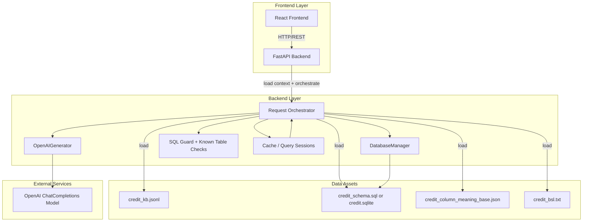
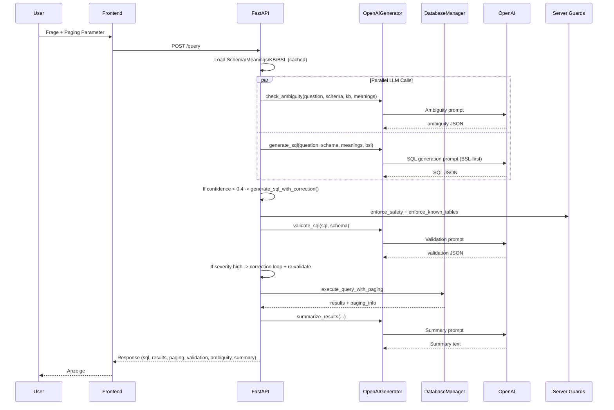

# Architektur & Prozesse – Text2SQL System (BSL-first)

> **Stand:** Januar 2026  
> **Scope:** **Credit-DB (mini-interact / BIRD Subset)**  
> **Backend:** **FastAPI** (`backend/main.py`)  
> **LLM-Integration:** OpenAI ChatCompletions via `OpenAIGenerator` (`backend/llm/generator.py`)  
> **Wichtiger Hinweis zur BSL-Generierung:** `bsl_builder.py` ist ein **Build-/Maintenance-Tool** (offline/on-demand) und **kein** Request-Step im API-Flow.

---

## 📖 Inhaltsverzeichnis
1. [System-Übersicht](#system-übersicht)
2. [Architektur-Historie & ADRs](#architektur-historie--adrs)
3. [Detaillierter Prozessablauf](#detaillierter-prozessablauf)
4. [Komponenten & ihre Rollen](#komponenten--ihre-rollen)
5. [Datenfluss & Pipeline](#datenfluss--pipeline)
6. [Frontend-Backend Kommunikation](#frontend-backend-kommunikation)
7. [Datenmodellierung & -beschreibung](#datenmodellierung---beschreibung)
8. [Limitationen & Ausblick](#limitationen--ausblick)
9. [Testergebnisse & Validierung](#testergebnisse--validierung)
10. [Produktivierungsanforderungen](#produktivierungsanforderungen)
11. [Organisatorisches](#organisatorisches)
12. [Selbstreflektion (Retrospektive)](#selbstreflektion-retrospektive)

---

## System-Übersicht

### Was ist das System?

**Text2SQL** ist ein KI-basiertes System, das **natürliche Sprache in SQL-Abfragen übersetzt**, diese auf einer **SQLite-Datenbank** ausführt und die Ergebnisse (inkl. Paging) zurückliefert. Ein Nutzer stellt eine Frage in normaler Sprache (z. B. „Zeige mir Kunden mit hoher Schuldenlast nach Segment“), und das System generiert eine SQL-Query, validiert sie (rule-based + LLM-based), führt sie aus und präsentiert die Resultate samt Kurz-Zusammenfassung.

### Kerninnovation: Business Semantics Layer (BSL)

Das System verwendet einen **Business Semantics Layer (BSL)** als explizite Regelschicht, die **fachliche Logik**, **Identifier-Systeme** und **Aggregation/Output-Patterns** kodifiziert. Damit werden typische Fehlerklassen in Text2SQL reduziert:

- Identifier-Verwechslungen (**CU vs CS**)
- falscher Detailgrad (Summary vs Row-Level)
- JOIN-Chain-Verletzungen / „Skipping tables“
- unklare Business-Begriffe / Metriken
- SQL-Dialekt-Fallen (z. B. SQLite `UNION` + `ORDER BY`)

---

## Architektur auf höchster Ebene

> **Korrektur:** Der BSL Builder ist im produktiven Request-Flow **nicht** Teil der Pipeline. Die API **lädt** `credit_bsl.txt`; der Builder wird offline/on-demand genutzt, um diese Datei zu erzeugen/aktualisieren.



---

## Kernkomponenten

> **Korrektur:** Backend ist **FastAPI**, nicht FastAPI + separater „Consistency Checker" als Modul. Validierung ist verteilt auf `utils/sql_guard.py`, `enforce_known_tables`, plus LLM-Validation in `llm/generator.py`.

| Komponente             | Technologie                         | Verantwortlichkeit                                                         | BSL-Integration         |
| ---------------------- | ----------------------------------- | -------------------------------------------------------------------------- | ----------------------- |
| **Frontend**           | React                               | UI, Frage-Input, Ergebnisanzeige, Paging                                   | -                       |
| **Backend API**        | FastAPI                             | Orchestrierung, Caching, Paging, Validierung                               | lädt `credit_bsl.txt`   |
| **LLM Generator**      | `OpenAIGenerator`                   | SQL-Generierung + BSL-Compliance-Regeneration + LLM-Validation + Summaries | **BSL-first Prompting** |
| **SQL Guard**          | `utils/sql_guard.py` + known tables | Security (nur SELECT), Tabellenvalidierung                                 | indirekt                |
| **Database Manager**   | SQLite                              | Execution, Paging, Query-Normalisierung                                    | -                       |
| **BSL Builder (Tool)** | `bsl_builder.py`                    | Offline/On-demand: Generiert `credit_bsl.txt`                              | erzeugt BSL-Datei       |

---

## BSL-Sektionen (in `credit_bsl.txt`)

> **Korrektur:** Der Builder trennt in **Part A (True BSL)**, **Part B (Mapping, nicht Teil der BSL)**, **Annex C (Policy)**. Es sind Textblöcke in einer Datei, keine `.py`-Module im Runtime-System.

1. **Part A: BUSINESS SEMANTICS LAYER (BSL)** (Business Terms, Rules, Metric Definitions)
2. **Part B: SEMANTIC-TO-SCHEMA MAPPING (NOT PART OF THE BSL)** (Identifier-Mapping, Relationship-Chain, JSON-Feldpfade)
3. **Annex C: SQL GENERATION POLICY** (Implementation Notes: Aggregation/Ranking/Row-level Policies)

---

## Architektur-Historie & ADRs

> **Wichtig:** In deinem ADR-Dokument sind die Nummern bereits sauber (ADR-001..006).
> Dieses Dokument referenziert die relevanten Entscheidungen nur kurz und konsistent.

### ADR-004: Migration zu BSL-first Single-Database Architektur (accepted)

* **Status:** accepted
* **Date:** 12.01.2026 (Verwurf der RAG-Architektur) / Einführung BSL-first erfolgte zuvor im Projektverlauf
* **Kernpunkt:** Scope-Fit (Credit DB), Stabilität, Auditability

### ADR-005: Heuristische Fragetyp-Erkennung + BSL-Compliance-Trigger (accepted)

* **Status:** accepted
* **Date:** 12.01.2026
* **Kernpunkt:** Edge-Case Stabilisierung ohne Hardcoding: Heuristiken → Compliance Instruction → ggf. Regeneration

### ADR-006: Consistency Validation (mehrstufig, accepted)

* **Status:** accepted
* **Date:** 12.01.2026
* **Kernpunkt:** Layer A (rule-based) + Layer B (LLM-based) + serverseitige Guards

> **Korrektur gegenüber vorheriger Version:** Es gibt in deinem Code weiterhin Fragetyp-Checks – das ist **kein Hardcoding von SQL**, sondern "Guardrails/Policy".

---

## Detaillierter Prozessablauf

### Phase 0: Build/Maintenance (offline/on-demand)

* `bsl_builder.py` generiert `mini-interact/credit/credit_bsl.txt` 
* BSL Overrides können manuell in `credit_bsl.txt` gepflegt werden (`# BSL OVERRIDES (MANUAL)`)

> Diese Phase ist **nicht** Teil des `/query` Request-Flows.

---

### Phase 1: Request Intake, Context Loading & Caching

**Schritt 1.1: Frontend sendet Anfrage**

```http
POST /query
Content-Type: application/json

{
  "question": "Zeige mir Kunden mit hoher Schuldenlast nach Segment",
  "page": 1,
  "page_size": 100,
  "query_id": null
}
```

**Schritt 1.2: Backend lädt Kontext**

* DB-Pfad: `DATA_DIR/credit/credit.sqlite` 
* Kontext:

  * Schema: `get_cached_schema(db_path)` 
  * Meanings: `get_cached_meanings(database, DATA_DIR)` 
  * KB + BSL: `load_context_files(database, DATA_DIR)` 
    (danach wird Meanings nochmals aus Cache überschrieben – ist okay, aber doppelt)

> **Korrektur:** "unendlich" als Cache-Policy ist keine Eigenschaft aus dem Code. Nenne es neutral: *Schema wird gecacht, da es selten ändert.*

---

### Phase 2: Parallelisierung – Ambiguity Detection + SQL-Generierung

> **Korrektur:** In `main.py` laufen Ambiguity Check und SQL-Generierung **parallel** (ThreadPool), und Ambiguity führt **nicht** zum Abbruch — es wird nur ein Hinweis (`notice`) ergänzt.

* Task A: `llm_generator.check_ambiguity(question, schema, kb, meanings)` 
* Task B: `llm_generator.generate_sql(question, schema, meanings, bsl)` 

Wenn `ambiguity.is_ambiguous == true`:

* Kein Hard-Fail; es wird ein `ambiguity_notice` in `notice` eingeblendet.

---

### Phase 3: SQL-Generierung (BSL-first) + Layer A (rule-based Compliance + Auto-Repair)

**In `OpenAIGenerator.generate_sql(...)`:**

1. Prompt: **Overrides → BSL → Schema → Meanings → Frage**
2. LLM liefert JSON (sql, explanation, confidence, …)
3. Layer A:

   * `_bsl_compliance_instruction(question, sql)` → ggf. Instruction
   * `_regenerate_with_bsl_compliance(...)` → 2. LLM Call nur bei Verstoß
   * `_fix_union_order_by(sql)` für SQLite

> **Korrektur:** Placeholders-Guard existiert (`_contains_param_placeholders`), wird aber aktuell nur indirekt über `_bsl_compliance_instruction` behandelt (Instruction), nicht als harter Block.

---

### Phase 4: Optionaler Self-Correction Loop (Layer B) bei niedriger Confidence

> **Korrektur:** Layer B wird in `main.py` **zusätzlich** getriggert, wenn `confidence < 0.4`.

* `generate_sql_with_correction(...)` führt iterativ:

  * SQL generieren/korrigieren
  * `validate_sql(sql, schema)` via LLM
  * erneute Korrektur (max 2)

---

### Phase 5: Server-Side Security & Known-Table Validation

In `main.py` (vor Execution):

* `enforce_safety(sql)` → nur SELECT, keine gefährlichen Statements
* `enforce_known_tables(sql, table_columns)` → nur bekannte Tabellen

Bei *nur* Table-Fehlern versucht `main.py` eine **Autokorrektur der Tabellennamen** via LLM (separater Correction Prompt) und validiert erneut.

> **Korrektur:** Das ist zusätzlich zu Layer A/B und gehört als eigener "Server Guard"-Step in die Doku.

---

### Phase 6: LLM SQL Validation (zusätzliche Prüfung) + ggf. Korrektur

Nach Server Guards:

* `validate_sql(generated_sql, schema)` (LLM)
* Bei `severity == "high"`: `generate_sql_with_correction(...)` und erneute Validation

> **Korrektur:** Validation ist **nicht** nur "Consistency Checker"; es ist LLM-based Semantikprüfung + mögliche Korrektur.

---

### Phase 7: Query Execution & Paging

* `generated_sql = db_manager.normalize_sql_for_paging(generated_sql)` 
* `execute_query_with_paging(sql, page, page_size)` liefert:

  * `results` 
  * `paging_info` (page, total_pages, total_rows, …)

Query Session:

* `query_id = create_query_session(database, sql, question)` 
* Für Folgeseiten: `query_id` erforderlich; die SQL kommt aus der Session

---

### Phase 8: Result Summarization (optional)

* `summarize_results(question, generated_sql, results, len(results), notice)` 
* Fallback: einfache Preview ("Top N rows…")

---

## Komponenten & ihre Rollen

### Frontend (React)

* sendet `POST /query` mit `question`, `page`, `page_size`, optional `query_id` 
* zeigt SQL, Results, Paging, Summary, Notice, Errors

### Backend (FastAPI – `backend/main.py`)

* Orchestriert:

  * Context Loading
  * parallel Ambiguity + SQL Generation
  * Confidence-based Self-correction
  * Server-side Guards
  * LLM Validation + Korrektur bei high severity
  * Execution + Paging + Query Sessions
  * Summaries + Caching

### LLM Generator (`backend/llm/generator.py`)

* **Layer A (rule-based + auto-repair):**

  * Fragetyp-Heuristiken (`_is_property_leverage_question`, `_has_explicit_time_range`, …)
  * `_bsl_compliance_instruction` → `_regenerate_with_bsl_compliance` 
  * SQLite Dialektfix (`_fix_union_order_by`)
* **Layer B (LLM-based):**

  * `validate_sql` 
  * `generate_sql_with_correction` 
* `summarize_results` 

### BSL Builder (`bsl_builder.py`) – Tooling

* Generiert `credit_bsl.txt` (Part A / Part B / Annex C)
* liest:

  * `credit_kb.jsonl` 
  * `credit_column_meaning_base.json` 
  * `credit_schema.sql` oder `credit.sqlite` 

---

## Datenfluss & Pipeline

### End-to-End Request Flow (korrigiert)

> **Korrektur:** Keine "BSL Generate" Phase im Request. BSL wird geladen.
> Außerdem: Ambiguity läuft parallel und blockiert nicht.



---

## Frontend-Backend Kommunikation

### Request Format (korrigiert)

> **Korrektur:** In `main.py` wird `database` nicht aus dem Request genutzt, sondern `Config.DEFAULT_DATABASE`. Du kannst `database` im Request weglassen oder als "future extension" deklarieren.

```json
{
  "question": "Zeige Schuldenlast pro Segment",
  "page": 1,
  "page_size": 100,
  "query_id": null
}
```

### Response Format (korrigiert / code-nah)

> **Korrektur:** In `main.py` wird **kein `question_intent`** erzeugt. Außerdem heißt die SQL in der Response `generated_sql`.
> Validation/Ambiguity werden als Objekte (`ambiguity_check`, `validation`) ausgegeben, wenn verfügbar.

```json
{
  "question": "…",
  "generated_sql": "SELECT …",
  "results": [ { "clientseg": "Premium", "avg_debt_ratio": 0.32 } ],
  "row_count": 1,

  "page": 1,
  "page_size": 100,
  "total_pages": 1,
  "total_rows": 1,
  "has_next_page": false,
  "has_previous_page": false,

  "summary": "…",
  "explanation": "…",
  "notice": "…",

  "ambiguity_check": {
    "is_ambiguous": false,
    "reason": "…",
    "questions": []
  },
  "validation": {
    "is_valid": true,
    "errors": [],
    "severity": "low",
    "suggestions": []
  },

  "query_id": "uuid..."
}
```

---

## Datenmodellierung & -beschreibung

> **Hinweis:** Das ER-Diagramm ist ok als High-Level-Chain.
> Die exakten PK/FK-Namen sollten aber aus dem Schema generiert werden. In der Doku formulierst du lieber "Kettenprinzip" statt "||--||" (1:1), falls Kardinalitäten nicht sicher sind.

---

## Limitationen & Ausblick (korrigiert)

### Aktuelle Limitationen

**Technisch**

1. **Single-Database Fokus:** API routet aktuell nicht; `Config.DEFAULT_DATABASE` ist immer Credit.
2. **Token-Kosten:** BSL-first benötigt großen Kontext (Schema + Meanings + BSL).
3. **SQLite Concurrency:** nicht optimiert für viele parallele Writer (hier read-only, aber dennoch begrenzt).
4. **LLM Latenz/Costs:** mehrere LLM Calls möglich (Ambiguity + SQL + Validation + Summary + ggf. Correction).

**Funktional**

1. **Read-only Policy:** serverseitiger Guard erzwingt SELECT-only.
2. **Heuristiken für Edge-Cases:** erhöhen Robustheit, decken aber nicht jede Formulierung ab.
3. **Abhängigkeit von Schema-Export:** Beispiele/JSON-Pfade funktionieren nur, wenn Schema/Meanings konsistent sind.

---

## Testergebnisse & Validierung (korrigiert)

> **Korrektur:** "Consistency Checker Results" ist irreführend, da Validierung verteilt ist. Nenne es neutral: **Validation/Guardrail Results**.

* **Rule-based Layer A:** BSL-Compliance-Regeneration + SQLite Fixes
* **Server Guards:** SELECT-only + known tables
* **Layer B:** LLM Validation + optional Self-correction (confidence/ severity-gated)

> Falls du bei Q5 "95%" erwähnst: präzisiere, ob es ein **Identifier-Problem** oder **JSON extraction** war.

---

## Produktivierungsanforderungen (korrigiert)

> **Korrektur:** "Stored Procedures (Read-Only)" passt nicht zu SQLite und eurem Guard. Formuliere stattdessen "CTEs, Window Functions, Subqueries" (read-only).

---

## Organisatorisches (kleine Fixes)

* "Backend-Entwicklung (2 Person)" → **2 Personen**
* "Selbstreflektion" → **Selbstreflexion**

---

## Zusammenfassung (korrigiert)

Dieses Text2SQL-System demonstriert:

* **BSL-first Domain Layer:** explizite Regeln statt impliziter Embeddings
* **Determinismus:** temperature=0 + Policy/Compliance + Guards
* **Guardrails:** Layer A (rule-based auto-repair) + Layer B (LLM validation/self-correction) + server-side safety
* **Praxisnaher API-Flow:** Caching + Query Sessions + Paging + Summaries

**Status:** production-ready **für den aktuellen Credit-DB Scope (read-only, Single-DB)**
**Nächste Meilensteine:** Multi-DB Routing (optional), Token-/Latency-Optimierung, Observability & Hardening

---
