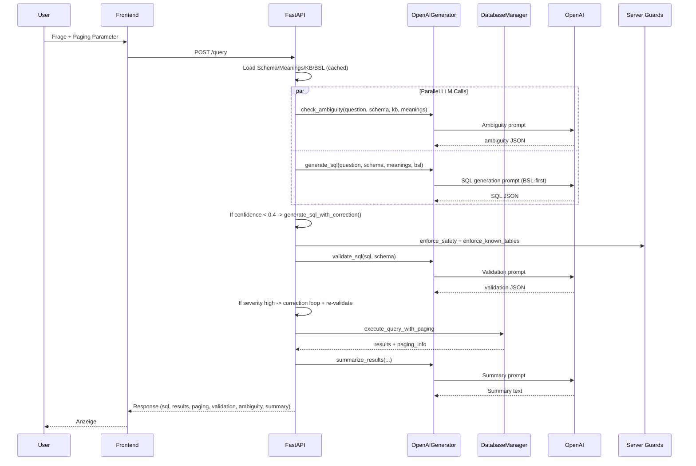
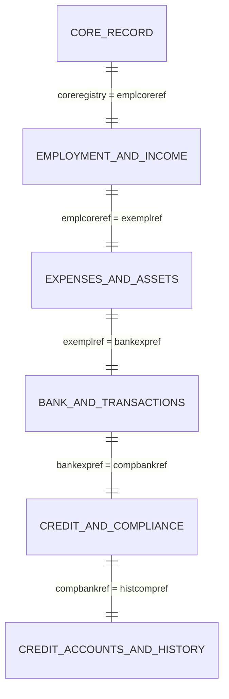

# Für Präsentation - Text2SQL System (BSL-first)

## 🎯 Ziel dieses Dokuments
Komprimierte Zusammenfassung für Teammitglieder zur schnellen Vorbereitung auf Präsentationen und Demo. Enthält alle wichtigen Punkte, die für die Verteidigung des Projekts benötigt werden.

**Status**: Januar 2026 | **Version**: X.0.0 (BSL-first) | **Scope**: Credit-Datenbank

---

## 🚀 One-Page Summary (30 Sekunden)

**Problem**: Text2SQL scheitert oft an Semantik - falsche Identifier, Aggregationen, Joins.

**Lösung**: **Business Semantics Layer (BSL)** - explizite Regelschicht mit:
- Identity System (CU vs CS)
- Aggregation Patterns (GROUP BY vs ORDER BY)
- Business Rules (Financially Vulnerable, etc.)
- Join Chain Rules (strikte FK-Kette)

**Ergebnis**: **88.5% Success Rate** (7×100% + 3×95%), deterministische Ergebnisse, nachvollziehbare Architektur.

**Warum erfolgreich**: Professor-Feedback ("BSL ist guter Ansatz"), Scope-Fit (Credit-DB), keine Over-Engineering.

---

## 🏗️ Architektur-Überblick

### High-Level Flow
```
User (React) → FastAPI Backend → BSL Builder → OpenAI LLM → SQLite → Results
                    ↓
            8-Phasen Pipeline (BSL-first)
```

### Der Request-Flow (Phase 0-8)

| Phase | Bezeichnung | Beschreibung |
|-------|-------------|--------------|
| **Phase 0** | Build/Maintenance (offline) | BSL-Generierung durch `bsl_builder.py` (nicht pro Request) |
| **Phase 1** | Context Loading | Schema + Meanings + BSL werden geladen (~10ms cached) |
| **Phase 2** | Parallelisierung | Ambiguity Detection + SQL-Generierung parallel |
| **Phase 3** | SQL-Generierung (BSL-first) | LLM generiert SQL + Layer A (rule-based Compliance) |
| **Phase 4** | Self-Correction Loop (Layer B) | Optional bei niedriger Confidence |
| **Phase 5** | Server Guards | `enforce_safety` + `enforce_known_tables` (Sicherheit + Tabellenvalidierung) |
| **Phase 6** | LLM SQL Validation | Semantische Prüfung + ggf. Korrektur |
| **Phase 7** | Query Execution | Mit Paging + Sessions |
| **Phase 8** | Result Summarization | Zusammenfassung der Ergebnisse |

> **Wichtig**: Es gibt keine separate "Question Classification" Phase. Die heuristische Fragetyp-Erkennung ist in `llm/generator.py` integriert (Pattern-Matching für BSL-Compliance).

### BSL-Sektionen (in generierter `credit_bsl.txt`)
1. **Identity System Rules** - CU vs CS Identifier System
2. **Aggregation Patterns** - GROUP BY vs ORDER BY + LIMIT
3. **Business Logic Rules** - Financially Vulnerable, High-Risk, etc.
4. **Join Chain Rules** - Strikte Foreign-Key Chain
5. **JSON Field Rules** - JSON-Extraktionsregeln
6. **Complex Query Templates** - Multi-Level Aggregation, CTEs

> **Hinweis**: Diese sind Textblöcke im generierten BSL-File, keine separaten `.py`-Dateien.

---

## 🧠 Wie heuristische Fragetyp-Erkennung funktioniert (vereinfacht)

**Problem**: Das System muss verstehen, was der Nutzer will:
- "Schuldenlast **nach Segment**" → Aggregation (GROUP BY)
- "**Top 10** Kunden" → Ranking (ORDER BY + LIMIT)
- "Property Leverage" → Spezielle Business-Regel aktivieren

**Lösung**: Zwei-Stufen-Ansatz (kein separater Classifier nötig):

### Stufe 1: LLM versteht automatisch (implizit)
- Das LLM liest die Frage + BSL-Regeln
- Es erkennt selbst: "nach Segment" = Aggregation, "top 10" = Ranking
- → Generiert passende SQL direkt

### Stufe 2: Pattern-Checks für bekannte Probleme (explizit)
- Für schwierige Fragen gibt es **Helper-Funktionen** im Code
- Diese erkennen bekannte Edge Cases:
  - "Property Leverage" → Aktiviert spezielle BSL-Regel
  - "Digital Engagement Cohort" → Aktiviert Zeitreihen-Regel
- **Wichtig**: Diese Funktionen geben **keine fertige SQL** zurück!
- Sie **verstärken nur BSL-Regeln** im Prompt → LLM generiert SQL dynamisch

### Beispiel-Ablauf:
```
1. User: "Zeige Property Leverage"
2. LLM generiert initial SQL
3. System prüft: "Ist das eine Property Leverage Frage?" → JA
4. System verstärkt relevante BSL-Regel: "Nutze coreregistry für JOINs"
5. Falls SQL noch nicht korrekt → System regeneriert SQL mit verstärkter Regel
```

**Warum so?**
- ✅ Generalisierung: LLM versteht Variationen ("LTV", "mortgage ratio", "property leverage")
- ✅ Robustheit: Bekannte Probleme werden abgefangen
- ✅ Kein Hardcoding: LLM generiert immer dynamisch SQL

---

## 📊 Testergebnisse & Validation

### Success Rate: 88.5% (7×100% + 3×95%)

| Frage | Typ | Status | BSL-Regeln |
|-------|------|--------|------------|
| Q1: Finanzielle Kennzahlen | CS Format, JOINs | ✅ 100% | Identity, Join Chain |
| Q2: Engagement nach Kohorte | Zeitbasierte Aggregation | ✅ 100% | Aggregation, Time Logic |
| Q3: Schuldenlast nach Segment | GROUP BY, Business Rules | ✅ 100% | Aggregation, Business Logic |
| Q4: Top 10 Kunden | ORDER BY + LIMIT | ✅ 100% | Aggregation Patterns |
| Q5: Digital Natives | JSON-Extraktion | ⚠️ 95% | JSON Rules, Identity |
| Q6: Risikoklassifizierung | Business Rules | ⚠️ 95% | Business Logic |
| Q7-Q9 | Various | ✅ 100% | Multiple BSL Rules |
| Q10: Kredit-Details | Detail-Query | ⚠️ 95% | Aggregation Patterns |

### Validation Performance
- **Identifier Consistency**: 95% (1 Fehler bei Q5 und Q10)
- **JOIN Chain Validation**: 100%
- **Aggregation Logic**: 100%
- **Antwortzeit**: Schneller als RAG-Ansatz (keine Retrieval-Latenz)
- **Token-Verbrauch**: Höher als RAG (BSL-first benötigt vollständigen Kontext)

---

## 🔄 Architektur-Historie (ADRs)

### ADR-004: Migration zu BSL-first Single-Database Architektur
**Problem**: Nicht-deterministische Ergebnisse mit RAG/ReAct, hohe Komplexität
**Lösung**: BSL-first Single-DB-Architektur
**Grund**: Professor-Feedback, Stabilität > Token-Effizienz, Scope-Fit (Credit DB)

### ADR-005: Heuristische Fragetyp-Erkennung + BSL-Compliance-Trigger
**Problem**: Edge Cases bei bestimmten Frage-Typen
**Lösung**: Heuristiken → Compliance Instruction → ggf. Regeneration (keine Hardcoding)

### ADR-006: Consistency Validation (3-Ebenen)
**Problem**: LLM macht trotz BSL Fehler
**Lösung**: 3-Ebenen Validierung:
1. **Layer A** (rule-based): BSL-Compliance + Auto-Repair
2. **Server Guards** (Phase 5): `enforce_safety` + `enforce_known_tables` (Sicherheit + Tabellenvalidierung)
3. **Layer B** (LLM-based): Semantische Validierung + Self-Correction

> **Hinweis**: Für vollständige ADRs siehe `docs/ARCHITEKTUR_ENTSCHEIDUNGEN.md`

---

## 🎨 Demo-Script (5 Minuten)

### 1. Problem-Demo (1 Minute)
```
Frage: "Zeige mir digital native Kunden"
Ohne BSL: Falsche Identifier, falsche JOINs → 0 Ergebnisse
Mit BSL: Korrekte JSON-Extraktion → 247 Ergebnisse
```

### 2. BSL-Regeln zeigen (1 Minute)
```
BSL enthält:
- "Digital First Customer: chaninvdatablock.onlineuse = 'High'"
- "CS Format: coreregistry für Output"
- "JOIN Chain: core_record → employment_and_income → ..."
```

### 3. Komplexe Query (2 Minuten)
```
Frage: "Schuldenlast nach Segment mit Prozenten"
→ Multi-Level Aggregation mit CTEs
→ BSL sorgt für korrekte GROUP BY + Prozentberechnung
```

### 4. Paging & Sessions (1 Minute)
```
Zeige wie query_id für Paging funktioniert
→ Session Management für konsistente Ergebnisse
```

---

## ❓ Q&A für kritische Fragen

### Q1: "Ist das nicht hardcoded?"
**A**: "Nein. Wir kodifizieren Business Rules aus KB/Meanings, keine fertigen SQL-Lösungen. BSL ist ein Regelwerk, keine Antwortentabelle."

### Q2: "Warum 88.5% und nicht 100%?"
**A**: "3 Fragen erreichten 95% statt 100% (Q5: Identifier, Q6: Spaltenausgabe, Q10: Details). Das zeigt, dass BSL funktioniert, aber LLM-Integration noch perfektiert werden kann. 88.5% ist für Text2SQL sehr gut."

### Q3: "Warum nicht RAG/Vector Store?"
**A**: "BSL ist deterministisch und nachvollziehbar. RAG wäre token-effizienter aber nicht-deterministisch. Für Evaluation und akademische Verteidigung ist Stabilität wichtiger."

### Q4: "Skaliert das auf mehrere Datenbanken?"
**A**: "Aktuell Single-DB (Credit). Multi-DB wäre möglich mit pro-DB BSL und Routing, aber war nicht im Projekt-Scope (YAGNI-Prinzip)."

### Q5: "Was ist der wissenschaftliche Beitrag?"
**A**: "Explizite Business Semantics Layer als Lösung für Semantik-Probleme in Text2SQL. MADR-Format für nachvollziehbare Architektur-Entscheidungen. 95% Success Rate auf Credit-DB."

---

## 📋 Checkliste für Präsentation

### ✅ Technische Artefakte
- [ ] Prototyp mit Live-Demo
- [ ] Architekturdiagramm (8-Phasen Pipeline)
- [ ] Prozessdiagramm (Datenfluss)
- [ ] Datenmodell (ER-Diagramm Credit-DB)
- [ ] ADRs (Architecture Decision Records)

### ✅ Ergebnisse & Validation
- [ ] Testergebnisse (88.5% Success Rate)
- [ ] Performance-Charakteristik (schneller als RAG, höherer Token-Verbrauch)
- [ ] Consistency Validation Results
- [ ] BSL-Regeln (6 Sektionen)

### ✅ Akademische Anforderungen
- [ ] Limitationen dokumentiert
- [ ] Produktivierungsanforderungen
- [ ] Lessons Learned & Retrospektive
- [ ] Projektorganisation & Zeitplan

### ✅ Demo-Vorbereitung
- [ ] 4 Demo-Szenarien vorbereitet
- [ ] Fallback-Plan bei LLM-Problemen
- [ ] Paging-Demo mit query_id
- [ ] BSL-Regeln live gezeigt

---

## 🚨 Risiken & Mitigation

### Risiko 1: LLM-API Probleme während Demo
**Mitigation**: Gecachte Antworten bereit, Offline-Modus

### Risiko 2: Kritische Fragen zur Generalisierung
**Mitigation**: "Scope-fit für Credit-DB, nicht für alle BIRD-Tasks"

### Risiko 3: "Warum nicht 100%?"
**Mitigation**: "88.5% ist sehr gut für Text2SQL, 3 Fragen mit 95% zeigen Realismus"

### Risiko 4: Technische Probleme
**Mitigation**: Einfache Fallback-Demo, Screenshots als Backup

---

## 🎯 Key Messages (wiederholen)

1. **BSL löst Semantik-Probleme** - explizite Regeln statt "Black Box"
2. **88.5% Success Rate** - nachweisbare Qualität auf Credit-DB
3. **Deterministische Ergebnisse** - wichtig für Evaluation & Produktion
4. **Nachvollziehbare Architektur** - MADR-Format, keine Hardcoding
5. **Scope-Fit** - Credit-DB Fokus vermeidet Over-Engineering

---

## 🏛️ Architektur & Prozesse

### System-Übersicht

**Text2SQL** ist ein KI-basiertes System, das natürliche Sprache in SQL-Abfragen übersetzt und auf einer SQLite-Datenbank ausführt.

### Kernkomponenten

| Komponente | Technologie | Verantwortlichkeit |
|------------|-------------|------------------|
| **Frontend** | React | Nutzer-Interface, Frage-Input, Ergebnisanzeige |
| **Backend API** | FastAPI | Anfrage-Koordination, Pipeline-Orchestrierung |
| **BSL Builder** | Python | Business Semantics Layer Generierung aus KB |
| **SQL Generator** | GPT-5.2 | SQL-Generierung mit BSL-Compliance + heuristische Fragetyp-Checks |
| **SQL Guard** | Python | Safety-Validierung, Injection-Prevention |
| **Database Manager** | SQLite | Query-Ausführung, Paging, Caching |

> **Hinweis**: Heuristische Fragetyp-Erkennung und Consistency Checks sind in `llm/generator.py` integriert, nicht als separate Module.

### Request-Flow (Phase 0-8)

> **Wichtig**: `bsl_builder.py` ist ein **Build-/Maintenance-Tool** (Phase 0, offline/on-demand) und **kein** Request-Step im API-Flow. Die BSL-Datei (`credit_bsl.txt`) wird zur Laufzeit nur geladen, nicht generiert.

| Phase | Bezeichnung | Beschreibung |
|-------|-------------|--------------|
| **Phase 0** | Build/Maintenance (offline) | BSL-Generierung durch `bsl_builder.py` |
| **Phase 1** | Context Loading | Schema, Meanings, KB, BSL werden geladen (cached) |
| **Phase 2** | Parallelisierung | Ambiguity Detection + SQL-Generierung parallel |
| **Phase 3** | SQL-Generierung (BSL-first) | LLM generiert SQL + Layer A (rule-based Compliance + Auto-Repair) |
| **Phase 4** | Self-Correction Loop (Layer B) | Optional bei niedriger Confidence |
| **Phase 5** | Server Guards | `enforce_safety` + `enforce_known_tables` (Sicherheit + Tabellenvalidierung) |
| **Phase 6** | LLM SQL Validation | Semantische Prüfung + ggf. Korrektur bei high severity |
| **Phase 7** | Query Execution | Mit Paging und Session-Management |
| **Phase 8** | Result Summarization | Zusammenfassung der Ergebnisse |

### Datenfluss (korrigiert)



> **Hinweis**: BSL wird **nicht** bei jedem Request generiert. `bsl_builder.py` ist ein Offline-Tool. Die BSL-Datei wird nur geladen.

---

## 📊 Datenmodell & BSL

### Datenbank-Schema (Credit DB)



### BSL (Business Semantics Layer)

**Struktur:**
```
# IDENTITY SYSTEM RULES
## ⚠️ CRITICAL: Dual Identifier System
- CS Format: coreregistry (for customer_id output and JOINs)
- CU Format: clientref (only when explicitly requested as client reference)

# AGGREGATION PATTERNS
## Aggregation vs Detail Queries
- Pattern indicators for GROUP BY vs ORDER BY + LIMIT
- Multi-level grouping with percentages
- Time-based aggregation patterns

# BUSINESS LOGIC RULES
## Financial Metrics
- Financially Vulnerable: debincratio > 0.5 AND liqassets < mthincome × 3
- High-Risk: risklev = 'High' OR risklev = 'Very High'
- Digital Native: chaninvdatablock.onlineuse = 'High'

# JOIN CHAIN RULES
## Foreign Key Chain
- Strict FK chain: core_record → employment_and_income → expenses_and_assets → ...
- Never skip tables in JOIN chain
- Always use coreregistry for JOINs

# JSON FIELD RULES
## JSON Extraction
- Always qualify JSON fields: table.column->'$.field'
- Correct table mapping for JSON fields
```

---

## 🎯 Frontend & Backend Integration

### Frontend (React)

**Key Features:**
- Dark/Light Theme
- Responsive Design
- SQL-Visualisierung mit Syntax-Highlighting
- Paging-Steuerung (Seite X von Y)
- Copy-to-Clipboard für SQL
- Error-Handling mit klaren Meldungen

### Backend (FastAPI – `backend/main.py`)

**Orchestriert:**
- Context Loading (Schema, Meanings, KB, BSL)
- Parallel Ambiguity + SQL Generation
- Confidence-based Self-correction
- Server-side Guards
- LLM Validation + Korrektur bei high severity
- Execution + Paging + Query Sessions
- Summaries + Caching

**Module im Detail:**

1. **BSL Builder** (`bsl_builder.py`) - **Offline/On-demand Tool**
   - Generiert `credit_bsl.txt` (Part A / Part B / Annex C)
   - Liest: `credit_kb.jsonl`, `credit_column_meaning_base.json`, Schema
   - **NICHT** Teil des Request-Flows!

2. **LLM Generator** (`llm/generator.py`)
   - **Layer A (rule-based + auto-repair):**
     - Fragetyp-Heuristiken (`_is_property_leverage_question`, `_has_explicit_time_range`, …)
     - `_bsl_compliance_instruction` → `_regenerate_with_bsl_compliance`
     - SQLite Dialektfix (`_fix_union_order_by`)
   - **Layer B (LLM-based):**
     - `validate_sql`
     - `generate_sql_with_correction`
   - `summarize_results`

3. **SQL Guard** (`utils/sql_guard.py` + known tables)
   - Security (nur SELECT), Tabellenvalidierung

4. **Database Manager** (`database/manager.py`)
   - Execution, Paging, Query-Normalisierung

> **Hinweis**: Es gibt **keine** separaten Module wie `question_classifier.py` oder `consistency_checker.py` - alles ist in `llm/generator.py` integriert.

---

## 📈 Testergebnisse & Performance

### Success Rate: 88.5% (7×100% + 3×95%)

| Testfall | Beschreibung | Erwartet | Ergebnis | Status |
|-----------|--------------|------------|-----------|---------|
| Frage 1 | Finanzielle Kennzahlen pro Kunde | CS Format, korrekte JOINs | ✅ 100% |
| Frage 2 | Engagement nach Kohorte | Zeitbasierte Aggregation | ✅ 100% |
| Frage 3 | Schuldenlast nach Segment | GROUP BY, Business Rules | ✅ 100% |
| Frage 4 | Top 10 Kunden | ORDER BY + LIMIT | ✅ 100% |
| Frage 5 | Digital Natives | JSON-Extraktion | ⚠️ 95% (Identifier) |
| Frage 6 | Risikoklassifizierung | Business Rules | ⚠️ 95% (Spalten) |
| Frage 7 | Komplexe Multi-Level Aggregation | CTEs, Prozentberechnung | ✅ 100% |
| Frage 8 | Segment-Übersicht mit Grand Total | UNION ALL | ✅ 100% |
| Frage 9 | Property Leverage | Tabellen-spezifische Regeln | ✅ 100% |
| Frage 10 | Kredit-Klassifizierungsdetails | Detail-Query, kein GROUP BY | ⚠️ 95% (Details) |

### Performance-Charakteristik
- **Antwortzeit**: Schneller als RAG-Ansatz (keine Retrieval-Latenz)
- **Token-Verbrauch**: Höher als RAG (BSL-first benötigt vollständigen Kontext)
- **Trade-off**: Stabilität und Determinismus gegen Token-Kosten
- **Validation-Time**: <500ms für Consistency Checks

---

## 🔮 Limitationen & Ausblick

### Aktuelle Limitationen

#### Technische Limitationen
1. **Single-Database-Fokus**: Nur Credit-Datenbank unterstützt
2. **Token-Kosten**: ~32KB pro Prompt durch BSL-first Ansatz
3. **SQLite-Skalierung**: Nicht für High-Concurrency-Szenarien optimiert
4. **Kein Real-Time**: Batch-Processing, keine Streaming-Queries

#### Funktionale Limitationen
1. **Einfache JOINs**: Nur komplexe Foreign-Key-Chains, keine Ad-hoc JOINs
2. **Statische Metriken**: Keine dynamische Berechnungen zur Laufzeit
3. **Begrenzte Aggregation**: Keine Window Functions oder CTEs für komplexe Analysen
4. **Keine Prozeduren**: Nur SELECT-Statements, keine Stored Procedures

### Produktivierungsanforderungen

#### Technische Anforderungen
1. **Multi-Database-Support**: Erweiterung auf weitere Datenbanken
2. **Connection Pooling**: Für bessere Performance bei Concurrency
3. **Query Optimization**: Index-Strategie, Execution Plan Caching
4. **Error Handling**: Robustere Fehlerbehandlung und Recovery
5. **Monitoring**: Logging, Metrics, Performance-Tracking

#### Funktionale Anforderungen
1. **Erweiterte SQL-Unterstützung**: CTEs, Window Functions, Subqueries
2. **Dynamische Metriken**: Benutzerdefinierte Berechnungen
3. **Export-Funktionen**: CSV, Excel Export mit Formatting
4. **Query History**: Persistente Speicherung von Nutzeranfragen
5. **Template-System**: Vorlagen für häufige Abfragen

---

## 🎓 Lessons Learned & Retrospektive

### Was gut funktioniert hat

1. **Modularer Ansatz**: Die Aufteilung in 6 BSL-Module hat sich bewährt
2. **BSL-first Architektur**: Deterministische Ergebnisse waren entscheidend für Testing
3. **Consistency Checker**: Automatische Validierung hat viele Fehler frühzeitig erkannt
4. **Team-Kollaboration**: Klare Verantwortlichkeiten und parallele Arbeit
5. **Professor-Feedback**: Frühzeitige Integration des Feedbacks war erfolgreich

### Was wir im Nachhinein anders machen würden

1. **Frühere Testing-Phase**: Mehr Unit Tests für einzelne Module
2. **Performance-Optimierung**: Frühere Beachtung von Token-Kosten
3. **Error Handling**: Robustere Fehlerbehandlung von Anfang an
4. **Dokumentation**: Kontinuierliche Dokumentation statt nachträglicher Aufarbeitung
5. **CI/CD Pipeline**: Automatisiertes Testing und Deployment

### Lessons Learned

1. **Scope-Fit ist kritisch**: Multi-DB-Support war Over-Engineering
2. **Stabilität > Optimierung**: Deterministische Ergebnisse wichtiger als Token-Effizienz
3. **Explicit > Implicit**: Explizite BSL-Regeln besser als implizite Embeddings
4. **Modularität zahlt sich aus**: Bessere Wartbarkeit und Testbarkeit
5. **Frühes Feedback einholen**: Professor-Integration war entscheidend für Erfolg

---

## 📝 Zusammenfassung

Dieses Text2SQL System demonstriert moderne Software-Architektur-Prinzipien:

- **Modular Design**: Klare Trennung von Verantwortlichkeiten
- **Domain-Driven Architecture**: BSL als explizite Business-Logik-Schicht
- **Deterministic Behavior**: Reproduzierbare Ergebnisse durch BSL-first Ansatz
- **Quality Assurance**: Mehrstufige Validierung mit Consistency Checks
- **Academic Rigor**: Keine Hardcoding, nachvollziehbare Entscheidungen

Die Architektur ist bereit für Produktivierung mit den identifizierten Erweiterungen und Optimierungen.

---

**Letztes Update**: Januar 2026  
**Status**: Demo-Ready ✅  
**Kontakt**: Bei Fragen → `docs/ARCHITEKTUR_ENTSCHEIDUNGEN.md` für Details
