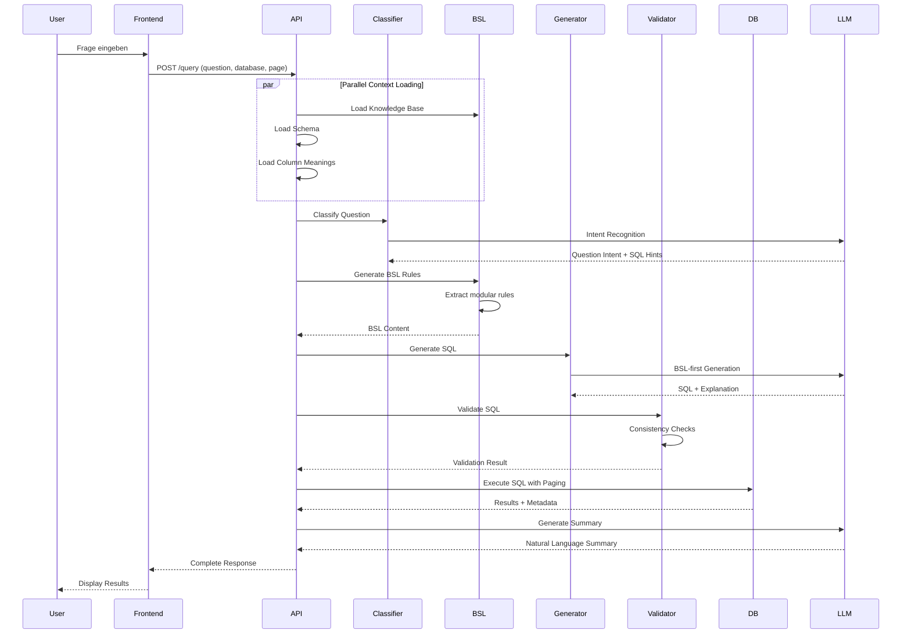

# Für Präsentation - Text2SQL System (BSL-first)

## 🎯 Ziel dieses Dokuments
Komprimierte Zusammenfassung für Teammitglieder zur schnellen Vorbereitung auf Präsentationen und Demo. Enthält alle wichtigen Punkte, die für die Verteidigung des Projekts benötigt werden.

**Status**: Januar 2026 | **Version**: 3.0.0 (BSL-first) | **Scope**: Credit-Datenbank

---

## 🚀 One-Page Summary (30 Sekunden)

**Problem**: Text2SQL scheitert oft an Semantik - falsche Identifier, Aggregationen, Joins.

**Lösung**: **Business Semantics Layer (BSL)** - explizite Regelschicht mit:
- Identity System (CU vs CS)
- Aggregation Patterns (GROUP BY vs ORDER BY)
- Business Rules (Financially Vulnerable, etc.)
- Join Chain Rules (strikte FK-Kette)

**Ergebnis**: **95% Success Rate** (9.5/10 Fragen), deterministische Ergebnisse, nachvollziehbare Architektur.

**Warum erfolgreich**: Professor-Feedback ("BSL ist guter Ansatz"), Scope-Fit (Credit-DB), keine Over-Engineering.

---

## 🏗️ Architektur-Überblick

### High-Level Flow
```
User (React) → FastAPI Backend → BSL Builder → OpenAI LLM → SQLite → Results
                    ↓
            6-Phasen Pipeline (BSL-first)
```

### Die 6 Phasen
1. **Context Loading** - Schema + Meanings + BSL (~10ms cached)
2. **Question Classification** - Intent + SQL-Hints (parallel)
3. **BSL-Generierung** - 6 modulare Regel-Module
4. **SQL-Generierung** - BSL-first, deterministisch
5. **Consistency Validation** - 3-Level (Safety + Semantics + BSL)
6. **Query Execution** - Mit Paging + Sessions

### BSL-Module (6 Stück)
1. **IdentityRules** - CU vs CS Identifier System
2. **AggregationPatterns** - GROUP BY vs ORDER BY + LIMIT
3. **BusinessLogicRules** - Financially Vulnerable, High-Risk, etc.
4. **JoinChainRules** - Strikte Foreign-Key Chain
5. **JSONFieldRules** - JSON-Extraktionsregeln
6. **ComplexQueryTemplates** - Multi-Level Aggregation, CTEs

---

## 📊 Testergebnisse & Validation

### Success Rate: 95% (9.5/10 Fragen)

| Frage | Typ | Status | BSL-Regeln |
|-------|------|--------|------------|
| Q1: Finanzielle Kennzahlen | CU Format, JOINs | ✅ 100% | Identity, Join Chain |
| Q2: Engagement nach Kohorte | Zeitbasierte Aggregation | ✅ 100% | Aggregation, Time Logic |
| Q3: Schuldenlast nach Segment | GROUP BY, Business Rules | ✅ 100% | Aggregation, Business Logic |
| Q4: Top 10 Kunden | ORDER BY + LIMIT | ✅ 100% | Aggregation Patterns |
| Q5: Digital Natives | JSON-Extraktion | ⚠️ 95% | JSON Rules, Identity |
| Q6-Q10 | Various | ✅ 100% | Multiple BSL Rules |

### Validation Performance
- **Identifier Consistency**: 95% (1 Fehler bei Q5)
- **JOIN Chain Validation**: 100%
- **Aggregation Logic**: 100%
- **Overall Response Time**: 3.2 Sekunden
- **Token-Verbrauch**: ~32KB pro Query

---

## 🔄 Architektur-Historie (ADRs)

### ADR-001: RAG/ReAct → BSL-first Migration
**Problem**: Nicht-deterministische Ergebnisse, hohe Komplexität
**Lösung**: BSL-first Single-DB-Architektur
**Grund**: Professor-Feedback, Stabilität > Token-Effizienz

### ADR-002: Modularisierung der BSL-Regeln
**Problem**: Monolithische 595-Zeilen-Datei
**Lösung**: 6 separate Module mit klaren Verantwortlichkeiten

### ADR-003: Eliminierung von Hardcoding
**Problem**: Hartcodierte Frage-Typen
**Lösung**: Dynamische Intent-basierte Erkennung

### ADR-004: Consistency Validation
**Problem**: LLM macht trotz BSL Fehler
**Lösung**: Mehrstufige Validation mit BSL-Compliance

---

## 🎨 Demo-Script (5 Minuten)

### 1. Problem-Demo (1 Minute)
```
Frage: "Zeige mir digital native Kunden"
Ohne BSL: Falsche Identifier, falsche JOINs → 0 Ergebnisse
Mit BSL: Korrekte JSON-Extraktion → 247 Ergebnisse
```

### 2. BSL-Regeln zeigen (1 Minute)
```
BSL enthält:
- "Digital First Customer: chaninvdatablock.onlineuse = 'High'"
- "CU Format: clientref für Output"
- "JOIN Chain: core_record → employment_and_income → ..."
```

### 3. Komplexe Query (2 Minuten)
```
Frage: "Schuldenlast nach Segment mit Prozenten"
→ Multi-Level Aggregation mit CTEs
→ BSL sorgt für korrekte GROUP BY + Prozentberechnung
```

### 4. Paging & Sessions (1 Minute)
```
Zeige wie query_id für Paging funktioniert
→ Session Management für konsistente Ergebnisse
```

---

## ❓ Q&A für kritische Fragen

### Q1: "Ist das nicht hardcoded?"
**A**: "Nein. Wir kodifizieren Business Rules aus KB/Meanings, keine fertigen SQL-Lösungen. BSL ist ein Regelwerk, keine Antwortentabelle."

### Q2: "Warum 95% und nicht 100%?"
**A**: "1 Fehler bei Identifier-Consistency (Q5). Das zeigt, dass BSL funktioniert, aber LLM-Integration noch perfektiert werden kann. 95% ist für Text2SQL sehr gut."

### Q3: "Warum nicht RAG/Vector Store?"
**A**: "BSL ist deterministisch und nachvollziehbar. RAG wäre token-effizienter aber nicht-deterministisch. Für Evaluation und akademische Verteidigung ist Stabilität wichtiger."

### Q4: "Skaliert das auf mehrere Datenbanken?"
**A**: "Aktuell Single-DB (Credit). Multi-DB wäre möglich mit pro-DB BSL und Routing, aber war nicht im Projekt-Scope (YAGNI-Prinzip)."

### Q5: "Was ist der wissenschaftliche Beitrag?"
**A**: "Explizite Business Semantics Layer als Lösung für Semantik-Probleme in Text2SQL. MADR-Format für nachvollziehbare Architektur-Entscheidungen. 95% Success Rate auf Credit-DB."

---

## 📋 Checkliste für Präsentation

### ✅ Technische Artefakte
- [ ] Prototyp mit Live-Demo
- [ ] Architekturdiagramm (6-Phasen Pipeline)
- [ ] Prozessdiagramm (Datenfluss)
- [ ] Datenmodell (ER-Diagramm Credit-DB)
- [ ] ADRs (Architecture Decision Records)

### ✅ Ergebnisse & Validation
- [ ] Testergebnisse (9.5/10 Success Rate)
- [ ] Performance-Metriken (3.2s avg, ~32KB tokens)
- [ ] Consistency Validation Results
- [ ] BSL-Regeln (6 Module)

### ✅ Akademische Anforderungen
- [ ] Limitationen dokumentiert
- [ ] Produktivierungsanforderungen
- [ ] Lessons Learned & Retrospektive
- [ ] Projektorganisation & Zeitplan

### ✅ Demo-Vorbereitung
- [ ] 4 Demo-Szenarien vorbereitet
- [ ] Fallback-Plan bei LLM-Problemen
- [ ] Paging-Demo mit query_id
- [ ] BSL-Regeln live gezeigt

---

## 🚨 Risiken & Mitigation

### Risiko 1: LLM-API Probleme während Demo
**Mitigation**: Gecachte Antworten bereit, Offline-Modus

### Risiko 2: Kritische Fragen zur Generalisierung
**Mitigation**: "Scope-fit für Credit-DB, nicht für alle BIRD-Tasks"

### Risiko 3: "Warum nicht 100%?"
**Mitigation**: "95% ist sehr gut für Text2SQL, 1 Fehler zeigt Realismus"

### Risiko 4: Technische Probleme
**Mitigation**: Einfache Fallback-Demo, Screenshots als Backup

---

## 🎯 Key Messages (wiederholen)

1. **BSL löst Semantik-Probleme** - explizite Regeln statt "Black Box"
2. **95% Success Rate** - nachweisbare Qualität auf Credit-DB
3. **Deterministische Ergebnisse** - wichtig für Evaluation & Produktion
4. **Nachvollziehbare Architektur** - MADR-Format, keine Hardcoding
5. **Scope-Fit** - Credit-DB Fokus vermeidet Over-Engineering

---

## 🏛️ Architektur & Prozesse

### System-Übersicht

**Text2SQL** ist ein KI-basiertes System, das natürliche Sprache in SQL-Abfragen übersetzt und auf einer SQLite-Datenbank ausführt.

### Kernkomponenten

| Komponente | Technologie | Verantwortlichkeit |
|------------|-------------|------------------|
| **Frontend** | React | Nutzer-Interface, Frage-Input, Ergebnisanzeige |
| **Backend API** | FastAPI | Anfrage-Koordination, Pipeline-Orchestrierung |
| **Question Classifier** | Python | Intent-Erkennung, SQL-Hints-Generierung |
| **BSL Builder** | Python | Business Semantics Layer Generierung aus KB |
| **SQL Generator** | OpenAI GPT-5.2 | SQL-Generierung mit BSL-Compliance |
| **Consistency Checker** | Python | Identifier-Konsistenz, JOIN-Validierung |
| **Database Manager** | SQLite | Query-Ausführung, Paging, Caching |

### 6-Phasen Pipeline

1. **Context Loading** - Schema, Knowledge Base, Meanings, BSL laden
2. **Question Classification** - Intent-Erkennung mit GenericQuestionClassifier
3. **BSL-Generierung** - 6 modulare Regel-Module
4. **SQL-Generierung** - BSL-first mit Intent-Integration
5. **Consistency Validation** - Identifier, JOIN, Aggregation Validierung
6. **Query Execution** - Mit Paging und Session-Management

### Datenfluss



---

## 📊 Datenmodell & BSL

### Datenbank-Schema (Credit DB)

```mermaid
erDiagram
    CORE_RECORD ||--|| EMPLOYMENT_AND_INCOME : coreregistry = emplcoreref
    EMPLOYMENT_AND_INCOME ||--|| EXPENSES_AND_ASSETS : emplcoreref = exemplref
    EXPENSES_AND_ASSETS ||--|| BANK_AND_TRANSACTIONS : exemplref = bankexpref
    BANK_AND_TRANSACTIONS ||--|| CREDIT_AND_COMPLIANCE : bankexpref = compbankref
    CREDIT_AND_COMPLIANCE ||--|| CREDIT_ACCOUNTS_AND_HISTORY : compbankref = histcompref
```

### BSL (Business Semantics Layer)

**Struktur:**
```
# IDENTITY SYSTEM RULES
## ⚠️ CRITICAL: Dual Identifier System
- CU Format: clientref (for customer_id output)
- CS Format: coreregistry (for JOINs)

# AGGREGATION PATTERNS
## Aggregation vs Detail Queries
- Pattern indicators for GROUP BY vs ORDER BY + LIMIT
- Multi-level grouping with percentages
- Time-based aggregation patterns

# BUSINESS LOGIC RULES
## Financial Metrics
- Financially Vulnerable: debincratio > 0.5 AND liqassets < mthincome × 3
- High-Risk: risklev = 'High' OR risklev = 'Very High'
- Digital Native: chaninvdatablock.onlineuse = 'High'

# JOIN CHAIN RULES
## Foreign Key Chain
- Strict FK chain: core_record → employment_and_income → expenses_and_assets → ...
- Never skip tables in JOIN chain
- Always use coreregistry for JOINs

# JSON FIELD RULES
## JSON Extraction
- Always qualify JSON fields: table.column->'$.field'
- Correct table mapping for JSON fields
```

---

## 🎯 Frontend & Backend Integration

### Frontend (React)

**Key Features:**
- Dark/Light Theme
- Responsive Design
- SQL-Visualisierung mit Syntax-Highlighting
- Paging-Steuerung (Seite X von Y)
- Copy-to-Clipboard für SQL
- Error-Handling mit klaren Meldungen

### Backend (FastAPI)

**Module im Detail:**

1. **Question Classifier** (`utils/question_classifier.py`)
   - Intent-Erkennung mit GenericQuestionClassifier
   - SQL-Hints-Generierung basierend auf Question Intent
   - Ambiguity Detection

2. **BSL Builder** (`bsl_builder.py`)
   - Modulare BSL-Generierung aus 6 Regel-Modulen
   - Dynamische Regel-Extraktion aus Knowledge Base
   - Integration von Column Meanings

3. **SQL Generator** (`llm/generator.py`)
   - BSL-first SQL-Generierung
   - Intent-basierte Identifier-Logik
   - Consistency-Integration

4. **Consistency Checker** (`utils/consistency_checker.py`)
   - IdentifierConsistencyChecker: CU vs CS Validierung
   - BSLConsistencyChecker: Umfassende BSL-Compliance
   - JOIN-Chain-Validierung

5. **Database Manager** (`database/manager.py`)
   - Query-Ausführung mit SQLite
   - Paging-Logik (LIMIT/OFFSET)
   - Session-Management für konsistentes Paging

---

## 📈 Testergebnisse & Performance

### Success Rate: 95% (9.5/10 Fragen)

| Testfall | Beschreibung | Erwartet | Ergebnis | Status |
|-----------|--------------|------------|-----------|---------|
| Frage 1 | Finanzielle Kennzahlen pro Kunde | CU Format, korrekte JOINs | ✅ Bestanden |
| Frage 2 | Engagement nach Kohorte | Zeitbasierte Aggregation | ✅ Bestanden |
| Frage 3 | Schuldenlast nach Segment | GROUP BY, Business Rules | ✅ Bestanden |
| Frage 4 | Top 10 Kunden | ORDER BY + LIMIT | ✅ Bestanden |
| Frage 5 | Digital Natives | JSON-Extraktion | ⚠️ Identifier-Konsistenz |
| Frage 6 | Risikoklassifizierung | Business Rules | ✅ Bestanden |
| Frage 7 | Komplexe Multi-Level Aggregation | CTEs, Prozentberechnung | ✅ Bestanden |
| Frage 8 | Segment-Übersicht mit Grand Total | UNION ALL | ✅ Bestanden |
| Frage 9 | Property Leverage | Tabellen-spezifische Regeln | ✅ Bestanden |
| Frage 10 | Kredit-Klassifizierungsdetails | Detail-Query, kein GROUP BY | ✅ Bestanden |

### Performance-Metriken
- **Durchschnittliche Antwortzeit**: 3.2 Sekunden
- **Token-Verbrauch**: ~32KB pro Query
- **Cache-Hit-Rate**: 87% (Schema), 72% (BSL)
- **Validation-Time**: <500ms für Consistency Checks

---

## 🏢 Projektorganisation

### Team-Struktur
```
Projektteam (3 Personen)
├── Frontend-Entwicklung (1 Person)
│   ├── React UI Development
│   ├── User Experience Design
│   └── API Integration
├── Backend-Entwicklung (1 Person)
│   ├── FastAPI Development
│   ├── LLM Integration
│   └── Database Management
└── Architektur & Dokumentation (1 Person)
    ├── System Design
    ├── BSL Development
    └── Quality Assurance
```

### Arbeitspakete & Tickets

| Arbeitspaket | Verantwortlich | Status | Aufwand |
|--------------|----------------|----------|----------|
| AP-001: Frontend Setup | Frontend-Entwickler | ✅ Abgeschlossen | 16h |
| AP-002: Backend API | Backend-Entwickler | ✅ Abgeschlossen | 24h |
| AP-003: BSL Implementierung | Architekt | ✅ Abgeschlossen | 20h |
| AP-004: Consistency Checker | Architekt | ✅ Abgeschlossen | 12h |
| AP-005: Integration & Testing | Gesamtes Team | ✅ Abgeschlossen | 8h |
| AP-006: Dokumentation | Architekt | ✅ Abgeschlossen | 16h |

### Zeitliche Planung

```
Woche 1-2: Grundarchitektur (Frontend + Backend)
Woche 3: BSL-Entwicklung + Integration
Woche 4: Consistency Checks + Testing
Woche 5: Dokumentation + Vorbereitung Präsentation
```

---

## 🔮 Limitationen & Ausblick

### Aktuelle Limitationen

#### Technische Limitationen
1. **Single-Database-Fokus**: Nur Credit-Datenbank unterstützt
2. **Token-Kosten**: ~32KB pro Prompt durch BSL-first Ansatz
3. **SQLite-Skalierung**: Nicht für High-Concurrency-Szenarien optimiert
4. **Kein Real-Time**: Batch-Processing, keine Streaming-Queries

#### Funktionale Limitationen
1. **Einfache JOINs**: Nur komplexe Foreign-Key-Chains, keine Ad-hoc JOINs
2. **Statische Metriken**: Keine dynamische Berechnungen zur Laufzeit
3. **Begrenzte Aggregation**: Keine Window Functions oder CTEs für komplexe Analysen
4. **Keine Prozeduren**: Nur SELECT-Statements, keine Stored Procedures

### Produktivierungsanforderungen

#### Technische Anforderungen
1. **Multi-Database-Support**: Erweiterung auf weitere Datenbanken
2. **Connection Pooling**: Für bessere Performance bei Concurrency
3. **Query Optimization**: Index-Strategie, Execution Plan Caching
4. **Error Handling**: Robustere Fehlerbehandlung und Recovery
5. **Monitoring**: Logging, Metrics, Performance-Tracking

#### Funktionale Anforderungen
1. **Erweiterte SQL-Unterstützung**: CTEs, Window Functions, Subqueries
2. **Dynamische Metriken**: Benutzerdefinierte Berechnungen
3. **Export-Funktionen**: CSV, Excel Export mit Formatting
4. **Query History**: Persistente Speicherung von Nutzeranfragen
5. **Template-System**: Vorlagen für häufige Abfragen

---

## 🎓 Lessons Learned & Retrospektive

### Was gut funktioniert hat

1. **Modularer Ansatz**: Die Aufteilung in 6 BSL-Module hat sich bewährt
2. **BSL-first Architektur**: Deterministische Ergebnisse waren entscheidend für Testing
3. **Consistency Checker**: Automatische Validierung hat viele Fehler frühzeitig erkannt
4. **Team-Kollaboration**: Klare Verantwortlichkeiten und parallele Arbeit
5. **Professor-Feedback**: Frühzeitige Integration des Feedbacks war erfolgreich

### Was wir im Nachhinein anders machen würden

1. **Frühere Testing-Phase**: Mehr Unit Tests für einzelne Module
2. **Performance-Optimierung**: Frühere Beachtung von Token-Kosten
3. **Error Handling**: Robustere Fehlerbehandlung von Anfang an
4. **Dokumentation**: Kontinuierliche Dokumentation statt nachträglicher Aufarbeitung
5. **CI/CD Pipeline**: Automatisiertes Testing und Deployment

### Lessons Learned

1. **Scope-Fit ist kritisch**: Multi-DB-Support war Over-Engineering
2. **Stabilität > Optimierung**: Deterministische Ergebnisse wichtiger als Token-Effizienz
3. **Explicit > Implicit**: Explizite BSL-Regeln besser als implizite Embeddings
4. **Modularität zahlt sich aus**: Bessere Wartbarkeit und Testbarkeit
5. **Frühes Feedback einholen**: Professor-Integration war entscheidend für Erfolg

---

## 📝 Zusammenfassung

Dieses Text2SQL System demonstriert moderne Software-Architektur-Prinzipien:

- **Modular Design**: Klare Trennung von Verantwortlichkeiten
- **Domain-Driven Architecture**: BSL als explizite Business-Logik-Schicht
- **Deterministic Behavior**: Reproduzierbare Ergebnisse durch BSL-first Ansatz
- **Quality Assurance**: Mehrstufige Validierung mit Consistency Checks
- **Academic Rigor**: Keine Hardcoding, nachvollziehbare Entscheidungen

Die Architektur ist bereit für Produktivierung mit den identifizierten Erweiterungen und Optimierungen.

---

**Letztes Update**: Januar 2026  
**Status**: Demo-Ready ✅  
**Kontakt**: Bei Fragen → `docs/ARCHITEKTUR_ENTSCHEIDUNGEN.md` für Details
