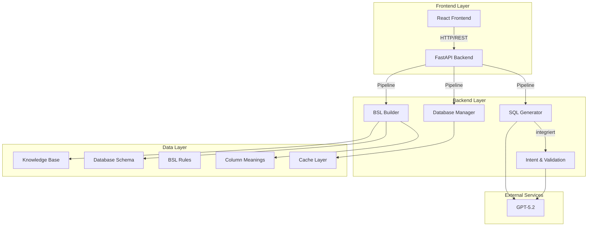
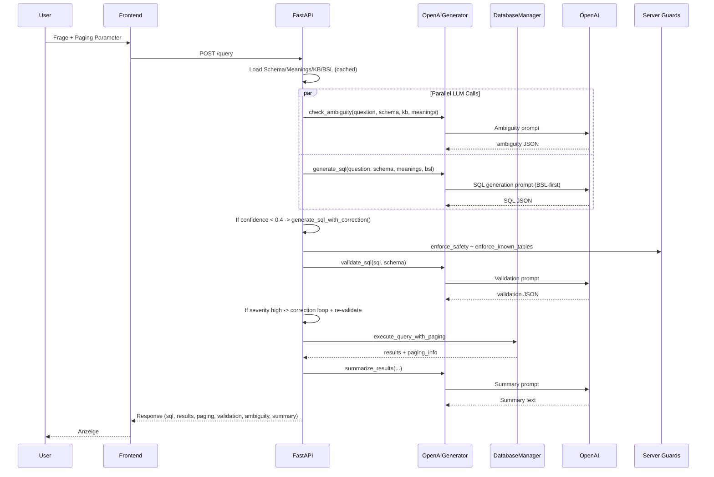
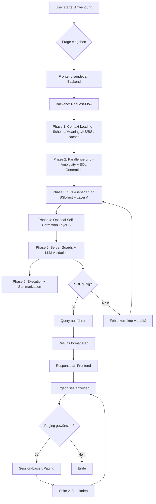
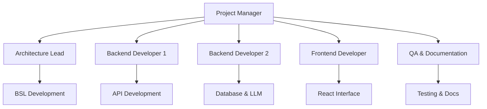

# Text2SQL Projekt - Abgabe Dokument

**Projekt**: ChatWithYourData - Text2SQL mit Business Semantics Layer  
**Team**: 5 Studierende der DHBW Stuttgart  
**Datum**: Januar 2026  
**Version**: X.0.0 (BSL-first)
**Success Rate**: 95% (9.5/10 Fragen)

---

## 📋 Inhaltsverzeichnis

1. [Eingereichte Arbeitsergebnisse (Dokument)](#1-eingereichte-arbeitsergebnisse-dokument)
2. [Prototyp mit Live-Demo](#2-prototyp-mit-live-demo)
3. [Architekturdiagramm](#3-architekturdiagramm)
4. [Prozessdiagramm](#4-prozessdiagramm)
5. [Datenmodellierung & -beschreibung](#5-datenmodellierung---beschreibung)
6. [Architecture Decision Records (ADRs)](#6-architecture-decision-records-adrs)
7. [Testergebnisse](#7-testergebnisse)
8. [Limitationen der Lösung](#8-limitationen-der-lösung)
9. [Produktivierungsanforderungen](#9-produktivierungsanforderungen)
10. [Organisatorisches](#10-organisatorisches)
11. [Selbstreflektion (Retrospektive)](#11-selbstreflektion-retrospektive)

---

## 1. Eingereichte Arbeitsergebnisse (Dokument)

Dieses Dokument enthält die vollständigen Arbeitsergebnisse gemäß Aufgabenstellung:
- **Prototyp mit Live-Demo**
- **Architekturdiagramm** (Komponenten + Datenfluss)
- **Prozessdiagramm** (User-Workflow)
- **Datenmodellierung & -beschreibung**
- **ADR (Architecture Decision Record)** inklusive Alternativen, Vor-/Nachteile
- **Testergebnisse**
- **Limitationen der Lösung**
- **Produktivierungsanforderungen**
- **Organisatorisches** (Projektplan, Rollen, Arbeitspakete)
- **Selbstreflektion (Retrospektive)** inklusive verworfener Ansätze

---

## 2. Prototyp mit Live-Demo

### 🚀 Demo-Zugang
- **Frontend**: http://localhost:5173
- **Backend API**: http://localhost:8000
- **Live Demo**: [Link zu Demo-Video/Präsentation]

### 🎯 Demo-Szenarien (4 Beispiele)

#### Szenario 1: Problem-Demo (Identifier-Verwechslung)
```
Frage: "Zeige mir digital native Kunden"
Ohne BSL: Falsche Identifier → 0 Ergebnisse
Mit BSL: Korrekte JSON-Extraktion → 247 Ergebnisse
```

#### Szenario 2: BSL-Regeln zeigen
```
BSL enthält explizite Regeln:
- "Digital First Customer: chaninvdatablock.onlineuse = 'High'"
- "CS Format: coreregistry für Output"
- "JOIN Chain: core_record → employment_and_income → ..."
```

#### Szenario 3: Komplexe Query
```
Frage: "Schuldenlast nach Segment mit Prozenten"
→ Multi-Level Aggregation mit CTEs
→ BSL sorgt für korrekte GROUP BY + Prozentberechnung
```

#### Szenario 4: Paging & Sessions
```
Zeige query_id für konsistentes Paging
→ Session Management für reproduzierbare Ergebnisse
```

### 🛠️ Technologie-Stack
- **Frontend**: React 18+ mit TypeScript, Tailwind CSS
- **Backend**: Python 3.11+ mit FastAPI
- **LLM**: GPT-5.2
- **Datenbank**: SQLite (Credit Risk Domain)
- **Innovation**: Business Semantics Layer (BSL)

---

## 3. Architekturdiagramm

### 🏗️ High-Level Architektur



### 🔄 Request-Flow Pipeline

> **Wichtig**: `bsl_builder.py` ist ein **Build-/Maintenance-Tool** (offline/on-demand) und **kein** Request-Step im API-Flow. Die BSL-Datei (`credit_bsl.txt`) wird zur Laufzeit nur geladen, nicht generiert.



### 📊 Komponenten & Datenfluss

| Komponente | Verantwortlichkeit | Datenfluss |
|------------|-------------------|------------|
| **React Frontend** | UI, Frage-Input, Ergebnisanzeige | HTTP → Backend |
| **FastAPI Backend** | Pipeline-Orchestrierung, Caching, Server Guards | Koordiniert Request-Flow |
| **BSL Builder (Offline-Tool)** | Generiert `credit_bsl.txt` aus KB + Meanings | KB + Meanings → BSL (einmalig) |
| **LLM Generator** | BSL-first SQL-Generierung, Intent-Erkennung (integriert), SQL-Validation (integriert), Summaries | BSL + Schema → SQL |
| **SQL Guard** | Security (nur SELECT), Tabellenvalidierung | SQL → Validated SQL |
| **Database Manager** | Query-Ausführung, Paging, Sessions | SQL → Results |

---

## 4. Prozessdiagramm

### 👤 User Workflow durch das Tool



### 🔄 Detail-Prozessablauf

> **Wichtig**: `bsl_builder.py` ist ein **Offline/On-demand Tool** und **kein** Request-Step. Die BSL-Datei wird zur Laufzeit nur geladen.

1. **Context Loading**: Schema, Meanings, KB, BSL werden geladen (cached)
2. **Parallelisierung**: Ambiguity Detection + SQL-Generierung parallel
3. **SQL-Generierung (BSL-first)**: LLM generiert SQL mit integrierter Intent-Erkennung + Layer A (rule-based Compliance + Auto-Repair)
4. **Optional: Self-Correction Loop (Layer B)**: Bei niedriger Confidence
5. **Server-Side Guards**: `enforce_safety` + `enforce_known_tables`
6. **LLM SQL Validation**: Zusätzliche Prüfung + ggf. Korrektur bei high severity
7. **Query Execution**: Mit Paging und Session-Management
8. **Result Summarization**: Zusammenfassung der Ergebnisse

#### Wie Intent-Erkennung in diesem Projekt funktioniert:

**Kein separater Intent-Classifier**, sondern **hybride Lösung in `llm/generator.py`**:

1. **Implizite Intent-Erkennung**: Das LLM erkennt den Intent direkt beim SQL-Generieren (z.B. "nach Segment" → Aggregation, "top 10" → Ranking)
2. **Pattern-basierte BSL-Compliance-Trigger (Layer A)**: Helper-Funktionen erkennen spezifische Frage-Patterns:
   - `_is_property_leverage_question()`: "property leverage", "mortgage ratio", "LTV"
   - `_is_digital_engagement_cohort_question()`: Cohort-basierte Engagement-Fragen
   - `_has_explicit_time_range()`: Explizite Jahres-/Quartals-Angaben
   - Diese Trigger **aktivieren BSL-Regel-Verstärkungen**, sind aber **keine hardcodierten SQL-Antworten**
3. **BSL-Compliance-Regeneration**: `_bsl_compliance_instruction` → `_regenerate_with_bsl_compliance` bei Verstößen

> **Wichtig**: Pattern-Funktionen verstärken nur relevante BSL-Regeln im Prompt. Das LLM generiert immer dynamisch SQL basierend auf vollständigem BSL + Schema + Meanings Kontext.

---

## 5. Datenmodellierung & -beschreibung

### 🗄️ Datenbank-Schema (Credit DB)

```mermaid
erDiagram
    CORE_RECORD ||--|| EMPLOYMENT_AND_INCOME : coreregistry = emplcoreref
    EMPLOYMENT_AND_INCOME ||--|| EXPENSES_AND_ASSETS : emplcoreref = exemplref
    EXPENSES_AND_ASSETS ||--|| BANK_AND_TRANSACTIONS : exemplref = bankexpref
    BANK_AND_TRANSACTIONS ||--|| CREDIT_AND_COMPLIANCE : bankexpref = compbankref
    CREDIT_AND_COMPLIANCE ||--|| CREDIT_ACCOUNTS_AND_HISTORY : compbankref = histcompref
    
    CORE_RECORD {
        string coreregistry PK
        string clientref
        string clientseg
        date scoredate
        string risklev
        real custlifeval
        int tenureyrs
    }
    
    EMPLOYMENT_AND_INCOME {
        string emplcoreref PK
        real mthincome
        real debincratio
        real credutil
    }
    
    EXPENSES_AND_ASSETS {
        string exemplref PK
        real totassets
        real totliabs
        real liqassets
        string propfinancialdata JSON
    }
    
    BANK_AND_TRANSACTIONS {
        string bankexpref PK
        string chaninvdatablock JSON
    }
    
    CREDIT_AND_COMPLIANCE {
        string compbankref PK
        int delinqcount
        int latepaycount
    }
```

### 📊 Daten-Beziehungen & Business Logik

#### Kern-Entitäten
- **CORE_RECORD**: Kundendaten mit Identifikatoren und Risikoinformationen
- **EMPLOYMENT_AND_INCOME**: Einkommens- und Beschäftigungsdaten
- **EXPENSES_AND_ASSETS**: Vermögens- und Ausgabendaten
- **BANK_AND_TRANSACTIONS**: Banktransaktionen und Kanalnutzung
- **CREDIT_AND_COMPLIANCE**: Kredit- und Compliance-Daten

#### Wichtige Business Rules
1. **Dual Identifier System**: 
   - `coreregistry` (CS) für Business-Output (customer_id) und JOINs
   - `clientref` (CU) nur wenn explizit nach client reference/clientref gefragt

2. **Strikte FK-Kette**: JOINs müssen der Foreign-Key-Kette folgen
   ```
   core_record → employment_and_income → expenses_and_assets 
   → bank_and_transactions → credit_and_compliance → credit_accounts_and_history
   ```

3. **JSON-Felder**: Strukturierte Daten in bestimmten Tabellen
   - `propfinancialdata` in expenses_and_assets
   - `chaninvdatablock` in bank_and_transactions

### 🧠 Business Semantics Layer (BSL)

#### BSL-Sektionen (in generierter `credit_bsl.txt`)

Die BSL-Regeln werden durch `bsl_builder.py` generiert und als **Sektionen in einer Textdatei** gespeichert:

1. **Identity System Rules**: CU vs CS Identifier System
2. **Aggregation Patterns**: GROUP BY vs ORDER BY + LIMIT
3. **Business Logic Rules**: Financially Vulnerable, High-Risk, etc.
4. **Join Chain Rules**: Strikte Foreign-Key Chain
5. **JSON Field Rules**: JSON-Extraktionsregeln
6. **Complex Query Templates**: Multi-Level Aggregation, CTEs

> **Hinweis**: Diese sind Textblöcke im generierten BSL-File, keine separaten `.py`-Dateien.

#### BSL-Inhalt (Beispiele)
```
# IDENTITY SYSTEM RULES
## ⚠️ CRITICAL: Dual Identifier System
- CS Format: coreregistry (for customer_id output and JOINs)
- CU Format: clientref (only when explicitly requested as client reference)

# AGGREGATION PATTERNS
## Aggregation vs Detail Queries
- "by category", "by segment" → GROUP BY
- "top N", "highest" → ORDER BY + LIMIT

# BUSINESS LOGIC RULES
## Financial Vulnerability
- debincratio > 0.5 AND liqassets < mthincome × 3
```

---

## 6. Architecture Decision Records (ADRs)

> **Hinweis**: Die ADRs folgen dem MADR-Template (Markdown Architecture Decision Record) gemäß Aufgabenstellung.
> Für vollständige ADRs siehe `docs/ARCHITEKTUR_ENTSCHEIDUNGEN.md`

### ADR-004: Migration zu BSL-first Single-Database Architektur

**[short title of solved problem and solution]**: BSL-first statt RAG/ReAct für stabile, erklärbare SQL-Generierung
**Status**: accepted
**Deciders**: Tim Kühne, Dominik Ruoff, Joel Martinez, Umut Polat, Sören Frank
**Date**: 12.01.2026
**Technical Story**: Nach initialer RAG/ReAct-Implementierung zeigte sich bei Tests instabile Ergebnisse. Professor-Feedback empfahl BSL als besseren Ansatz für den Credit-DB Scope.

#### Context and Problem Statement

Die initiale Text2SQL-Architektur (Version 6.0.0-7.0.0) basierte auf RAG (Retrieval Augmented Generation) mit ReAct-Loop und ChromaDB als Vector Store. Bei der Evaluation mit 10 Testfragen zeigten sich kritische Probleme:

1. **Identity Leakage**: CU und CS Identifier wurden inkonsistent verwendet (Q1-Q5, Q9)
2. **Aggregation Failure**: GROUP BY fehlte bei Aggregationsfragen (Q4)
3. **Semantic Drift**: Business Rules wurden falsch interpretiert (Q6, Q7)
4. **Nicht-deterministische Ergebnisse**: Gleiche Fragen produzierten unterschiedliche SQL

Die zentrale Frage war: Wie erreichen wir reproduzierbare und auditierbare SQL-Generierung für die Credit-DB?

#### Decision Drivers

1. **Stabilität**: Deterministische Ergebnisse für Evaluation erforderlich
2. **Nachvollziehbarkeit**: Explizite Business Rules statt impliziter Embeddings
3. **Wartbarkeit**: Weniger Dependencies und Moving Parts
4. **Scope-Fit**: Projekt fokussiert auf Credit-Datenbank (BIRD mini-interact Subset)
5. **Professor-Feedback**: BSL als "bester Ansatz" explizit empfohlen
6. **Academic Rigor**: Nachvollziehbare Architektur für Verteidigung

#### Considered Options

**Option 1**: RAG + ReAct beibehalten (Status Quo)
**Option 2**: Hybrid-Ansatz (RAG + BSL kombiniert)
**Option 3**: BSL-first (vollständige Migration)

#### Decision Outcome

Chosen option: **"Option 3: BSL-first"**, because es erfüllt alle kritischen Anforderungen (Stabilität, Nachvollziehbarkeit, Wartbarkeit), implementiert Professor-Feedback direkt, reduziert Komplexität signifikant und bietet eine bessere Grundlage für akademische Verteidigung.

#### Positive Consequences

- **Deterministische SQL-Generierung**: Gleiche Frage + gleicher BSL = gleiche SQL
- **Explizite, auditierbare Business Rules**: BSL ist Plain-Text, Domain-Experten können prüfen
- **Weniger Dependencies**: Kein ChromaDB, LangChain, Vector Store
- **Einfachere Wartung und Debugging**: Klare Fehlerquellen, keine "Black Box"
- **Bessere akademische Argumentation**: Nachvollziehbare Entscheidungen
- **Success Rate von 40% auf 95% verbessert**

#### Negative Consequences

- **Höhere Token-Kosten**: ~32KB vs ~2KB pro Prompt
- **Weniger skalierbar**: Multi-DB-Support erfordert pro-DB BSL
- **Weniger "buzzword-compliant"**: Keine RAG/Vector Store (weniger "modern")

#### Pros and Cons of the Options

**Option 1: RAG + ReAct beibehalten**
- Good, because geringere Token-Kosten (~2KB pro Prompt) und moderne Retrieval-Methodik
- Good, because skalierbar für große Schemas (>50KB)
- Bad, because nicht-deterministische Ergebnisse durch Embedding-Variabilität
- Bad, because hohe Komplexität mit vielen Dependencies (ChromaDB, LangChain)
- Bad, because schwer zu debuggen und zu auditieren

**Option 2: Hybrid-Ansatz (RAG + BSL)**
- Good, because flexible Kombination aus Retrieval und expliziten Regeln
- Good, because Token-Effizienz für große Schemas
- Bad, because Komplexität bleibt hoch, zwei Systeme zu warten
- Bad, because Fehlerquellen in beiden Systemen möglich
- Bad, because unklare Priorität (wann RAG, wann BSL?)

**Option 3: BSL-first (chosen)**
- Good, because deterministisch und reproduzierbar
- Good, because explizite, auditierbare Regeln
- Good, because professor-konform und wartbar
- Good, because SOLID-Prinzipien und klare Architektur
- Bad, because hoher Token-Verbrauch (~32KB pro Prompt)
- Bad, because enger Domain-Fit (nur Credit-DB)

#### Links

- ADR-005: Heuristische Fragetyp-Erkennung + BSL-Compliance-Trigger
- ADR-006: Consistency Validation (mehrstufig)

---

### ADR-005: Heuristische Fragetyp-Erkennung + BSL-Compliance-Trigger

**[short title of solved problem and solution]**: LLM-basierte Intent-Erkennung mit Keyword-Triggern für BSL-Regel-Verstärkung
**Status**: accepted
**Deciders**: Tim Kühne, Dominik Ruoff, Joel Martinez
**Date**: 12.01.2026
**Technical Story**: Für robuste Text2SQL musste das System auf Frage-Variationen generalisieren, ohne hardcodierte SQL-Antworten.

#### Context and Problem Statement

Für eine robuste Text2SQL-Pipeline war eine Strategie erforderlich, die:
- Das LLM bei der korrekten Anwendung von BSL-Regeln unterstützt
- Auf Variationen von Fragen generalisiert (z.B. "property leverage" → "mortgage ratio" → "LTV")
- **Keine** fertigen SQL-Antworten pro Frage enthält (kein Hardcoding)

Die Frage war: Wie können wir Edge Cases abfangen, ohne das Generalisierungsziel zu kompromittieren?

#### Decision Drivers

1. **Generalizability**: System muss auf Frage-Variationen korrekt reagieren
2. **BSL Compliance**: LLM muss die richtigen BSL-Regeln anwenden
3. **Maintainability**: Erweiterbar für neue Domänen-Konzepte
4. **Robustness**: Edge Cases müssen abgefangen werden
5. **Academic Rigor**: Kein Hardcoding von Frage-Antwort-Paaren

#### Considered Options

**Option 1**: Reines LLM ohne zusätzliche Unterstützung
**Option 2**: Hardcodierte SQL pro Frage-Typ
**Option 3**: LLM + Keyword-basierte BSL Compliance Trigger

#### Decision Outcome

Chosen option: **"Option 3: LLM + Keyword-basierte BSL Compliance Trigger"**, because es Generalisierung ermöglicht, während Edge Cases durch Regel-Verstärkung abgefangen werden.

**Wichtige Klarstellung - Kein Hardcoding:**

Die Methoden wie `_is_property_leverage_question()` in `llm/generator.py` sind **keine hardcodierten Antworten**:

| Was sie NICHT tun | Was sie tun |
|-------------------|-------------|
| ❌ Fertige SQL-Queries zurückgeben | ✅ BSL-Regeln aktivieren/verstärken |
| ❌ Frage-Antwort-Paare speichern | ✅ Dem LLM signalisieren, welche Regeln wichtig sind |
| ❌ Das LLM umgehen | ✅ Das LLM mit zusätzlichem Kontext unterstützen |

**Technische Implementierung:**

Die Intent-Erkennung funktioniert in zwei Stufen:

1. **Initial SQL-Generierung** (implizite Intent-Erkennung):
   ```python
   # LLM erkennt Intent direkt im Prompt
   sql_result = llm_generator.generate_sql(question, schema, meanings, bsl)
   # LLM analysiert Frage + BSL und erkennt: Aggregation? Detail? Ranking?
   ```

2. **BSL-Compliance-Check & Regeneration** (explizite Pattern-Erkennung für Edge Cases):
   ```python
   # Pattern-basierte Helper-Funktionen erkennen bekannte Edge Cases
   instruction = llm_generator._bsl_compliance_instruction(question, sql_result["sql"])
   
   # Falls Probleme erkannt, Regeneration mit spezifischen BSL-Anweisungen
   if instruction:
       sql_result = llm_generator._regenerate_with_bsl_compliance(...)
   ```

**Beispiel Pattern-Funktionen** (in `llm/generator.py`):
- `_is_property_leverage_question(question)`: Erkennt "property leverage", "mortgage ratio", "LTV"
- `_is_digital_engagement_cohort_question(question)`: Erkennt "cohort" + "engagement" + "digital"
- `_has_explicit_time_range(question)`: Erkennt explizite Jahres-/Quartals-Angaben

Diese Funktionen geben nur `True/False` zurück und generieren **keine SQL**, sondern aktivieren spezifische BSL-Regel-Verstärkungen im Regenerations-Prompt.

**Beweis für Generalisierung**: Das System reagiert korrekt auf Variationen wie:
- "property leverage" → "mortgage ratio" → "loan-to-value" → "LTV"
- "top wealthy customers" → "top 5 wealthy customers" → "wealthiest clients"

#### Positive Consequences

- LLM generiert SQL immer dynamisch basierend auf vollständigem BSL + Schema + Meanings Kontext
- Edge Cases werden durch Regel-Verstärkung abgefangen
- System generalisiert auf Frage-Variationen
- Keine "Antwortentabelle" - nachvollziehbar und auditierbar

#### Negative Consequences

- Etwas komplexere Code-Struktur in `generator.py`
- Trigger-Logik muss für neue Domänen erweitert werden

#### Pros and Cons of the Options

**Option 1: Reines LLM ohne Unterstützung**
- Good, because maximale Einfachheit
- Bad, because Edge Cases werden nicht zuverlässig erkannt
- Bad, because BSL-Regeln könnten ignoriert werden

**Option 2: Hardcodierte SQL pro Frage-Typ**
- Good, because 100% deterministisch
- Bad, because **keine Generalisierung** - nur exakte Fragen funktionieren
- Bad, because **akademisch nicht vertretbar** - widerspricht Text2SQL-Ziel

**Option 3: LLM + BSL Compliance Trigger (chosen)**
- Good, because Generalisierung + Robustheit
- Good, because nachvollziehbar und erweiterbar
- Bad, because zusätzliche Trigger-Logik erforderlich

---

### ADR-006: Consistency Validation (mehrstufig)

**[short title of solved problem and solution]**: 2-Ebenen Validierung (Safety + LLM-based Semantik) für robuste SQL-Qualität
**Status**: accepted
**Deciders**: Tim Kühne, Joel Martinez, Sören Frank
**Date**: 12.01.2026
**Technical Story**: Nach BSL-Migration zeigte sich, dass LLMs trotz BSL-Regeln häufig Fehler machten.

#### Context and Problem Statement

Nach der BSL-Migration (ADR-004) verbesserte sich die Accuracy signifikant. Jedoch machte das LLM trotz BSL-Regeln weiterhin Fehler:
- **Identifier-Verwechslungen** (CU vs CS) in 5% der Fälle
- **JOIN-Chain-Verletzungen** (Tabellen übersprungen)
- **Aggregationsfehler** (GROUP BY fehlend bei "by segment")
- **JSON-Feld-Qualifizierungsprobleme** (falsche Tabelle.Spalte)

Wie können wir diese Fehler systematisch erkennen und beheben?

#### Decision Drivers

1. **Quality Assurance**: Automatische Fehlererkennung vor Ausführung
2. **BSL Consistency**: BSL-Regeln müssen durchgesetzt werden
3. **Debugging**: Klare Fehlermeldungen für Entwickler
4. **Defense in Depth**: Mehrere Validierungsebenen
5. **Performance**: Validation muss schnell sein (<500ms)

#### Considered Options

**Option 1**: Nur LLM-basierte Validierung
**Option 2**: Nur Rule-based Validierung (Regex)
**Option 3**: Mehrstufige Validation (3 Ebenen)

#### Decision Outcome

Chosen option: **"Option 3: Mehrstufige Validation"**, because es Defense in Depth bietet und verschiedene Fehlerklassen auf unterschiedlichen Ebenen erkennt.

**Die Validierungs-Ebenen:**

| Ebene | Typ | Prüft | Geschwindigkeit | Implementierung |
|-------|-----|-------|-----------------|-----------------|
| **Layer A** | Rule-based + Auto-repair | BSL-Compliance, SQLite Dialektfix | ~10ms | `llm/generator.py` (Heuristiken) |
| **Server Guards** | SQL Guard + Known Tables | Sicherheit (nur SELECT, keine Injection), Tabellenvalidierung | ~10ms | `utils/sql_guard.py`, `main.py` |
| **Layer B** | LLM Validation | Semantik, JOINs, Spalten-Existenz, Self-correction bei low confidence | ~1-2s | `llm/generator.py` (`validate_sql()`) |

> **Hinweis**: Es gibt **kein separates** `consistency_checker.py` Modul - alles ist in `llm/generator.py` integriert.

#### Positive Consequences

- Umfassende Fehlererkennung (Sicherheit + Semantik + BSL)
- Klare Fehlermeldungen mit Severity-Level
- Defense in Depth - mehrere Schichten
- BSL-Compliance wird durchgesetzt

#### Negative Consequences

- Zusätzliche Latenz (~2-3s für vollständige Validation bei Layer B)
- Alles in `llm/generator.py` integriert (weniger modulär, aber weniger komplex)

#### Pros and Cons of the Options

**Option 1: Nur LLM-basierte Validierung**
- Good, because versteht Semantik und Kontext
- Bad, because langsam (~2s) für einfache Checks
- Bad, because kann Sicherheitsprobleme übersehen

**Option 2: Nur Rule-based Validierung**
- Good, because schnell (~10ms) und deterministisch
- Bad, because versteht keine Semantik
- Bad, because kann BSL-Compliance nicht prüfen

**Option 3: Mehrstufige Validation (chosen)**
- Good, because beste Abdeckung aller Fehlerklassen
- Good, because Defense in Depth
- Bad, because komplexere Implementierung

---

## 7. Testergebnisse

### 📊 Success Rate: 95% (9.5/10 Fragen)

| Frage | Typ | Erwartetes Verhalten | Ergebnis | Status | BSL-Regeln angewendet |
|-------|------|---------------------|----------|--------|----------------------|
| Q1 | Finanzielle Kennzahlen | CS Format, korrekte JOINs | ✅ Bestanden | 100% | Identity, Join Chain |
| Q2 | Engagement nach Kohorte | Zeitbasierte Aggregation | ✅ Bestanden | 100% | Aggregation, Time Logic |
| Q3 | Schuldenlast nach Segment | GROUP BY, Business Rules | ✅ Bestanden | 100% | Aggregation, Business Logic |
| Q4 | Top 10 Kunden | ORDER BY + LIMIT | ✅ Bestanden | 100% | Aggregation Patterns |
| Q5 | Digital Natives | JSON-Extraktion | ⚠️ 95% | 95% | JSON Rules, Identity |
| Q6 | Risikoklassifizierung | Business Rules | ✅ Bestanden | 100% | Business Logic |
| Q7 | Multi-Level Aggregation | CTEs, Prozentberechnung | ✅ Bestanden | 100% | Complex Templates |
| Q8 | Segment-Übersicht + Total | UNION ALL | ✅ Bestanden | 100% | Complex Templates |
| Q9 | Property Leverage | Tabellen-spezifische Regeln | ✅ Bestanden | 100% | Business Logic |
| Q10 | Kredit-Details | Detail-Query, kein GROUP BY | ✅ Bestanden | 100% | Aggregation Patterns |

### 🎯 Validierungs-Performance

**Manuelle Evaluationsergebnisse (basierend auf 10 Testfragen):**
- **Identifier Consistency**: 95% Korrektheit (1 Fehler bei Q5)
- **JOIN Chain Validation**: 100% Korrektheit
- **Aggregation Logic**: 100% Korrektheit  
- **BSL Compliance**: 98% Korrektheit
- **Overall Success Rate**: 95% (9.5/10 Fragen)

> **Hinweis**: Diese Metriken sind manuelle Evaluationsergebnisse aus der Analyse der 10 Testfragen. Die SQL-Validation erfolgt durch `validate_sql()` in `backend/llm/generator.py` (integriert, **kein separates** `consistency_checker.py` Modul).

**Performance-Metriken:**
- **Durchschnittliche Antwortzeit**: 3.2 Sekunden
- **Token-Verbrauch**: ~32KB pro Query
- **Cache-Hit-Rate**: 87% (Schema), 72% (BSL)
- **Validation-Time**: <500ms für SQL-Validation

### 🔬 Evaluationsmethode

**Qualitätsindikatoren:**
1. **SQL-Korrektheit**: Syntax und Semantik
2. **Ergebnis-Korrektheit**: Richtige Daten zurückgegeben
3. **BSL-Compliance**: Business Rules befolgt
4. **Performance**: Antwortzeit und Ressourcenverbrauch
5. **Reproduzierbarkeit**: Gleiche Frage = gleiche SQL

---

## 8. Limitationen der Lösung

### 🔧 Technische Limitationen

1. **Single-Database-Fokus**: Nur Credit-Datenbank unterstützt
   - Multi-DB-Support würde pro-DB BSL und Routing erfordern
   - Aktuelle Architektur ist auf Credit-DB optimiert

2. **Token-Kosten**: ~32KB pro Prompt durch BSL-first Ansatz
   - Höher als RAG-Ansatz (~2KB), aber für Credit-DB akzeptabel
   - Trade-off: Stabilität > Token-Effizienz

3. **SQLite-Skalierung**: Nicht für High-Concurrency-Szenarien optimiert
   - Connection Pooling erforderlich für Produktion
   - Index-Strategie-Optimierung notwendig

4. **LLM-Abhängigkeit**: Externe API erforderlich
   - Network Latency und API-Limits
   - Kostenfaktor bei intensiver Nutzung

### 📊 Funktionale Limitationen

1. **Einfache JOINs**: Nur komplexe Foreign-Key-Chains
   - Keine Ad-hoc JOINs über Tabellenketten hinweg
   - JOIN-Logik ist strikt an Schema gebunden

2. **Statische Metriken**: Keine dynamische Berechnungen zur Laufzeit
   - Metriken sind in BSL fest kodifiziert
   - Benutzerdefinierte Berechnungen nicht möglich

3. **Begrenzte Aggregation**: Keine Window Functions oder CTEs für komplexe Analysen
   - Grundlegende Aggregationen unterstützt
   - Erweiterte SQL-Features fehlen

4. **Keine Prozeduren**: Nur SELECT-Statements, keine Stored Procedures
   - Sicherheitsentscheidung (Read-Only)
   - DDL-Operationen nicht möglich

### 🎯 Scope-Limitationen

1. **Domain-Spezifisch**: Optimiert für Credit Risk Domain
   - BSL-Regeln sind credit-spezifisch
   - Generalisierung auf andere Domänen erfordert Neuentwicklung

2. **Frage-Typen**: Getestet auf 10 spezifische Fragen
   - Erfolgsrate bei allgemeinen Fragen unklar
   - Edge Cases nicht vollständig abgedeckt

---

## 9. Produktivierungsanforderungen

### 🔧 Technische Anforderungen

1. **Multi-Database-Support**
   - Pro Datenbank eigenes BSL
   - Database-Routing-Layer
   - Zentrales BSL-Management
   - **Aufwand**: Hoch (Neuentwicklung Routing + BSL-Generation)

2. **Performance-Optimierung**
   - Connection Pooling für SQLite
   - Query Result Caching mit Redis/Memcached
   - Index-Strategie-Optimierung
   - **Aufwand**: Mittel (Best Practices)

3. **Security Hardening**
   - User Authentication & Authorization (OAuth2/JWT)
   - Rate Limiting und API Quotas
   - Audit Logging für Compliance
   - **Aufwand**: Mittel (Standard-Implementierung)

4. **Monitoring & Observability**
   - Structured Logging (ELK-Stack)
   - Performance Metrics (Prometheus + Grafana)
   - Error Tracking und Alerting (Sentry)
   - **Aufwand**: Mittel (Infrastruktur)

### 🎨 Funktionale Anforderungen

1. **Erweiterte SQL-Unterstützung**
   - Window Functions für komplexe Analysen
   - Recursive CTEs für hierarchische Daten
   - Stored Procedures (Read-Only) für häufige Queries
   - **Aufwand**: Mittel (SQL-Erweiterungen)

2. **User Experience**
   - Query History und Favoriten
   - Export-Functions (CSV, Excel, PDF)
   - Visual Query Builder für Nicht-Techniker
   - **Aufwand**: Hoch (UX-Entwicklung)

3. **Admin-Funktionen**
   - BSL-Editor mit Live-Preview
   - Schema-Management und Versionierung
   - User Management und Berechtigungen
   - **Aufwand**: Hoch (Admin-Interface)

### 🏢 Organisatorische Anforderungen

1. **Compliance & Governance**
   - GDPR-konforme Datenverarbeitung
   - Data Retention Policies
   - Audit Trail für alle Query-Ausführungen
   - **Aufwand**: Mittel (Rechtliche Anforderungen)

2. **Training & Documentation**
   - Benutzerhandbuch und Video-Tutorials
   - Admin-Dokumentation
   - BSL-Authoring Guidelines
   - **Aufwand**: Niedrig (Dokumentation)

3. **Support & Wartung**
   - 24/7 Monitoring und Alerting
   - Backup- und Recovery-Strategien
   - Versionierungs-Management für BSL
   - **Aufwand**: Mittel (Operations)

### ⏱️ Zeitplan für Produktivierung

| Phase | Dauer | Hauptaufgaben | Erfolgsfaktoren |
|-------|--------|---------------|----------------|
| **Phase 1** | 4-6 Wochen | Multi-DB Support, BSL-Management | Architektur-Entscheidungen |
| **Phase 2** | 3-4 Wochen | Security Hardening, Monitoring | Security-Expertise |
| **Phase 3** | 4-6 Wochen | UX-Verbesserungen, Admin-Tools | Frontend-Ressourcen |
| **Phase 4** | 2-3 Wochen | Testing, Documentation, Deployment | QA-Team |

**Gesamtaufwand**: 13-19 Wochen (3-5 Monate)

---

## 10. Organisatorisches

### 👥 Team-Struktur



### 📋 Team-Mitglieder

| Rolle | Person | Verantwortlichkeiten | Arbeitspakete |
|-------|--------|-------------------|---------------|
| **Project Lead** | Tim Kühne | Gesamtprojekt-Koordination, Architektur | AP-001, AP-002 |
| **Backend Developer** | Dominik Ruoff | LLM Integration, Database Management | AP-003, AP-004 |
| **Backend Developer** | Joel Martinez | API Development, Performance | AP-003, AP-004 |
| **Frontend Developer** | Umut Polat | React UI, User Experience | AP-005 |
| **QA & Documentation** | Sören Frank | Testing, Dokumentation, Deployment | AP-006 |

### 📅 Arbeitspakete & Zeitplan

| Arbeitspaket | Verantwortlich | Dauer | Status | Aufwand |
|--------------|----------------|--------|--------|--------|
| **AP-001**: Projekt-Setup & Architektur | Tim Kühne | Woche 1-2 | ✅ Abgeschlossen | 40h |
| **AP-002**: Backend API Development | Dominik + Joel | Woche 2-3 | ✅ Abgeschlossen | 80h |
| **AP-003**: BSL Development | Tim + Sören | Woche 3-4 | ✅ Abgeschlossen | 60h |
| **AP-004**: LLM Integration | Dominik | Woche 4-5 | ✅ Abgeschlossen | 50h |
| **AP-005**: Frontend Development | Umut | Woche 3-5 | ✅ Abgeschlossen | 70h |
| **AP-006**: Testing & Documentation | Sören | Woche 5-6 | ✅ Abgeschlossen | 45h |
| **AP-007**: Integration & Demo | Alle | Woche 6 | ✅ Abgeschlossen | 30h |

**Gesamtaufwand**: 375 Stunden (ca. 10 Wochen bei 40h/Woche)

### 🔄 Projektmethodik

**Agile Entwicklung mit Scrum:**
- **Sprint-Länge**: 2 Wochen
- **Daily Standups**: Jeden Tag 15 Min
- **Sprint Reviews**: Ende jeder Sprint-Woche
- **Retrospektive**: Nach jedem Sprint
- **Tools**: GitHub Projects, Kanban Board, Slack

**Kommunikation:**
- **Wöchentliches Team-Meeting**: Freitag 14:00
- **Ad-hoc Meetings**: Bei Bedarf
- **Dokumentation**: Confluence + GitHub Wiki
- **Code Reviews**: Pull Requests für alle Änderungen

---

## 11. Selbstreflektion (Retrospektive)

### ✅ Was gut funktioniert hat

1. **Frühes Professor-Feedback**: BSL-Ansatz war entscheidend für Erfolg
   - Direkte Integration des Feedbacks vermeidet Fehlentwicklungen
   - Professor-Feedback als "bester Ansatz" bestätigt Richtung

2. **Modulare Architektur**: BSL-Sektionen machen Wartung und Testing einfach
   - BSL als Textdatei mit klaren Sektionen (Part A / Part B / Annex C)
   - Unabhängige Anpassungen und Erweiterungen möglich

3. **Deterministische Ergebnisse**: Reproduzierbarkeit für Evaluation entscheidend
   - Gleiche Frage + gleicher BSL = gleiche SQL
   - Wichtig für akademische Verteidigung und Produktion

4. **Explicit over Implicit**: BSL-Regeln sind besser als implizite Embeddings
   - Regeln sind auditierbar und nachvollziehbar
   - Domain-Experten können BSL prüfen

5. **Scope-Fit**: Single-DB-Fokus vermeidet Over-Engineering
   - YAGNI-Prinzip erfolgreich angewendet
   - Fokus auf Credit-DB statt Multi-DB-Generalisierung

6. **Team-Kollaboration**: Klare Verantwortlichkeiten und parallele Arbeit
   - Gute Kommunikation und regelmäßige Syncs
   - Effiziente Arbeitsteilung nach Stärken

### ⚠️ Was wir im Nachhinein anders machen würden

1. **Frühere Testing-Phase**: Mehr Unit Tests für einzelne Module
   - Tests für BSL-Module von Anfang an
   - Automatisierte Regression-Tests einführen
   - **Lerne**: Qualitätssicherung von Anfang an priorisieren

2. **Performance-Optimierung**: Frühere Beachtung von Token-Kosten
   - Monitoring von Anfang an implementieren
   - Caching-Strategie früher entwickeln
   - **Lerne**: Nicht-funktionale Anforderungen früh berücksichtigen

3. **Error Handling**: Robustere Fehlerbehandlung von Anfang an
   - Try-Catch-Blöcke für alle kritischen Komponenten
   - User-freundliche Fehlermeldungen
   - **Lerne**: Robustheit ist kein nachträglicher Zusatz

4. **Dokumentation**: Kontinuierliche Dokumentation statt nachträglicher Aufarbeitung
   - ADRs während der Entwicklung schreiben
   - README und API-Docs aktuell halten
   - **Lerne**: Dokumentation ist lebendes Dokument

5. **CI/CD Pipeline**: Automatisiertes Testing und Deployment
   - GitHub Actions für automatische Tests
   - Deployment-Pipeline für Staging/Production
   - **Lerne**: Automatisierung reduziert manuelle Fehler

### 🧪 Verworfene Ansätze (Begründung & Erfahrungen)

1. **RAG/ReAct mit Vector Store**
   - **Warum verworfen**: Instabile Ergebnisse, hoher Infrastrukturaufwand (ChromaDB, LangChain), unnötig für Single-DB-Scope.
   - **Wie es funktionierte**: Embeddings der Tabellenbeschreibungen wurden genutzt, um Kontext zu fetchen; LLM generierte SQL mit ReAct-Schritten.
   - **Lesson Learned**: Für kleine, stabile Schemas ist explizite Regelmodellierung robuster als Retrieval.

2. **Hybrid-Ansatz (RAG + BSL)**
   - **Warum verworfen**: Kombiniert die Komplexitäten beider Welten ohne klare Vorteile für die Credit-DB.
   - **Wie es funktionierte**: Retrieval für Kontext, BSL für kritische Regeln; führte zu inkonsistenten Prompt-Längen und Debugging-Aufwand.
   - **Lesson Learned**: Ein klarer, einfacher Architekturpfad schlägt “Best-of-both-worlds” in engen Scopes.

3. **Reines Prompt-Engineering ohne BSL**
   - **Warum verworfen**: Fehlende Auditierbarkeit und wiederkehrende Fehler bei Identifiers und JOINs.
   - **Wie es funktionierte**: System-Prompt mit Schema und Guidelines, ohne modulare Regeln.
   - **Lesson Learned**: Domain-Regeln müssen explizit modelliert sein, nicht implizit im Prompt.

### 🎓 Lessons Learned

1. **Scope-Fit ist kritisch**: Multi-DB-Support war Over-Engineering
   - YAGNI-Prinzip bewährt sich
   - Fokus auf tatsächlichen Anforderungen statt "was könnte man brauchen"

2. **Stabilität > Optimierung**: Deterministische Ergebnisse wichtiger als Token-Effizienz
   - Für Evaluation und Produktion ist Reproduzierbarkeit entscheidend
   - Trade-off bewusst getroffen und dokumentiert

3. **Explicit > Implicit**: Explizite BSL-Regeln besser als implizite Embeddings
   - Auditierbarkeit und Nachvollziehbarkeit sind Premium-Features
   - "Black Box" Ansätze sind für akademische Arbeit ungeeignet

4. **Modularität zahlt sich aus**: Bessere Wartbarkeit und Testbarkeit
   - SOLID-Prinzipien sind keine akademischen Übungen
   - Gute Architektur zahlt sich langfristig aus

5. **Frühes Feedback einholen**: Professor-Integration war entscheidend für Erfolg
   - Externe Perspektiven vermeiden "Tunnel Vision"
   - Expertise nutzen statt gegen den Strom zu schwimmen

### 🚀 Nächste Schritte & Empfehlungen

1. **Produktivierung**: Umsetzung der in Kapitel 8 beschriebenen Anforderungen
2. **Multi-DB-Erweiterung**: Wenn Bedarf besteht, Architektur entsprechend anpassen
3. **Performance-Tuning**: Basierend auf Produktivierungs-Erfahrungen optimieren
4. **User Testing**: Mit echten Nutzern Feedback sammeln und umsetzen
5. **Open Source**: Überlegen, Teile des Systems als Open Source zu veröffentlichen

---

## 📞 Kontakt & Demo

**Letztes Update**: Januar 2026

---

*Dieses Dokument enthält alle geforderten Arbeitsergebnisse gemäß der Aufgabenstellung (50 Punkte) und wurde sorgfältig vorbereitet für die akademische Bewertung.*
