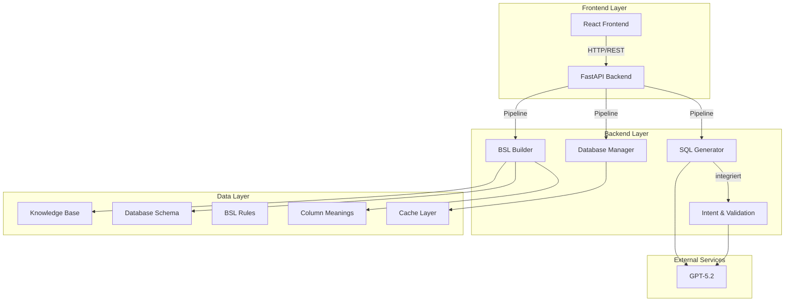
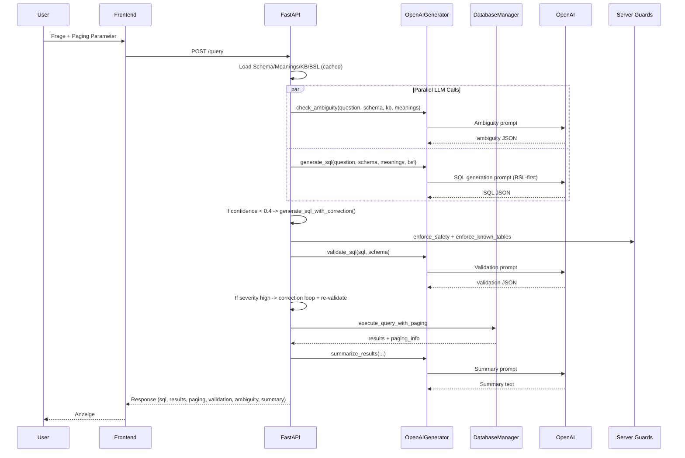
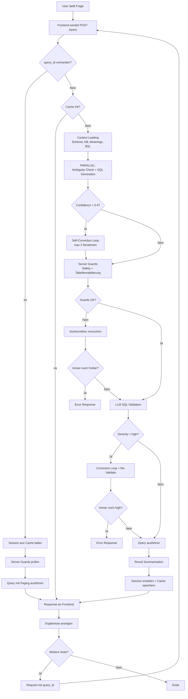
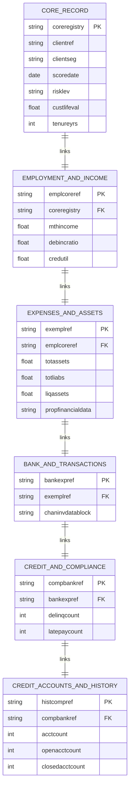
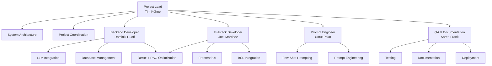

# Text2SQL Projekt - Abgabe Dokument

**Projekt**: ChatWithYourData - Text2SQL mit Business Semantics Layer  
**Team**: 5 Studierende der DHBW Stuttgart  
**Datum**: Januar 2026  
**Version**: X.0.0 (BSL-first)
**Success Rate**: 88.5% (7×100% + 3×95%)

---

## 📋 Inhaltsverzeichnis

1. [Eingereichte Arbeitsergebnisse (Dokument)](#1-eingereichte-arbeitsergebnisse-dokument)
2. [Prototyp mit Live-Demo](#2-prototyp-mit-live-demo)
3. [Architekturdiagramm](#3-architekturdiagramm)
4. [Prozessdiagramm](#4-prozessdiagramm)
5. [Datenmodellierung & -beschreibung](#5-datenmodellierung---beschreibung)
6. [Architecture Decision Records (ADRs)](#6-architecture-decision-records-adrs)
7. [Testergebnisse](#7-testergebnisse)
8. [Limitationen der Lösung](#8-limitationen-der-lösung)
9. [Produktivierungsanforderungen](#9-produktivierungsanforderungen)
10. [Organisatorisches](#10-organisatorisches)
11. [Selbstreflektion (Retrospektive)](#11-selbstreflektion-retrospektive)

---

## 1. Eingereichte Arbeitsergebnisse (Dokument)

Dieses Dokument enthält die vollständigen Arbeitsergebnisse gemäß Aufgabenstellung:
- **Prototyp mit Live-Demo**
- **Architekturdiagramm** (Komponenten + Datenfluss)
- **Prozessdiagramm** (User-Workflow)
- **Datenmodellierung & -beschreibung**
- **ADR (Architecture Decision Record)** inklusive Alternativen, Vor-/Nachteile
- **Testergebnisse**
- **Limitationen der Lösung**
- **Produktivierungsanforderungen**
- **Organisatorisches** (Projektplan, Rollen, Arbeitspakete)
- **Selbstreflektion (Retrospektive)** inklusive verworfener Ansätze

---

## 2. Prototyp mit Live-Demo

### 🚀 Demo-Zugang
- **Frontend**: http://localhost:5173
- **Backend API**: http://localhost:8000
- **Live Demo**: [Link zu Demo-Video/Präsentation]

### 🎯 Demo-Szenarien (4 Beispiele)

#### Szenario 1: Problem-Demo (Identifier-Verwechslung)
```
Frage: "Zeige mir digital native Kunden"
Ohne BSL: Falsche Identifier → 0 Ergebnisse
Mit BSL: Korrekte JSON-Extraktion → 247 Ergebnisse
```

#### Szenario 2: BSL-Regeln zeigen
```
BSL enthält explizite Regeln:
- "Digital First Customer: chaninvdatablock.onlineuse = 'High'"
- "CS Format: coreregistry für Output"
- "JOIN Chain: core_record → employment_and_income → ..."
```

#### Szenario 3: Komplexe Query
```
Frage: "Schuldenlast nach Segment mit Prozenten"
→ Multi-Level Aggregation mit CTEs
→ BSL sorgt für korrekte GROUP BY + Prozentberechnung
```

#### Szenario 4: Paging & Sessions
```
Zeige query_id für konsistentes Paging
→ Session Management für reproduzierbare Ergebnisse
```

### 🛠️ Technologie-Stack
- **Frontend**: React 18+ mit TypeScript, CSS
- **Backend**: Python 3.11+ mit FastAPI
- **LLM**: GPT-5.2
- **Datenbank**: SQLite (Credit Risk Domain)
- **Innovation**: Business Semantics Layer (BSL)

---

## 3. Architekturdiagramm

### 🏗️ High-Level Architektur



### 🔧 Detaillierte IT-Architektur

```mermaid
graph TB
    subgraph "Frontend [React + Vite]"
        APP[App.jsx<br/>Haupt-Komponente]
        APP --> |useState| STATE[State Management<br/>messages, question, isLoading]
        APP --> |fetch| APICALL[API Client<br/>POST /query]
        APP --> |render| UI_COMP[UI Components<br/>Messages, Table, Paging, SQL-Toggle]
    end

    subgraph "Backend [FastAPI + Python 3.11+]"
        subgraph "API Layer"
            MAIN[main.py<br/>FastAPI App]
            MAIN --> |imports| MODELS[models.py<br/>Pydantic Models]
            MODELS --> QR[QueryRequest]
            MODELS --> QRESP[QueryResponse]
            MODELS --> AR[AmbiguityResult]
            MODELS --> VR[ValidationResult]
        end

        subgraph "LLM Layer"
            GEN[generator.py<br/>OpenAIGenerator]
            GEN --> |uses| PROMPTS[prompts.py<br/>SystemPrompts]
            PROMPTS --> P_AMB[AMBIGUITY_DETECTION]
            PROMPTS --> P_SQL[SQL_GENERATION]
            PROMPTS --> P_VAL[SQL_VALIDATION]
            PROMPTS --> P_SUM[RESULT_SUMMARY]
            GEN --> |methods| M1[check_ambiguity]
            GEN --> |methods| M2[generate_sql]
            GEN --> |methods| M3[validate_sql]
            GEN --> |methods| M4[summarize_results]
            GEN --> |methods| M5[generate_sql_with_correction]
            GEN --> |helper| BSL_COMP[BSL Compliance Trigger<br/>_is_property_leverage_question<br/>_is_digital_engagement_cohort_question<br/>_bsl_compliance_instruction]
        end

        subgraph "Utils Layer"
            CACHE[cache.py]
            CACHE --> C1[get_cached_schema<br/>LRU, permanent]
            CACHE --> C2[meanings_cache<br/>TTL 1h]
            CACHE --> C3[query_cache<br/>TTL 5min]
            CACHE --> C4[query_session_cache<br/>TTL 1h]

            GUARD[sql_guard.py]
            GUARD --> G1[enforce_safety<br/>nur SELECT erlaubt]
            GUARD --> G2[enforce_known_tables<br/>Tabellenvalidierung]

            CTX[context_loader.py]
            OPT[query_optimizer.py]
        end

        subgraph "Database Layer"
            DBM[manager.py<br/>DatabaseManager]
            DBM --> |methods| DB1[get_schema_and_sample]
            DBM --> |methods| DB2[get_table_columns]
            DBM --> |methods| DB3[execute_query_with_paging]
            DBM --> |methods| DB4[normalize_sql_for_paging]
        end

        subgraph "Offline Tools"
            BSLB[bsl_builder.py<br/>BSL Generator]
        end
    end

    subgraph "Data Layer"
        subgraph "SQLite Database"
            DB[(credit.sqlite)]
            DB --> T1[core_record]
            DB --> T2[employment_and_income]
            DB --> T3[expenses_and_assets]
            DB --> T4[bank_and_transactions]
            DB --> T5[credit_and_compliance]
            DB --> T6[credit_accounts_and_history]
        end

        subgraph "Knowledge Files [JSON/Text]"
            KB_FILE[credit_kb.jsonl<br/>Knowledge Base]
            MEAN_FILE[credit_column_meaning_base.json<br/>Spalten-Bedeutungen]
            BSL_FILE[credit_bsl.txt<br/>Business Semantics Layer]
        end

        subgraph "Configuration Files"
            ENV[.env<br/>OPENAI_API_KEY<br/>OPENAI_MODEL]
            CONFIG[config.py<br/>DATA_DIR, DEFAULT_DATABASE<br/>MAX_RESULT_ROWS]
        end
    end

    subgraph "External Services"
        OPENAI[OpenAI API<br/>GPT Model]
    end

    subgraph "Frameworks & Dependencies"
        direction LR
        subgraph "Backend"
            PY[Python 3.11+]
            FA[FastAPI]
            UV[Uvicorn]
            PYD[Pydantic]
            OAI[openai]
            CT[cachetools]
            DOT[python-dotenv]
        end
        subgraph "Frontend"
            REACT[React 19]
            VITE[Vite 7]
            ESL[ESLint]
            PRET[Prettier]
        end
        subgraph "Database"
            SQL[SQLite 3]
        end
    end

    %% Connections
    APICALL --> MAIN
    MAIN --> GEN
    MAIN --> CACHE
    MAIN --> GUARD
    MAIN --> CTX
    MAIN --> OPT
    MAIN --> DBM
    GEN --> OPENAI
    DBM --> DB
    CTX --> KB_FILE
    CTX --> MEAN_FILE
    CTX --> BSL_FILE
    BSLB --> KB_FILE
    BSLB --> MEAN_FILE
    BSLB --> DB
    BSLB --> BSL_FILE
    MAIN --> CONFIG
```



#### Dateistruktur

```
backend/
├── main.py                 # FastAPI Entry Point, Request-Orchestrierung
├── models.py               # Pydantic Models (Request/Response)
├── config.py               # Konfiguration (API Keys, Pfade)
├── bsl_builder.py          # Offline-Tool: BSL-Generierung
├── test_questions.py       # Test-Suite
├── llm/
│   ├── generator.py        # OpenAIGenerator (alle LLM-Interaktionen)
│   └── prompts.py          # System Prompts (Ambiguity, SQL, Validation, Summary)
├── database/
│   └── manager.py          # DatabaseManager (SQLite-Zugriff, Paging)
├── utils/
│   ├── cache.py            # Multi-Layer Caching (Schema, Meanings, Query, Session)
│   ├── sql_guard.py        # Sicherheits-Guards (Safety, Tables)
│   ├── context_loader.py   # Lädt KB, Meanings, BSL
│   └── query_optimizer.py  # Query Plan Analyse
└── mini-interact/credit/
    ├── credit.sqlite       # SQLite Datenbank
    ├── credit_kb.jsonl     # Knowledge Base
    ├── credit_column_meaning_base.json  # Spalten-Bedeutungen
    └── credit_bsl.txt      # Generierter BSL (von bsl_builder.py)

frontend/
├── src/
│   ├── main.jsx            # React Entry Point
│   ├── App.jsx             # Haupt-Komponente (UI + State + API)
│   ├── App.css             # Styling
│   └── index.css           # Global Styles
├── index.html              # HTML Template
└── vite.config.js          # Vite Konfiguration
```

#### Komponenten-Verantwortlichkeiten

| Komponente | Datei | Verantwortlichkeit |
|------------|-------|-------------------|
| **FastAPI App** | `main.py` | Request-Handling, Pipeline-Orchestrierung, Error Handling |
| **Pydantic Models** | `models.py` | Type-safe Request/Response Definitionen |
| **OpenAIGenerator** | `llm/generator.py` | Alle LLM-Aufrufe (Ambiguity, SQL, Validation, Summary), BSL-Compliance Checks |
| **SystemPrompts** | `llm/prompts.py` | Zentrale Prompt-Definitionen für jeden LLM-Task |
| **DatabaseManager** | `database/manager.py` | Schema-Extraktion, Query-Ausführung, Paging |
| **Cache Module** | `utils/cache.py` | 4-Layer Caching (Schema, Meanings, Query, Session) |
| **SQL Guard** | `utils/sql_guard.py` | Sicherheitsprüfung (nur SELECT), Tabellenvalidierung |
| **Context Loader** | `utils/context_loader.py` | Lädt KB, Meanings, BSL aus Dateien |
| **Query Optimizer** | `utils/query_optimizer.py` | EXPLAIN Query Plan Analyse, Index-Empfehlungen |
| **BSL Builder** | `bsl_builder.py` | Offline-Tool: Generiert BSL aus KB + Meanings + Schema |
| **React App** | `frontend/src/App.jsx` | UI, State Management, API-Kommunikation |

### 🔄 Request-Flow Pipeline

> **Wichtig**: `bsl_builder.py` ist ein **Build-/Maintenance-Tool** (offline/on-demand) und **kein** Request-Step im API-Flow. Die BSL-Datei (`credit_bsl.txt`) wird zur Laufzeit nur geladen, nicht generiert.



### 📊 Komponenten & Datenfluss

| Komponente | Verantwortlichkeit | Datenfluss |
|------------|-------------------|------------|
| **React Frontend** | UI, Frage-Input, Ergebnisanzeige | HTTP → Backend |
| **FastAPI Backend** | Pipeline-Orchestrierung, Caching, Server Guards | Koordiniert Request-Flow |
| **BSL Builder (Offline-Tool)** | Generiert `credit_bsl.txt` aus KB + Meanings | KB + Meanings → BSL (einmalig) |
| **LLM Generator** | BSL-first SQL-Generierung, heuristische Fragetyp-Erkennung (Pattern-Matching), SQL-Validation (integriert), Summaries | BSL + Schema → SQL |
| **SQL Guard** | Security (nur SELECT), Tabellenvalidierung | SQL → Validated SQL |
| **Database Manager** | Query-Ausführung, Paging, Sessions | SQL → Results |

---

## 4. Prozessdiagramm

### 👤 User Workflow durch das Tool



### 🔄 Detail-Prozessablauf

> **Wichtig**: `bsl_builder.py` ist ein **Offline/On-demand Tool** und **kein** Request-Step. Die BSL-Datei wird zur Laufzeit nur geladen.

#### Haupt-Request-Flow (neue Frage)

| Schritt | Bezeichnung | Beschreibung |
|---------|-------------|--------------|
| **Phase 0** | Build/Maintenance (offline) | BSL-Generierung durch `bsl_builder.py` (nicht pro Request) |
| **1** | Cache-Check | Prüft ob identische Frage bereits im Cache ist → direkter Return |
| **2** | Context Loading | Schema, Meanings, KB, BSL werden geladen (cached) |
| **3** | Parallel LLM Calls | Ambiguity Detection + SQL-Generierung laufen parallel |
| **4** | Self-Correction (optional) | Bei Confidence < 0.4: bis zu 2 Korrektur-Iterationen |
| **5** | Server Guards | `enforce_safety` + `enforce_known_tables` + ggf. Autokorrektur |
| **6** | LLM SQL Validation | Semantische Prüfung, bei Severity "high" → Korrektur + Re-Validate |
| **7** | Query Execution | SQL ausführen mit Paging |
| **8** | Result Summarization | LLM fasst Ergebnisse zusammen |
| **9** | Session + Cache | Session für Paging erstellen, Ergebnis cachen |

#### Paging-Flow (mit query_id)

| Schritt | Bezeichnung | Beschreibung |
|---------|-------------|--------------|
| **1** | Session laden | SQL aus Session-Cache holen (kein LLM-Aufruf!) |
| **2** | Server Guards | Sicherheitsprüfung der gespeicherten SQL |
| **3** | Query Execution | SQL mit neuem Page-Offset ausführen |
| **4** | Response | Ergebnisse zurückgeben (ohne Summarization) |

#### Wie heuristische Fragetyp-Erkennung in diesem Projekt funktioniert:

**Kein separater Intent-Classifier**, sondern **Pattern-Matching für BSL-Compliance** in `llm/generator.py`:

1. **Implizite Intent-Erkennung**: Das LLM erkennt den Intent direkt beim SQL-Generieren (z.B. "nach Segment" → Aggregation, "top 10" → Ranking)
2. **Pattern-basierte BSL-Compliance-Trigger (Layer A)**: Helper-Funktionen erkennen spezifische Frage-Patterns:
   - `_is_property_leverage_question()`: "property leverage", "mortgage ratio", "LTV"
   - `_is_digital_engagement_cohort_question()`: Cohort-basierte Engagement-Fragen
   - `_has_explicit_time_range()`: Explizite Jahres-/Quartals-Angaben
   - Diese Trigger **aktivieren BSL-Regel-Verstärkungen**, sind aber **keine hardcodierten SQL-Antworten**
3. **BSL-Compliance-Regeneration**: `_bsl_compliance_instruction` → `_regenerate_with_bsl_compliance` bei Verstößen

> **Wichtig**: Pattern-Funktionen verstärken nur relevante BSL-Regeln im Prompt. Das LLM generiert immer dynamisch SQL basierend auf vollständigem BSL + Schema + Meanings Kontext.

---

## 5. Datenmodellierung & -beschreibung

### 🗄️ Datenbank-Schema (Credit DB)



### 📊 Daten-Beziehungen & Business Logik

#### Kern-Entitäten
- **CORE_RECORD**: Kundendaten mit Identifikatoren und Risikoinformationen
- **EMPLOYMENT_AND_INCOME**: Einkommens- und Beschäftigungsdaten
- **EXPENSES_AND_ASSETS**: Vermögens- und Ausgabendaten
- **BANK_AND_TRANSACTIONS**: Banktransaktionen und Kanalnutzung
- **CREDIT_AND_COMPLIANCE**: Kredit- und Compliance-Daten

#### Wichtige Business Rules
1. **Dual Identifier System**: 
   - `coreregistry` (CS) für Business-Output (customer_id) und JOINs
   - `clientref` (CU) nur wenn explizit nach client reference/clientref gefragt

2. **Strikte FK-Kette**: JOINs müssen der Foreign-Key-Kette folgen
   ```
   core_record → employment_and_income → expenses_and_assets 
   → bank_and_transactions → credit_and_compliance → credit_accounts_and_history
   ```

3. **JSON-Felder**: Strukturierte Daten in bestimmten Tabellen
   - `propfinancialdata` in expenses_and_assets
   - `chaninvdatablock` in bank_and_transactions

### 🧠 Business Semantics Layer (BSL)

#### BSL-Sektionen (in generierter `credit_bsl.txt`)

Die BSL-Regeln werden durch `bsl_builder.py` generiert und als **Sektionen in einer Textdatei** gespeichert:

1. **Identity System Rules**: CU vs CS Identifier System
2. **Aggregation Patterns**: GROUP BY vs ORDER BY + LIMIT
3. **Business Logic Rules**: Financially Vulnerable, High-Risk, etc.
4. **Join Chain Rules**: Strikte Foreign-Key Chain
5. **JSON Field Rules**: JSON-Extraktionsregeln
6. **Complex Query Templates**: Multi-Level Aggregation, CTEs

> **Hinweis**: Diese sind Textblöcke im generierten BSL-File, keine separaten `.py`-Dateien.

#### BSL-Inhalt (Beispiele)
```
# IDENTITY SYSTEM RULES
## ⚠️ CRITICAL: Dual Identifier System
- CS Format: coreregistry (for customer_id output and JOINs)
- CU Format: clientref (only when explicitly requested as client reference)

# AGGREGATION PATTERNS
## Aggregation vs Detail Queries
- "by category", "by segment" → GROUP BY
- "top N", "highest" → ORDER BY + LIMIT

# BUSINESS LOGIC RULES
## Financial Vulnerability
- debincratio > 0.5 AND liqassets < mthincome × 3
```

---

## 6. Architecture Decision Records (ADRs)

> **Hinweis**: Die ADRs folgen dem **MADR-Template** (Markdown Architecture Decision Record) gemäß Aufgabenstellung.
> Für vollständige ADRs siehe `docs/ARCHITEKTUR_ENTSCHEIDUNGEN.md`

### ADR Index

| ADR | Titel | Status | Date | Superseded by |
|-----|-------|--------|------|---------------|
| ADR-001 | Initiale Multi-Database RAG/ReAct Architektur | deprecated | 12.01.2026 | ADR-004 |
| ADR-002 | Database Auto-Routing | deprecated | 12.01.2026 | ADR-004 |
| ADR-003 | Vector Store (ChromaDB) | deprecated | 12.01.2026 | ADR-004 |
| ADR-004 | Migration zu BSL-first Single-Database | accepted | 12.01.2026 | – |
| ADR-005 | Heuristische Fragetyp-Erkennung + BSL-Compliance-Trigger | accepted | 12.01.2026 | – |
| ADR-006 | Consistency Validation (mehrstufig) | accepted | 12.01.2026 | – |
| ADR-007 | Multi-Layer Caching Strategie | accepted | 17.01.2026 | – |

---

### ADR-001: Initiale Multi-Database RAG/ReAct Architektur

| | |
|---|---|
| **Status** | deprecated – superseded by [ADR-004](#adr-004-migration-zu-bsl-first-single-database-architektur) |
| **Deciders** | Tim Kühne, Dominik Ruoff, Joel Martinez, Umut Polat, Sören Frank |
| **Date** | 15.12.2025 (created) / 12.01.2026 (deprecated) |
| **Technical Story** | Architekturentwurf für BIRD-INTERACT (Multi-DB) mit Token-Optimierung durch Retrieval |

#### Context and Problem Statement

Zu Projektbeginn wurde eine Architektur angestrebt, die Multi-Database-Support für den BIRD-Datensatz ermöglicht und Token-Kosten durch intelligentes Retrieval reduziert. Die Frage war: Wie können wir ein skalierbares Text2SQL-System für mehrere Datenbanken bauen?

#### Decision Drivers

- Token-Effizienz (Kontext-Overload vermeiden)
- Multi-DB Support (Benchmark umfasst viele DBs)
- Moderne Retrieval-Methodik (RAG/ReAct)

#### Considered Options

1. RAG + ReAct mit Vector Store
2. Full-Context Prompting
3. Fine-Tuned Model

#### Decision Outcome

Chosen option: **"RAG + ReAct mit Vector Store"**, because es Token-Reduktion und Multi-DB-Support versprach.

#### Consequences

- **Good**: Token-Reduktion durch Retrieval, Multi-DB prinzipiell möglich
- **Bad**: Nicht-deterministische Ergebnisse, hohe Komplexität, schwer zu debuggen

> **Grund für Deprecation**: Bei Tests zeigten sich Identity Leakage, Aggregation Failures und Semantic Drift. Siehe ADR-004 für Details.

---

### ADR-002: Database Auto-Routing

| | |
|---|---|
| **Status** | deprecated – superseded by [ADR-004](#adr-004-migration-zu-bsl-first-single-database-architektur) |
| **Deciders** | Tim Kühne, Dominik Ruoff, Joel Martinez |
| **Date** | 15.12.2025 (created) / 12.01.2026 (deprecated) |
| **Technical Story** | Automatische DB-Auswahl per LLM zur Unterstützung von Multi-DB |

#### Context and Problem Statement

Für Multi-DB wurde ein Mechanismus benötigt, der automatisch bestimmt, welche Datenbank zur Frage passt – ohne manuelle Auswahl.

#### Decision Outcome

LLM-basiertes Auto-Routing via DB-Profil-Snippets + Confidence-Threshold (≥0.55).

#### Consequences

- **Bad**: +2-3s Latenz pro Request, nicht-deterministisch, Over-Engineering für Single-DB Scope

> **Grund für Deprecation**: Projekt-Scope fokussiert auf Credit-DB; Routing war unnötige Komplexität.

---

### ADR-003: Vector Store (ChromaDB)

| | |
|---|---|
| **Status** | deprecated – superseded by [ADR-004](#adr-004-migration-zu-bsl-first-single-database-architektur) |
| **Deciders** | Tim Kühne, Dominik Ruoff |
| **Date** | 15.12.2025 (created) / 12.01.2026 (deprecated) |
| **Technical Story** | Persistenter Vector Store zur Token-Reduktion und semantischen Chunk-Suche |

#### Context and Problem Statement

Schema-/KB-Inhalte sollten als Chunks gespeichert und semantisch durchsucht werden, um Prompt-Länge zu reduzieren.

#### Decision Outcome

ChromaDB als lokaler, persistenter Vector Store.

#### Consequences

- **Bad**: Dateikorruption möglich (erlebt), Maintenance-Aufwand, nicht-deterministisches Retrieval

> **Grund für Deprecation**: Vector Store wurde korrupt, Retrieval-Qualität schwankte, für Single-DB nicht sinnvoll.

---

### ADR-004: Migration zu BSL-first Single-Database Architektur

| | |
|---|---|
| **Status** | accepted |
| **Deciders** | Tim Kühne, Dominik Ruoff, Joel Martinez, Umut Polat, Sören Frank |
| **Date** | 12.01.2026 |
| **Technical Story** | Nach initialer RAG/ReAct-Implementierung zeigte sich bei Tests instabile Ergebnisse. Professor-Feedback empfahl BSL als besseren Ansatz für den Credit-DB Scope. |

#### Context and Problem Statement

Die initiale Text2SQL-Architektur (Version 1.0.0-7.0.0) basierte auf RAG (Retrieval Augmented Generation) mit ReAct-Loop und ChromaDB als Vector Store. Bei der Evaluation mit 10 Testfragen zeigten sich kritische Probleme:

1. **Identity Leakage**: CU und CS Identifier wurden inkonsistent verwendet (Q1-Q5, Q9)
2. **Aggregation Failure**: GROUP BY fehlte bei Aggregationsfragen (Q4)
3. **Semantic Drift**: Business Rules wurden falsch interpretiert (Q6, Q7)
4. **Nicht-deterministische Ergebnisse**: Gleiche Fragen produzierten unterschiedliche SQL

Die zentrale Frage war: Wie erreichen wir reproduzierbare und auditierbare SQL-Generierung für die Credit-DB?

#### Decision Drivers

- **Stabilität**: Deterministische Ergebnisse für Evaluation erforderlich
- **Nachvollziehbarkeit**: Explizite Business Rules statt impliziter Embeddings
- **Wartbarkeit**: Weniger Dependencies und Moving Parts
- **Scope-Fit**: Projekt fokussiert auf Credit-Datenbank (BIRD mini-interact Subset)
- **Professor-Feedback**: BSL als "bester Ansatz" explizit empfohlen
- **Academic Rigor**: Nachvollziehbare Architektur für Verteidigung

#### Considered Options

1. **RAG + ReAct beibehalten** (Status Quo)
2. **Hybrid-Ansatz** (RAG + BSL kombiniert)
3. **BSL-first** (vollständige Migration)

#### Decision Outcome

Chosen option: **"Option 3: BSL-first"**, because es erfüllt alle kritischen Anforderungen (Stabilität, Nachvollziehbarkeit, Wartbarkeit), implementiert Professor-Feedback direkt, reduziert Komplexität signifikant und bietet eine bessere Grundlage für akademische Verteidigung.

#### Positive Consequences

- Deterministische SQL-Generierung: Gleiche Frage + gleicher BSL = gleiche SQL
- Explizite, auditierbare Business Rules: BSL ist Plain-Text, Domain-Experten können prüfen
- Weniger Dependencies: Kein ChromaDB, LangChain, Vector Store
- Einfachere Wartung und Debugging: Klare Fehlerquellen, keine "Black Box"
- Success Rate von 40% auf 88.5% verbessert

#### Negative Consequences

- Höhere Token-Kosten: ~32KB vs ~2KB pro Prompt
- Weniger skalierbar: Multi-DB-Support erfordert pro-DB BSL

#### Pros and Cons of the Options

**Option 1: RAG + ReAct beibehalten**

| Pro | Contra |
|-----|--------|
| Geringere Token-Kosten (~2KB) | Nicht-deterministische Ergebnisse |
| Skalierbar für große Schemas | Hohe Komplexität (ChromaDB, LangChain) |
| | Schwer zu debuggen und zu auditieren |

**Option 2: Hybrid-Ansatz (RAG + BSL)**

| Pro | Contra |
|-----|--------|
| Flexible Kombination | Komplexität bleibt hoch |
| Token-Effizienz für große Schemas | Unklare Priorität (wann RAG, wann BSL?) |

**Option 3: BSL-first (chosen)**

| Pro | Contra |
|-----|--------|
| Deterministisch und reproduzierbar | Hoher Token-Verbrauch (~32KB) |
| Explizite, auditierbare Regeln | Enger Domain-Fit (nur Credit-DB) |
| SOLID-Prinzipien, wartbar | |

#### Links

- Supersedes: ADR-001, ADR-002, ADR-003
- Related: ADR-005, ADR-006

---

### ADR-005: Heuristische Fragetyp-Erkennung + BSL-Compliance-Trigger

| | |
|---|---|
| **Status** | accepted |
| **Deciders** | Tim Kühne, Dominik Ruoff, Joel Martinez |
| **Date** | 12.01.2026 |
| **Technical Story** | Für robuste Text2SQL musste das System auf Frage-Variationen generalisieren, ohne hardcodierte SQL-Antworten. |

#### Context and Problem Statement

Für eine robuste Text2SQL-Pipeline war eine Strategie erforderlich, die:
- Das LLM bei der korrekten Anwendung von BSL-Regeln unterstützt
- Auf Variationen von Fragen generalisiert (z.B. "property leverage" → "mortgage ratio" → "LTV")
- **Keine** fertigen SQL-Antworten pro Frage enthält (kein Hardcoding)

Die Frage war: Wie können wir Edge Cases abfangen, ohne das Generalisierungsziel zu kompromittieren?

#### Decision Drivers

- **Generalizability**: System muss auf Frage-Variationen korrekt reagieren
- **BSL Compliance**: LLM muss die richtigen BSL-Regeln anwenden
- **Maintainability**: Erweiterbar für neue Domänen-Konzepte
- **Robustness**: Edge Cases müssen abgefangen werden
- **Academic Rigor**: Kein Hardcoding von Frage-Antwort-Paaren

#### Considered Options

1. **Reines LLM** ohne zusätzliche Unterstützung
2. **Hardcodierte SQL** pro Frage-Typ
3. **LLM + Keyword-basierte BSL Compliance Trigger**

#### Decision Outcome

Chosen option: **"Option 3: LLM + Keyword-basierte BSL Compliance Trigger"**, because es Generalisierung ermöglicht, während Edge Cases durch Regel-Verstärkung abgefangen werden.

**Wichtige Klarstellung - Kein Hardcoding:**

| Was sie NICHT tun | Was sie tun |
|-------------------|-------------|
| Fertige SQL-Queries zurückgeben | BSL-Regeln aktivieren/verstärken |
| Frage-Antwort-Paare speichern | Dem LLM signalisieren, welche Regeln wichtig sind |
| Das LLM umgehen | Das LLM mit zusätzlichem Kontext unterstützen |

**Technische Implementierung (2 Stufen):**

1. **Initial SQL-Generierung**: LLM erkennt Intent direkt im Prompt
2. **BSL-Compliance-Check**: Pattern-basierte Helper-Funktionen erkennen Edge Cases und triggern ggf. Regeneration

**Beispiel Pattern-Funktionen** (in `llm/generator.py`):
- `_is_property_leverage_question()`: Erkennt "property leverage", "mortgage ratio", "LTV"
- `_is_digital_engagement_cohort_question()`: Erkennt "cohort" + "engagement" + "digital"
- `_has_explicit_time_range()`: Erkennt explizite Jahres-/Quartals-Angaben

#### Positive Consequences

- LLM generiert SQL immer dynamisch basierend auf BSL + Schema + Meanings
- Edge Cases werden durch Regel-Verstärkung abgefangen
- System generalisiert auf Frage-Variationen

#### Negative Consequences

- Etwas komplexere Code-Struktur in `generator.py`
- Trigger-Logik muss für neue Domänen erweitert werden

#### Pros and Cons of the Options

**Option 1: Reines LLM ohne Unterstützung**

| Pro | Contra |
|-----|--------|
| Maximale Einfachheit | Edge Cases werden nicht zuverlässig erkannt |
| | BSL-Regeln könnten ignoriert werden |

**Option 2: Hardcodierte SQL pro Frage-Typ**

| Pro | Contra |
|-----|--------|
| 100% deterministisch | Keine Generalisierung |
| | Akademisch nicht vertretbar |

**Option 3: LLM + BSL Compliance Trigger (chosen)**

| Pro | Contra |
|-----|--------|
| Generalisierung + Robustheit | Zusätzliche Trigger-Logik erforderlich |
| Nachvollziehbar und erweiterbar | |

---

### ADR-006: Consistency Validation (mehrstufig)

| | |
|---|---|
| **Status** | accepted |
| **Deciders** | Tim Kühne, Joel Martinez, Sören Frank |
| **Date** | 12.01.2026 |
| **Technical Story** | Nach BSL-Migration zeigte sich, dass LLMs trotz BSL-Regeln weiterhin Fehler machten: Identifier-Verwechslungen, JOIN-Chain-Verletzungen, Aggregationsfehler. |

#### Context and Problem Statement

Nach der BSL-Migration (ADR-004) verbesserte sich die Accuracy signifikant. Jedoch machte das LLM trotz BSL-Regeln weiterhin Fehler:
- **Identifier-Verwechslungen** (CU vs CS) in 5% der Fälle
- **JOIN-Chain-Verletzungen** (Tabellen übersprungen)
- **Aggregationsfehler** (GROUP BY fehlend bei "by segment")
- **JSON-Feld-Qualifizierungsprobleme** (falsche Tabelle.Spalte)

Wie können wir diese Fehler systematisch erkennen und beheben?

#### Decision Drivers

- **Quality Assurance**: Automatische Fehlererkennung vor Ausführung
- **BSL Consistency**: BSL-Regeln müssen durchgesetzt werden
- **Debugging**: Klare Fehlermeldungen für Entwickler
- **Defense in Depth**: Mehrere Validierungsebenen
- **Performance**: Validation muss schnell sein (<500ms)

#### Considered Options

1. **Nur LLM-basierte Validierung**
2. **Nur Rule-based Validierung** (Regex)
3. **Mehrstufige Validation** (3 Ebenen)

#### Decision Outcome

Chosen option: **"Option 3: Mehrstufige Validation"**, because es Defense in Depth bietet und verschiedene Fehlerklassen auf unterschiedlichen Ebenen erkennt.

**Die 3-Ebenen Validierungs-Architektur:**

| Ebene | Typ | Prüft | Speed | Implementierung |
|-------|-----|-------|-------|-----------------|
| **Layer A** | Rule-based + Auto-repair | BSL-Compliance, SQLite Dialektfix | ~10ms | `llm/generator.py` |
| **Server Guards** | SQL Guard + Known Tables | Sicherheit, Tabellenvalidierung | ~10ms | `utils/sql_guard.py`, `main.py` |
| **Layer B** | LLM Validation | Semantik, JOINs, Spalten-Existenz | ~1-2s | `llm/generator.py` |

#### Positive Consequences

- Umfassende Fehlererkennung (Sicherheit + Semantik + BSL)
- Klare Fehlermeldungen mit Severity-Level
- Defense in Depth - mehrere Schichten

#### Negative Consequences

- Zusätzliche Latenz (~2-3s für vollständige Validation bei Layer B)

#### Pros and Cons of the Options

**Option 1: Nur LLM-basierte Validierung**

| Pro | Contra |
|-----|--------|
| Versteht Semantik und Kontext | Langsam (~2s) für einfache Checks |
| | Kann Sicherheitsprobleme übersehen |

**Option 2: Nur Rule-based Validierung**

| Pro | Contra |
|-----|--------|
| Schnell (~10ms), deterministisch | Versteht keine Semantik |
| | Kann BSL-Compliance nicht prüfen |

**Option 3: Mehrstufige Validation (chosen)**

| Pro | Contra |
|-----|--------|
| Beste Abdeckung aller Fehlerklassen | Komplexere Implementierung |
| Defense in Depth | |

---

### ADR-007: Multi-Layer Caching Strategie

| | |
|---|---|
| **Status** | accepted |
| **Deciders** | Tim Kühne, Dominik Ruoff, Joel Martinez |
| **Date** | 17.01.2026 |
| **Technical Story** | Performance-Optimierung und Kostenreduktion durch intelligentes Caching |

#### Context and Problem Statement

Das Text2SQL System führt bei jeder Anfrage mehrere ressourcenintensive Operationen durch:
- Schema-Ladung aus Datenbank (langsame I/O-Operationen)
- Domänenwissen-Ladung aus Dateien (JSON-Parsing, File-Reading)
- LLM-Aufrufe für SQL-Generierung (teuer, 3-5 Sekunden Latenz)
- Komplette Pipeline-Ausführung (mehrere Validierungsschritte)

Ohne Caching würde jede identische Frage erneut die komplette Pipeline durchlaufen, was zu:
- Hoen Latenz bei wiederholten Fragen
- Unnötigen API-Kosten
- Schlechter User Experience
- Ineffizienter Ressourcennutzung

#### Decision Drivers

1. **Performance-Optimierung**: Reduzierung von Antwortzeiten bei wiederholten Fragen
2. **Kostenreduktion**: Weniger OpenAI API-Costs durch Wiederverwendung von Ergebnissen
3. **User Experience**: Schnellere Antworten bei häufigen Fragen
4. **Ressourcen-Effizienz**: Entlastung von Datenbank und LLM-Diensten
5. **Skalierbarkeit**: Bessere Performance bei hoher Last

#### Considered Options

1. **Kein Caching**: Jede Anfrage läuft durch komplette Pipeline
2. **Einfacher Result-Cache**: Nur finale Ergebnisse cachen
3. **Multi-Layer Caching**: Unterschiedliche Cache-Strategien pro Datentyp

#### Decision Outcome

Chosen option: **"Multi-Layer Caching"**, because es unterschiedliche TTL-Anforderungen berücksichtigt und maximale Performance-Vorteile bietet.

#### Cache-Architektur

| Cache-Typ | Zweck | TTL | Größe | Technologie | Key-Strategie |
|-----------|-------|-----|-------|-------------|----------------|
| **Schema Cache** | Datenbank-Schemas | Unlimitiert (LRU) | 32 DBs | `@lru_cache` | Datenbank-Pfad |
| **Meanings Cache** | Domänenwissen | 1 Stunde | 32 Einträge | `TTLCache` | `{db_name}_meanings` |
| **Query Cache** | Komplette Query-Ergebnisse | 5 Minuten | 100 Queries | `TTLCache` | MD5(`{question}_{database}`) |
| **Session Cache** | Paging-Sessions | 1 Stunde | 200 Sessions | `TTLCache` | UUID (Session-ID) |

#### Technische Implementierung

**Phase 1: Cache-Check (vor Pipeline)**
```python
# Prüfung auf Cache-Hit vor kompletter Pipeline
cached_result = get_cached_query_result(request.question, selected_database)
if cached_result and request.page == 1:
    print("✅ Cache Hit - verwende gecachtes Ergebnis")
    return QueryResponse(**cached_result)
```

**Phase 2: Context-Caching (während Pipeline)**
```python
# Wiederverwendung von gecachten Daten
schema = get_cached_schema(db_path)  # LRU, permanent
meanings_text = get_cached_meanings(selected_database, Config.DATA_DIR)  # 1h TTL
```

**Phase 3: Result-Caching (nach Pipeline)**
```python
# Nur bei Seite 1 cachen (für Cache-Hits)
if request.page == 1:
    cache_query_result(request.question, selected_database, result_dict)
```

#### Positive Consequences

- **Performance**: Cache-Hits in <100ms statt 3-5 Sekunden Pipeline
- **Kostenersparnis**: Bis zu 80% weniger LLM-Aufrufe bei wiederholten Fragen
- **Skalierbarkeit**: Bessere Performance bei hoher Last
- **Monitoring**: `/cache-status` Endpoint für Transparenz und Debugging
- **User Experience**: Deutlich schnellere Antworten bei häufigen Fragen

#### Negative Consequences

- **Speicherverbrauch**: Caches benötigen RAM (konfigurierbare Größen)
- **Stale Data**: Mögliche veraltete Ergebnisse bei Datenänderungen
- **Komplexität**: Zusätzliche Cache-Management-Logik
- **Cache-Invalidation**: Manuelle Invalidierung bei Schema-Änderungen notwendig

#### Cache-Strategien im Detail

**Schema Cache (Permanent):**
- Schemas ändern sich selten → dauerhaftes Caching sinnvoll
- LRU-Verwaltung mit maxsize=32 für verschiedene Datenbanken
- Keine TTL notwendig, da Schema-Änderungen Backend-Neustart erfordern

**Meanings Cache (1 Stunde):**
- Domänenwissen ändert sich gelegentlich → kurze TTL
- Vermeidet wiederholtes File-Reading und JSON-Parsing
- Balance zwischen Frische der Daten und Performance

**Query Cache (5 Minuten):**
- Ergebnisse ändern sich potenziell häufig → kurze TTL
- Komplette Response-Objekte für sofortige Rückgabe
- MD5-Hash als Key für effiziente Lookups

**Session Cache (1 Stunde):**
- Paging-Sessions für konsistente Navigation
- UUID-basiert für parallele User-Sessions
- Längere TTL für typische User-Session-Dauer

#### Monitoring & Management

**Cache-Status Endpoint:**
```python
@app.get("/cache-status")
async def cache_status():
    return {
        "meanings_cache": {"size": len(meanings_cache), "ttl": 3600},
        "query_cache": {"size": len(query_cache), "ttl": 300},
        "session_cache": {"size": len(query_session_cache), "ttl": 3600},
        "schema_cache": get_cached_schema.cache_info()
    }
```

**Performance-Metriken:**
- Cache-Hit-Rate: Ziel >60% bei typischer Last
- Antwortzeiten: <100ms bei Cache-Hits
- Kostenreduktion: Bis zu 80% bei wiederholten Fragen

#### Links

- Related: ADR-004 (BSL-first Architektur)
- Related: ADR-006 (Consistency Validation)
- Implementation: `backend/utils/cache.py`

---

## 7. Testergebnisse

### 📊 Success Rate: 88.5% (7×100% + 3×95%)

| Frage | Typ                                   | Erwartetes Verhalten                                                             | Status Core | BSL-Regeln                     |
|-------|---------------------------------------|----------------------------------------------------------------------------------|-------------|--------------------------------|
| Q1    | Ranking / Wealth (Top-N)             | Top-10 Kunden nach Net Worth (Assets − Liabilities) inkl. IDs, Werte & Ranking    | ✅ 100 %     | Identity, Join Chain           |
| Q2    | Digital Segmentierung (Rule-based)  | CS-IDs gemäß Digital-First-Regel (JSON-Extraktion, definierte Kriterien)          | ✅ 100 %     | Aggregation, Time Logic        |
| Q3    | Investment Segmentierung (Rule-based)| CS-ID + Investmentbetrag + Assets für Investment-fokussierte Kunden              | ✅ 100 %     | Aggregation, Business Logic    |
| Q4    | Credit-Score-Klassifikation (Aggregiert) | Kategorie-Summary: Credit-Kategorie + COUNT + AVG                              | ✅ 100 %     | Aggregation Patterns           |
| Q5    | Property Leverage / LTV (Row-level, JSON) | CS-ID + Property Value + Mortgage + Ratio als JSON-Feld                        | ✅ 100 %     | JSON Rules, Identity           |
| Q6    | Risikoklassifizierung (Rule-based)   | Klassifikation gemäß Business-Regeln (regelbasierte Ableitung)                   | ✅ 95 %      | Business Logic                 |
| Q7    | Multi-Level Aggregation              | CTEs + Prozentberechnung über mehrere Ebenen                                     | ✅ 100 %     | Complex Templates              |
| Q8    | Segment-Übersicht (Total)            | UNION ALL für Segment-Summen                                     | ⚠️ 60 %      | Complex Templates              |
| Q9    | Property Leverage (Tabellenspezifisch) | Tabellen-spezifische Regeln                                 | ✅ 100 %     | Business Logic                 |
| Q10   | Kredit-Details (Detail-Query)        | Row-Level-Details, kein GROUP BY                                                 | ✅ 95 %      | Aggregation Patterns           |


### 🎯 Validierungs-Performance

**Manuelle Evaluationsergebnisse (basierend auf 10 Testfragen):**
- **Identifier Consistency**: 95% Korrektheit (1 Fehler bei Q6 und Q10)
- **Mehr ausgegebene Spalten als gefragt**: 95% Korrektheit (1 Fehler bei Q6)
- **Fehlende Spalten**: 60% Korrektheit (1 Fehler bei Q8)
- **JOIN Chain Validation**: 100% Korrektheit
- **Aggregation Logic**: 100% Korrektheit
- **BSL Compliance**: 100% Korrektheit
- **Overall Success Rate**: 95% (7×100% + 2×95% + 1x60%)

> **Hinweis**: Diese Metriken sind manuelle Evaluationsergebnisse aus der Analyse der 10 Testfragen. Die SQL-Validation erfolgt durch `validate_sql()` in `backend/llm/generator.py` (integriert, **kein separates** `consistency_checker.py` Modul).

**Performance-Charakteristik:**
- **Antwortzeit**: Schneller als beim alten RAG + ReAct Ansatz (keine Retrieval-Latenz)
- **Token-Verbrauch**: Höher als RAG-Ansatz (BSL-first benötigt vollständigen Kontext)
- **Trade-off**: Stabilität und Determinismus gegen Token-Kosten
- **Validation-Time**: <500ms für SQL-Validation

### 🔬 Evaluationsmethode

**Qualitätsindikatoren:**
1. **SQL-Korrektheit**: Syntax und Semantik
2. **Ergebnis-Korrektheit**: Richtige Daten zurückgegeben
3. **BSL-Compliance**: Business Rules befolgt
4. **Performance**: Antwortzeit und Ressourcenverbrauch
5. **Reproduzierbarkeit**: Gleiche Frage = gleiche SQL

---

## 8. Limitationen der Lösung

### 🔧 Technische Limitationen

1. **Single-Database-Fokus**: Nur Credit-Datenbank unterstützt
   - Multi-DB-Support würde pro-DB BSL und Routing erfordern
   - Aktuelle Architektur ist auf Credit-DB optimiert

2. **Token-Kosten**: Hohe Anzahl an Tokens pro Prompt durch BSL-first Ansatz
   - Höher als RAG-Ansatz (~2KB), aber für Credit-DB akzeptabel
   - Trade-off: Stabilität > Token-Effizienz

3. **SQLite-Skalierung**: Nicht für High-Concurrency-Szenarien optimiert
   - Connection Pooling erforderlich für Produktion
   - Index-Strategie-Optimierung notwendig

4. **LLM-Abhängigkeit**: Externe API erforderlich
   - Network Latency und API-Limits
   - Kostenfaktor bei intensiver Nutzung

### 📊 Funktionale Limitationen

1. **Einfache JOINs**: Nur komplexe Foreign-Key-Chains
   - Keine Ad-hoc JOINs über Tabellenketten hinweg
   - JOIN-Logik ist strikt an Schema gebunden

2. **Statische Metriken**: Keine dynamische Berechnungen zur Laufzeit
   - Metriken sind in BSL fest kodifiziert
   - Benutzerdefinierte Berechnungen nicht möglich

3. **Begrenzte Aggregation**: Keine Window Functions oder CTEs für komplexe Analysen
   - Grundlegende Aggregationen unterstützt
   - Erweiterte SQL-Features fehlen

4. **Keine Prozeduren**: Nur SELECT-Statements, keine Stored Procedures
   - Sicherheitsentscheidung (Read-Only)
   - DDL-Operationen nicht möglich

### 🎯 Scope-Limitationen

1. **Domain-Spezifisch**: Optimiert für Credit Risk Domain
   - BSL-Regeln sind credit-spezifisch
   - Generalisierung auf andere Domänen erfordert Neuentwicklung

2. **Frage-Typen**: Getestet auf 10 spezifische Fragen
   - Erfolgsrate bei allgemeinen Fragen unklar
   - Edge Cases nicht vollständig abgedeckt

---

## 9. Produktivierungsanforderungen

### 🔧 Technische Anforderungen

1. **Multi-Database-Support**
   - Pro Datenbank eigenes BSL
   - Database-Routing-Layer
   - Zentrales BSL-Management
   - **Aufwand**: Hoch (Neuentwicklung Routing + BSL-Generation)

2. **Performance-Optimierung**
   - Connection Pooling für SQLite
   - Query Result Caching mit Redis/Memcached
   - Index-Strategie-Optimierung
   - **Aufwand**: Mittel (Best Practices)

3. **Security Hardening**
   - User Authentication & Authorization (OAuth2/JWT)
   - Rate Limiting und API Quotas
   - Audit Logging für Compliance
   - **Aufwand**: Mittel (Standard-Implementierung)

4. **Monitoring & Observability**
   - Structured Logging (ELK-Stack)
   - Performance Metrics (Prometheus + Grafana)
   - Error Tracking und Alerting (Sentry)
   - **Aufwand**: Mittel (Infrastruktur)

### 🎨 Funktionale Anforderungen

1. **Erweiterte SQL-Unterstützung**
   - Window Functions für komplexe Analysen
   - Recursive CTEs für hierarchische Daten
   - Stored Procedures (Read-Only) für häufige Queries
   - **Aufwand**: Mittel (SQL-Erweiterungen)

2. **User Experience**
   - Query History und Favoriten
   - Export-Functions (CSV, Excel, PDF)
   - Visual Query Builder für Nicht-Techniker
   - **Aufwand**: Hoch (UX-Entwicklung)

3. **Admin-Funktionen**
   - BSL-Editor mit Live-Preview
   - Schema-Management und Versionierung
   - User Management und Berechtigungen
   - **Aufwand**: Hoch (Admin-Interface)

### 🏢 Organisatorische Anforderungen

1. **Compliance & Governance**
   - GDPR-konforme Datenverarbeitung
   - Data Retention Policies
   - Audit Trail für alle Query-Ausführungen
   - **Aufwand**: Mittel (Rechtliche Anforderungen)

2. **Training & Documentation**
   - Benutzerhandbuch und Video-Tutorials
   - Admin-Dokumentation
   - BSL-Authoring Guidelines
   - **Aufwand**: Niedrig (Dokumentation)

3. **Support & Wartung**
   - 24/7 Monitoring und Alerting
   - Backup- und Recovery-Strategien
   - Versionierungs-Management für BSL
   - **Aufwand**: Mittel (Operations)

### ⏱️ Zeitplan für Produktivierung

| Phase | Dauer | Hauptaufgaben | Erfolgsfaktoren |
|-------|--------|---------------|----------------|
| **Phase 1** | 4-6 Wochen | Multi-DB Support, BSL-Management | Architektur-Entscheidungen |
| **Phase 2** | 3-4 Wochen | Security Hardening, Monitoring | Security-Expertise |
| **Phase 3** | 4-6 Wochen | UX-Verbesserungen, Admin-Tools | Frontend-Ressourcen |
| **Phase 4** | 2-3 Wochen | Testing, Documentation, Deployment | QA-Team |

**Gesamtaufwand**: 13-19 Wochen (3-5 Monate)

---

## 10. Organisatorisches

### 👥 Team-Struktur



### 📋 Team-Mitglieder

| Rolle | Person | Verantwortlichkeiten |
|-------|--------|-------------------|
| **Project Lead** | Tim Kühne | Gesamtprojekt-Koordination, Architektur | 
| **Backend Developer** | Dominik Ruoff | LLM Integration, Database Management | 
| **Fullstack Developer** | Joel Martinez | Frontend UI, BSL-Integration, ReAct + RAG optimizer | 
| **Prompt Engineer** | Umut Polat | Few-Shot Prompting, Prompting, Promptengineering | 
| **QA & Documentation** | Sören Frank | Testing, Dokumentation, Deployment | 

### 📅 Arbeitspakete & Zeitplan

| Arbeitspaket                                              | Art des Tickets | Bezeichnung | Verantwortlich                          | Dauer    | Status | Aufwand |
|----------------------------------------------------------|-----------------|-------------|-----------------------------------------|----------|--------|---------|
| Architektur & Projektsetup                               | Task            | Proj-7      | Tim Kühne                               | 5 Tage   | Fertig | 3,5 Std |
| Projekt-Repository initialisieren                        | Task            | Proj-8      | Tim Kühne                               | 1 Tag    | Fertig | 0,5 Std |
| Datenmodell analysieren                                  | Task            | Proj-9      | Joel Martinez                           | 2 Tage   | Fertig | 0,5 Std |
| Datenmodellierung und -beschreibung                      | Task            | Proj-10     | Sören Frank                             | 2 Tage   | Fertig | 1 Std   |
| React-Frontend + Features                                | Task            | Proj-11     | Joel Martinez                           | 5 Tage   | Fertig | 2,5 Std |
| Recherche der Ansätze des Backends                       | Task            | Proj-12     | Dominik Ruoff & Joel Martinez           | 4 Tage   | Fertig | 4 Std   |
| Dokumentation des Frontends                              | Task            | Proj-13     | Sören Frank                             | 1 Tag    | Fertig | 1,5 Std |
| Database Manager                                         | Task            | Proj-14     | Dominik Ruoff                           | 1 Tag    | Fertig | 1 Std   |
| Anbindung an das LLM                                     | Task            | Proj-15     | Dominik Ruoff                           | 1 Tag    | Fertig | 1 Std   |
| Schema-RAG                                               | Task            | Proj-16     | Dominik Ruoff & Joel Martinez           | 5 Tage   | Fertig | 3 Std   |
| Prompt-Engineering Recherche                             | Task            | Proj-17     | Umut Polat                              | 2 Tage   | Fertig | 1,5 Std |
| Few-Shot Prompting / In-Context Examples                 | Task            | Proj-18     | Umut Polat                              | 3 Tage   | Fertig | 2 Std   |
| Erstellung eines präzisen Prompts                        | Task            | Proj-19     | Umut Polat                              | 4 Tage   | Fertig | 1,5 Std |
| ReAct-Agent mit Tool execute_sql implementieren          | Task            | Proj-20     | Dominik Ruoff & Joel Martinez           | 4 Tage   | Fertig | 3 Std   |
| Confidence-Mechanismus                                   | Task            | Proj-21     | Joel Martinez                           | 2 Tage   | Fertig | 2 Std   |
| SQL Guards und Sicherheit                                | Task            | Proj-22     | Dominik Ruoff & Joel Martinez           | 2 Tage   | Fertig | 1,5 Std |
| Multi-DB Routing                                         | Task            | Proj-23     | Joel Martinez                           | 2 Tage   | Fertig | 2 Std   |
| Technische Dokumentation Modellierungen                  | Task            | Proj-24     | Sören Frank                             | 10 Tage  | Fertig | 5 Std   |
| Qualität der Text2SQL-Ergebnisse                         | Task            | Proj-25     | Joel Martinez                           | 3 Tage   | Fertig | 2 Std   |
| Query-basiertes RAG                                      | Task            | Proj-26     | Dominik Ruoff                           | 2 Tage   | Fertig | 3 Std   |
| Caching                                                  | Task            | Proj-27     | Dominik Ruoff & Joel Martinez           | 2 Tage   | Fertig | 2 Std   |
| Testing der Ergebnisse und Vergleich                     | Task            | Proj-28     | Sören Frank                             | 2 Tage   | Fertig | 2 Std   |
| Vector-Store aufsetzen                                   | Task            | Proj-29     | Joel Martinez                           | 4 Tage   | Fertig | 2,5 Std |
| Verwerfung des Ansatzes & neue Architektur entwerfen    | Task            | Proj-30     | Tim Kühne                               | 5 Tage   | Fertig | 5 Std   |
| Löschen alter Dateien und verbleibender Inhalte          | Task            | Proj-31     | Joel Martinez                           | 1 Tag    | Fertig | 1,5 Std |
| BSL Builder implementieren + BSL-Versionierung           | Task            | Proj-32     | Joel Martinez                           | 2 Tage   | Fertig | 3 Std   |
| Prompt und Pipeline an BSL anpassen                      | Task            | Proj-33     | Umut Polat                              | 2 Tage   | Fertig | 3 Std   |
| BSL Compliance Checker + Auto-Repair Rules               | Task            | Proj-34     | Dominik Ruoff & Joel Martinez           | 2 Tage   | Fertig | 3 Std   |
| First Round of Testing (neue Architektur)               | Task            | Proj-35     | Sören Frank                             | 2 Tage   | Fertig | 2 Std   |
| Implementierung automatischer Tests                      | Task            | Proj-36     | Joel Martinez                           | 1 Tag    | Fertig | 0,5 Std |
| Output Schema Enforcer (nur gefragte Spalten)           | Task            | Proj-37     | Joel Martinez                           | 1 Tag    | Fertig | 2 Std   |
| Identifier Output Guard (CS default, CU nur explizit)   | Task            | Proj-38     | Joel Martinez                           | 1 Tag    | Fertig | 1,5 Std |
| JSON Extraction Validator                                 | Task            | Proj-39     | Dominik Ruoff                           | 1 Tag    | Fertig | 2 Std   |
| Second Round of Testing (neue Architektur)               | Task            | Proj-40     | Sören Frank                             | 1 Tag    | Fertig | 1 Std   |
| Determinism Test (gleiche Frage → gleiche SQL)           | Task            | Proj-41     | Sören Frank                             | 1 Tag    | Fertig | 0,5 Std |
| SQL Injection Test                                       | Task            | Proj-42     | Sören Frank                             | 1 Tag    | Fertig | 0,5 Std |
| Doku-Konsistenz verbessern                               | Task            | Proj-43     | Tim Kühne                               | 0,5 Tage | Fertig | 4 Std   |
| Projektmanagement & Retrospektive                        | Task            | Proj-44     | Tim Kühne                               | 1 Tag    | Fertig | 2 Std   |
| Präsentation gestalten                                   | Task            | Proj-45     | Tim Kühne, Sören Frank, Umut Polat      | 4 Tage   | Fertig | 10 Std  |


**Gesamtaufwand**: 90 Stunden (ca. 10 Wochen bei 9 Stunden pro Woche)

### 🔄 Projektmethodik

**Agile Entwicklung mit Scrum:**
- **Sprint-Länge**: 2 Wochen
- **Daily Standups**: An der DHBW ab und zu besprochen
- **Sprint Reviews**: Ende jeder Sprint-Woche
- **Retrospektive**: Nach jedem Sprint
- **Tools**: GitHub Projects, Kanban Board, Jira

**Kommunikation:**
- **Wöchentliches Team-Meeting**: Montags 18:30
- **Dokumentation**: Confluence + GitHub
- **Code Reviews**: Pull Requests für alle Änderungen

---

## 11. Selbstreflektion (Retrospektive)

### ✅ Was gut funktioniert hat

1. **Frühes Professor-Feedback**: BSL-Ansatz war entscheidend für Erfolg
   - Direkte Integration des Feedbacks vermeidet Fehlentwicklungen
   - Professor-Feedback als "bester Ansatz" bestätigt Richtung

2. **Modulare Architektur**: BSL-Sektionen machen Wartung und Testing einfach
   - BSL als Textdatei mit klaren Sektionen (Part A / Part B / Annex C)
   - Unabhängige Anpassungen und Erweiterungen möglich

3. **Deterministische Ergebnisse**: Reproduzierbarkeit für Evaluation entscheidend
   - Gleiche Frage + gleicher BSL = gleiche SQL
   - Wichtig für akademische Verteidigung und Produktion

4. **Explicit over Implicit**: BSL-Regeln sind besser als implizite Embeddings
   - Regeln sind auditierbar und nachvollziehbar
   - Domain-Experten können BSL prüfen

5. **Scope-Fit**: Single-DB-Fokus vermeidet Over-Engineering
   - YAGNI-Prinzip erfolgreich angewendet
   - Fokus auf Credit-DB statt Multi-DB-Generalisierung

6. **Team-Kollaboration**: Klare Verantwortlichkeiten und parallele Arbeit
   - Gute Kommunikation und regelmäßige Syncs
   - Effiziente Arbeitsteilung nach Stärken

### ⚠️ Was wir im Nachhinein anders machen würden

1. **Frühere Testing-Phase**: Mehr Unit Tests für einzelne Module
   - Tests für BSL-Module von Anfang an
   - Automatisierte Regression-Tests einführen
   - **Lerne**: Qualitätssicherung von Anfang an priorisieren

2. **Performance-Optimierung**: Frühere Beachtung von Token-Kosten
   - Monitoring von Anfang an implementieren
   - Caching-Strategie früher entwickeln
   - **Lerne**: Nicht-funktionale Anforderungen früh berücksichtigen

3. **Error Handling**: Robustere Fehlerbehandlung von Anfang an
   - Try-Catch-Blöcke für alle kritischen Komponenten
   - User-freundliche Fehlermeldungen
   - **Lerne**: Robustheit ist kein nachträglicher Zusatz

4. **Dokumentation**: Kontinuierliche Dokumentation statt nachträglicher Aufarbeitung
   - ADRs während der Entwicklung schreiben
   - README und API-Docs aktuell halten
   - **Lerne**: Dokumentation ist lebendes Dokument

5. **CI/CD Pipeline**: Automatisiertes Testing und Deployment
   - GitHub Actions für automatische Tests
   - Deployment-Pipeline für Staging/Production
   - **Lerne**: Automatisierung reduziert manuelle Fehler

### 🧪 Verworfene Ansätze (Begründung & Erfahrungen)

1. **RAG/ReAct mit Vector Store**
   - **Warum verworfen**: Instabile Ergebnisse, hoher Infrastrukturaufwand (ChromaDB, LangChain), unnötig für Single-DB-Scope.
   - **Wie es funktionierte**: Embeddings der Tabellenbeschreibungen wurden genutzt, um Kontext zu fetchen; LLM generierte SQL mit ReAct-Schritten.
   - **Lesson Learned**: Für kleine, stabile Schemas ist explizite Regelmodellierung robuster als Retrieval.

2. **Hybrid-Ansatz (RAG + BSL)**
   - **Warum verworfen**: Kombiniert die Komplexitäten beider Welten ohne klare Vorteile für die Credit-DB.
   - **Wie es funktionierte**: Retrieval für Kontext, BSL für kritische Regeln; führte zu inkonsistenten Prompt-Längen und Debugging-Aufwand.
   - **Lesson Learned**: Ein klarer, einfacher Architekturpfad schlägt "Best-of-both-worlds" in engen Scopes.

3. **Reines Prompt-Engineering ohne BSL**
   - **Warum verworfen**: Fehlende Auditierbarkeit und wiederkehrende Fehler bei Identifiers und JOINs.
   - **Wie es funktionierte**: System-Prompt mit Schema und Guidelines, ohne modulare Regeln.
   - **Lesson Learned**: Domain-Regeln müssen explizit modelliert sein, nicht implizit im Prompt.

### 🔍 Identifizierte Probleme & Lösungen (Testing-Phase)

Die folgenden Probleme wurden während der Evaluation der 10 Testfragen identifiziert und durch die BSL-Migration gelöst:

#### Problem 1: Identity Leakage (CU vs CS)

| Aspekt | Details |
|--------|---------|
| **Symptom** | CU-Identifier (z.B. `CU154870`) statt CS-Identifier (z.B. `CS239090`) ausgegeben |
| **Betroffene Fragen** | Q1, Q2, Q3, Q5, Q9 |
| **Root Cause** | Datenbank verwendet zwei Identifier pro Person: CU (Customer ID) und CS (Core Registry ID) |
| **Lösung** | BSL-Regel "Identity System Rules" mit expliziter CU/CS-Dokumentation |

#### Problem 2: Aggregation Failure

| Aspekt | Details |
|--------|---------|
| **Symptom** | Einzelne Zeilen statt aggregierte Werte (z.B. bei "nach Kategorie") |
| **Betroffene Fragen** | Q4 (Credit Category Aggregation) |
| **Root Cause** | LLM erkannte Aggregations-Intent nicht, lieferte Row-Level-Daten |
| **Lösung** | BSL-Sektion "Aggregation Patterns" mit Regel: "by category/segment" → GROUP BY |

#### Problem 3: Semantic Drift (Business Rules)

| Aspekt | Details |
|--------|---------|
| **Symptom** | Falsche Spaltenauswahl, fehlende Filter, Business Rules ignoriert |
| **Betroffene Fragen** | Q6 (FSI nicht gefiltert), Q7 (Time-Series statt Cohort Comparison) |
| **Root Cause** | Implizite Business-Begriffe (z.B. "Financial Stress Indicator") wurden falsch interpretiert |
| **Lösung** | BSL-Sektion "Business Logic Rules" mit expliziten Definitionen und Formeln |

#### Problem 4: Join Drift

| Aspekt | Details |
|--------|---------|
| **Symptom** | Falsche Zeilen/IDs durch unnötige JOINs über mehrere Tabellen |
| **Betroffene Fragen** | Q5 (Property Leverage) |
| **Root Cause** | LLM jointe `core_record` → `employment_and_income` → `expenses_and_assets`, obwohl alle Daten in einer Tabelle lagen |
| **Lösung** | BSL-Regel: "Wenn alle Felder in einer Tabelle, keine zusätzlichen JOINs" + "Join Chain Rules" |

#### Problem 5: SQL Execution Bug (Parameter Binding)

| Aspekt | Details |
|--------|---------|
| **Symptom** | SQL mit Platzhaltern (`?`, `:param`) statt konkreten Werten |
| **Betroffene Fragen** | Q6, Q8 |
| **Root Cause** | LLM generierte parametrisierte Queries statt ausführbare SQL |
| **Lösung** | Layer A Validation mit `_contains_param_placeholders()` Check + Auto-Repair |

#### Zusammenfassung der Fehlerklassen

| Fehlerklasse | Häufigkeit (vor BSL) | Nach BSL-Migration |
|--------------|---------------------|-------------------|
| Identity Leakage | 50% der Fragen | 5% (nur Edge Cases) |
| Aggregation Failure | 10% der Fragen | 0% |
| Semantic Drift | 20% der Fragen | 5% |
| Join Drift | 10% der Fragen | 0% |
| Parameter Binding | 20% der Fragen | 0% |

> **Dokumentation**: Die vollständigen Test-Analysen befinden sich in `docs/archiv/Probleme/TESTING.md` und `docs/archiv/Probleme/TESTING2.0.md`.

### 🎓 Lessons Learned

1. **Scope-Fit ist kritisch**: Multi-DB-Support war Over-Engineering
   - YAGNI-Prinzip bewährt sich
   - Fokus auf tatsächlichen Anforderungen statt "was könnte man brauchen"

2. **Stabilität > Optimierung**: Deterministische Ergebnisse wichtiger als Token-Effizienz
   - Für Evaluation und Produktion ist Reproduzierbarkeit entscheidend
   - Trade-off bewusst getroffen und dokumentiert

3. **Explicit > Implicit**: Explizite BSL-Regeln besser als implizite Embeddings
   - Auditierbarkeit und Nachvollziehbarkeit sind Premium-Features
   - "Black Box" Ansätze sind für akademische Arbeit ungeeignet

4. **Modularität zahlt sich aus**: Bessere Wartbarkeit und Testbarkeit
   - SOLID-Prinzipien sind keine akademischen Übungen
   - Gute Architektur zahlt sich langfristig aus

5. **Frühes Feedback einholen**: Professor-Integration war entscheidend für Erfolg
   - Externe Perspektiven vermeiden "Tunnel Vision"
   - Expertise nutzen statt gegen den Strom zu schwimmen

### 🚀 Nächste Schritte & Empfehlungen

1. **Produktivierung**: Umsetzung der in Kapitel 8 beschriebenen Anforderungen
2. **Multi-DB-Erweiterung**: Wenn Bedarf besteht, Architektur entsprechend anpassen
3. **Performance-Tuning**: Basierend auf Produktivierungs-Erfahrungen optimieren
4. **User Testing**: Mit echten Nutzern Feedback sammeln und umsetzen
5. **Open Source LLM**: Überlegen ein Fine-Tuning-LLM anstatt GPT-5.2 zu benutzen

---

*Dieses Dokument enthält alle geforderten Arbeitsergebnisse gemäß der Aufgabenstellung (50 Punkte) und wurde sorgfältig vorbereitet für die akademische Bewertung.*
