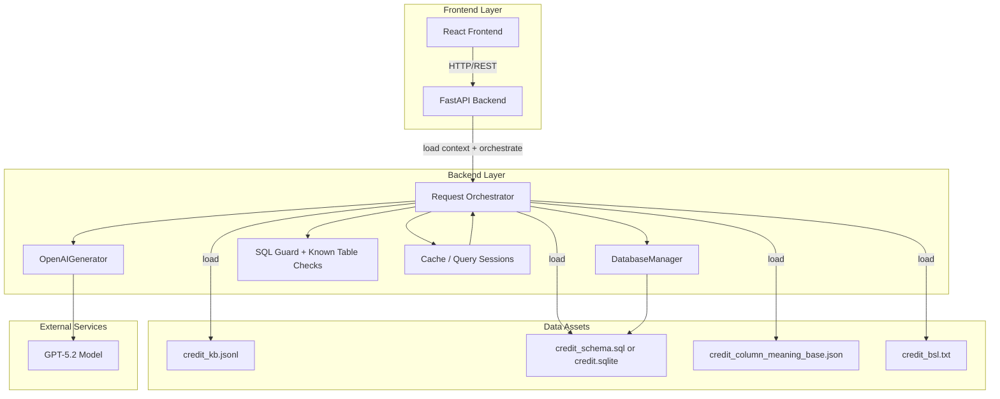
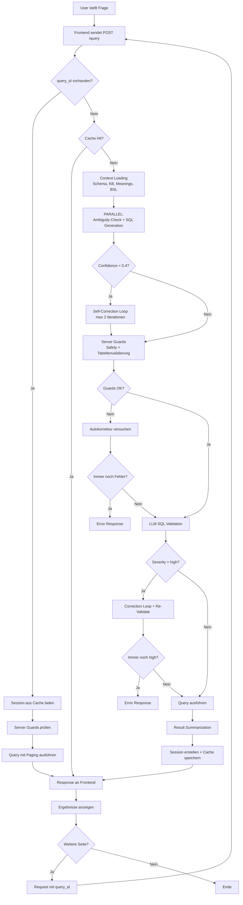
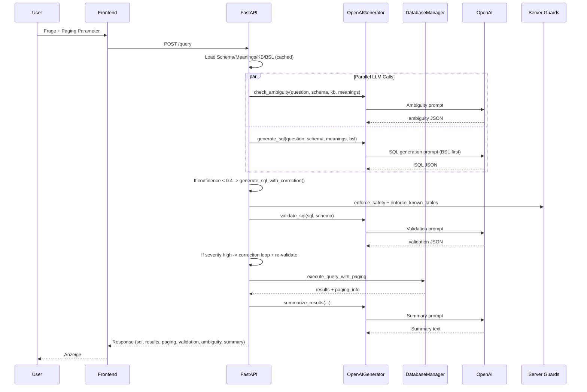

# Architektur & Prozesse – Text2SQL System (BSL-first)

> **Stand:** Januar 2026  
> **Scope:** **Credit-DB (mini-interact / BIRD Subset)**  
> **Backend:** **FastAPI** (`backend/main.py`)  
> **LLM-Integration:** GPT-5.2 via `OpenAIGenerator` (`backend/llm/generator.py`)  
> **Wichtiger Hinweis zur BSL-Generierung:** `bsl_builder.py` ist ein **Build-/Maintenance-Tool** (offline/on-demand) und **kein** Request-Step im API-Flow.

---

## 📖 Inhaltsverzeichnis
1. [System-Übersicht](#system-übersicht)
2. [Architektur-Historie & ADRs](#architektur-historie--adrs)
3. [Detaillierter Prozessablauf](#detaillierter-prozessablauf)
4. [Komponenten & ihre Rollen](#komponenten--ihre-rollen)
5. [Datenfluss & Pipeline](#datenfluss--pipeline)
6. [Frontend-Backend Kommunikation](#frontend-backend-kommunikation)
7. [Datenmodellierung & -beschreibung](#datenmodellierung---beschreibung)
8. [Limitationen & Ausblick](#limitationen--ausblick)
9. [Testergebnisse & Validierung](#testergebnisse--validierung)
10. [Produktivierungsanforderungen](#produktivierungsanforderungen)
11. [Organisatorisches](#organisatorisches)
12. [Selbstreflektion (Retrospektive)](#selbstreflektion-retrospektive)

---

## System-Übersicht

### Was ist das System?

**Text2SQL** ist ein KI-basiertes System, das **natürliche Sprache in SQL-Abfragen übersetzt**, diese auf einer **SQLite-Datenbank** ausführt und die Ergebnisse (inkl. Paging) zurückliefert. Ein Nutzer stellt eine Frage in normaler Sprache (z. B. „Zeige mir Kunden mit hoher Schuldenlast nach Segment“), und das System generiert eine SQL-Query, validiert sie (rule-based + LLM-based), führt sie aus und präsentiert die Resultate samt Kurz-Zusammenfassung.

### Kerninnovation: Business Semantics Layer (BSL)

Das System verwendet einen **Business Semantics Layer (BSL)** als explizite Regelschicht, die **fachliche Logik**, **Identifier-Systeme** und **Aggregation/Output-Patterns** kodifiziert. Damit werden typische Fehlerklassen in Text2SQL reduziert:

- Identifier-Verwechslungen (**CU vs CS**)
- falscher Detailgrad (Summary vs Row-Level)
- JOIN-Chain-Verletzungen / „Skipping tables“
- unklare Business-Begriffe / Metriken
- SQL-Dialekt-Fallen (z. B. SQLite `UNION` + `ORDER BY`)

---

## Architektur auf höchster Ebene



---

## Kernkomponenten

| Komponente             | Technologie                         | Verantwortlichkeit                                                         | BSL-Integration         |
| ---------------------- | ----------------------------------- | -------------------------------------------------------------------------- | ----------------------- |
| **Frontend**           | React                               | UI, Frage-Input, Ergebnisanzeige, Paging                                   | -                       |
| **Backend API**        | FastAPI                             | Orchestrierung, Caching, Paging, Validierung                               | lädt `credit_bsl.txt`   |
| **LLM Generator**      | `OpenAIGenerator`                   | SQL-Generierung + BSL-Compliance-Regeneration + LLM-Validation + Summaries | **BSL-first Prompting** |
| **SQL Guard**          | `utils/sql_guard.py` + known tables | Security (nur SELECT), Tabellenvalidierung                                 | indirekt                |
| **Database Manager**   | SQLite                              | Execution, Paging, Query-Normalisierung                                    | -                       |
| **BSL Builder (Tool)** | `bsl_builder.py`                    | Offline/On-demand: Generiert `credit_bsl.txt`                              | erzeugt BSL-Datei       |

---

## BSL-Sektionen (in `credit_bsl.txt`)

1. **Part A: BUSINESS SEMANTICS LAYER (BSL)** (Business Terms, Rules, Metric Definitions)
2. **Part B: SEMANTIC-TO-SCHEMA MAPPING (NOT PART OF THE BSL)** (Identifier-Mapping, Relationship-Chain, JSON-Feldpfade)
3. **Annex C: SQL GENERATION POLICY** (Implementation Notes: Aggregation/Ranking/Row-level Policies)

---

## Architektur-Historie & ADRs

> **Wichtig:** In deinem ADR-Dokument sind die Nummern bereits sauber (ADR-001..006).
> Dieses Dokument referenziert die relevanten Entscheidungen nur kurz und konsistent.

### ADR-004: Migration zu BSL-first Single-Database Architektur (accepted)

* **Status:** accepted
* **Date:** 12.01.2026 (Verwurf der RAG-Architektur) / Einführung BSL-first erfolgte zuvor im Projektverlauf
* **Kernpunkt:** Scope-Fit (Credit DB), Stabilität, Auditability

### ADR-005: Heuristische Fragetyp-Erkennung + BSL-Compliance-Trigger (accepted)

* **Status:** accepted
* **Date:** 12.01.2026
* **Kernpunkt:** Edge-Case Stabilisierung ohne Hardcoding: Heuristiken → Compliance Instruction → ggf. Regeneration

### ADR-006: Consistency Validation (3-Ebenen, accepted)

* **Status:** accepted
* **Date:** 12.01.2026
* **Kernpunkt:** 3-Ebenen Validierung:
  1. **Layer A** (rule-based): BSL-Compliance + Auto-Repair in `generator.py`
  2. **Server Guards** (Phase 5): `enforce_safety` + `enforce_known_tables` in `main.py`
  3. **Layer B** (LLM-based): Semantische Validierung + Self-Correction

### ADR-007: Multi-Layer Caching Strategie (accepted)

* **Status:** accepted
* **Date:** 17.01.2026
* **Kernpunkt:** Performance-Optimierung durch intelligentes Caching:
  * **Schema Cache**: Permanent (LRU, 32 DBs)
  * **Meanings Cache**: 1 Stunde TTL (32 Einträge)
  * **Query Cache**: 5 Minuten TTL (100 Queries) - komplette Results
  * **Session Cache**: 1 Stunde TTL (200 Sessions) - Paging
* **Ergebnis**: Cache-Hits in <100ms statt 3-5 Sekunden Pipeline

---

## Detaillierter Prozessablauf

### User Workflow Diagramm



---

### Haupt-Request-Flow (neue Frage)

| Schritt | Bezeichnung | Beschreibung |
|---------|-------------|--------------|
| **Phase 0** | Build/Maintenance (offline) | BSL-Generierung durch `bsl_builder.py` (nicht pro Request) |
| **1** | Cache-Check | Prüft ob identische Frage bereits im Cache ist → direkter Return |
| **2** | Context Loading | Schema, Meanings, KB, BSL werden geladen (cached) |
| **3** | Parallel LLM Calls | Ambiguity Detection + SQL-Generierung laufen parallel |
| **4** | Self-Correction (optional) | Bei Confidence < 0.4: bis zu 2 Korrektur-Iterationen |
| **5** | Server Guards | `enforce_safety` + `enforce_known_tables` + ggf. Autokorrektur |
| **6** | LLM SQL Validation | Semantische Prüfung, bei Severity "high" → Korrektur + Re-Validate |
| **7** | Query Execution | SQL ausführen mit Paging |
| **8** | Result Summarization | LLM fasst Ergebnisse zusammen |
| **9** | Session + Cache | Session für Paging erstellen, Ergebnis cachen |

---

### Paging-Flow (mit query_id)

| Schritt | Bezeichnung | Beschreibung |
|---------|-------------|--------------|
| **1** | Session laden | SQL aus Session-Cache holen (kein LLM-Aufruf!) |
| **2** | Server Guards | Sicherheitsprüfung der gespeicherten SQL |
| **3** | Query Execution | SQL mit neuem Page-Offset ausführen |
| **4** | Response | Ergebnisse zurückgeben (ohne Summarization) |

---

### Phase 0: Build/Maintenance (offline/on-demand)

* `bsl_builder.py` generiert `mini-interact/credit/credit_bsl.txt`
* BSL Overrides können manuell in `credit_bsl.txt` gepflegt werden (`# BSL OVERRIDES (MANUAL)`)

> Diese Phase ist **nicht** Teil des `/query` Request-Flows.

---

### Schritt 1: Cache-Check

* Prüfung auf Cache-Hit vor kompletter Pipeline
* `get_cached_query_result(question, database)` mit MD5-Hash Key
* Bei Cache-Hit: Direkte Rückgabe in <100ms

---

### Schritt 2: Context Loading

**Frontend sendet Anfrage:**

```http
POST /query
Content-Type: application/json

{
  "question": "Zeige mir Kunden mit hoher Schuldenlast nach Segment",
  "page": 1,
  "page_size": 100,
  "query_id": null
}
```

**Backend lädt Kontext (cached):**

* DB-Pfad: `DATA_DIR/credit/credit.sqlite`
* Schema: `get_cached_schema(db_path)` - permanent LRU-Cache
* Meanings: `get_cached_meanings(database, DATA_DIR)` - 1h TTL
* KB + BSL: `load_context_files(database, DATA_DIR)`

---

### Schritt 3: Parallel LLM Calls (Ambiguity + SQL Generation)

Beide Tasks laufen parallel via `asyncio.gather`:

* **Task A:** `llm_generator.check_ambiguity(question, schema, kb, meanings)`
* **Task B:** `llm_generator.generate_sql(question, schema, meanings, bsl)`

**SQL-Generierung (BSL-first) + Layer A:**

1. Prompt: **Overrides → BSL → Schema → Meanings → Frage**
2. LLM liefert JSON (sql, explanation, confidence, …)
3. Layer A (rule-based Compliance):
   * `_bsl_compliance_instruction(question, sql)` → ggf. Instruction
   * `_regenerate_with_bsl_compliance(...)` → 2. LLM Call nur bei Verstoß
   * `_fix_union_order_by(sql)` für SQLite

Wenn `ambiguity.is_ambiguous == true`:
* Kein Hard-Fail; es wird ein `ambiguity_notice` in `notice` eingeblendet.

---

### Schritt 4: Self-Correction (optional)

Bei `confidence < 0.4`:

* `generate_sql_with_correction(...)` führt iterativ:
  * SQL generieren/korrigieren
  * `validate_sql(sql, schema)` via LLM
  * erneute Korrektur (max 2 Iterationen)

---

### Schritt 5: Server Guards

**Server Guards** sind die mittlere Validierungsebene (ADR-006):

* `enforce_safety(sql)` → nur SELECT, keine gefährlichen Statements
* `enforce_known_tables(sql, table_columns)` → nur bekannte Tabellen erlaubt

**Autokorrektur bei Tabellenfehlern:**
Bei *nur* Table-Fehlern versucht `main.py` eine **Autokorrektur der Tabellennamen** via LLM und validiert erneut.

Bei Fehler nach Autokorrektur → **Error Response**

---

### Schritt 6: LLM SQL Validation

* `validate_sql(generated_sql, schema)` (LLM)
* Bei `severity == "high"`:
  * `generate_sql_with_correction(...)`
  * Erneute Validation
  * Bei weiterhin "high" → **Error Response**

---

### Schritt 7: Query Execution

* `generated_sql = db_manager.normalize_sql_for_paging(generated_sql)`
* `execute_query_with_paging(sql, page, page_size)` liefert:
  * `results`
  * `paging_info` (page, total_pages, total_rows, …)

---

### Schritt 8: Result Summarization

* `summarize_results(question, generated_sql, results, len(results), notice)`
* Fallback: einfache Preview ("Top N rows…")

---

### Schritt 9: Session + Cache

* `query_id = create_query_session(database, sql, question)` - 1h TTL
* Nur bei Seite 1: Ergebnis wird für Query-Cache gespeichert (5min TTL)
* Für Folgeseiten: `query_id` erforderlich; die SQL kommt aus der Session

---

## Komponenten & ihre Rollen

### Frontend (React)

* sendet `POST /query` mit `question`, `page`, `page_size`, optional `query_id` 
* zeigt SQL, Results, Paging, Summary, Notice, Errors

### Backend (FastAPI – `backend/main.py`)

* Orchestriert:

  * Context Loading
  * parallel Ambiguity + SQL Generation
  * Confidence-based Self-correction
  * Server-side Guards
  * LLM Validation + Korrektur bei high severity
  * Execution + Paging + Query Sessions
  * Summaries + Caching

### LLM Generator (`backend/llm/generator.py`)

* **Layer A (rule-based + auto-repair):**

  * Fragetyp-Heuristiken (`_is_property_leverage_question`, `_has_explicit_time_range`, …)
  * `_bsl_compliance_instruction` → `_regenerate_with_bsl_compliance` 
  * SQLite Dialektfix (`_fix_union_order_by`)
* **Layer B (LLM-based):**

  * `validate_sql` 
  * `generate_sql_with_correction` 
* `summarize_results` 

### BSL Builder (`bsl_builder.py`) – Tooling

* Generiert `credit_bsl.txt` (Part A / Part B / Annex C)
* liest:

  * `credit_kb.jsonl` 
  * `credit_column_meaning_base.json` 
  * `credit_schema.sql` oder `credit.sqlite` 

---

## Datenfluss & Pipeline

### End-to-End Request Flow (korrigiert)



---

## Frontend-Backend Kommunikation

### Request Format

```json
{
  "question": "Zeige Schuldenlast pro Segment",
  "page": 1,
  "page_size": 100,
  "query_id": null
}
```

### Response Format

```json
{
  "question": "…",
  "generated_sql": "SELECT …",
  "results": [ { "clientseg": "Premium", "avg_debt_ratio": 0.32 } ],
  "row_count": 1,

  "page": 1,
  "page_size": 100,
  "total_pages": 1,
  "total_rows": 1,
  "has_next_page": false,
  "has_previous_page": false,

  "summary": "…",
  "explanation": "…",
  "notice": "…",

  "ambiguity_check": {
    "is_ambiguous": false,
    "reason": "…",
    "questions": []
  },
  "validation": {
    "is_valid": true,
    "errors": [],
    "severity": "low",
    "suggestions": []
  },

  "query_id": "uuid..."
}
```

---

## Datenmodellierung & -beschreibung

> **Hinweis:** Das ER-Diagramm ist ok als High-Level-Chain.
> Die exakten PK/FK-Namen sollten aber aus dem Schema generiert werden. In der Doku formulierst du lieber "Kettenprinzip" statt "||--||" (1:1), falls Kardinalitäten nicht sicher sind.

---

## Limitationen & Ausblick

### Aktuelle Limitationen

**Technisch**

1. **Single-Database Fokus:** API routet aktuell nicht; `Config.DEFAULT_DATABASE` ist immer Credit.
2. **Token-Kosten:** BSL-first benötigt großen Kontext (Schema + Meanings + BSL).
3. **SQLite Concurrency:** nicht optimiert für viele parallele Writer (hier read-only, aber dennoch begrenzt).
4. **LLM Latenz/Costs:** mehrere LLM Calls möglich (Ambiguity + SQL + Validation + Summary + ggf. Correction).

**Funktional**

1. **Read-only Policy:** serverseitiger Guard erzwingt SELECT-only.
2. **Heuristiken für Edge-Cases:** erhöhen Robustheit, decken aber nicht jede Formulierung ab.
3. **Abhängigkeit von Schema-Export:** Beispiele/JSON-Pfade funktionieren nur, wenn Schema/Meanings konsistent sind.

---

## Testergebnisse & Validierung 

* **Rule-based Layer A:** BSL-Compliance-Regeneration + SQLite Fixes
* **Server Guards:** SELECT-only + known tables
* **Layer B:** LLM Validation + optional Self-correction (confidence/ severity-gated)

> Falls du bei Q5 "95%" erwähnst: präzisiere, ob es ein **Identifier-Problem** oder **JSON extraction** war.

---

## Produktivierungsanforderungen 

---

## Organisatorisches (kleine Fixes)

* "Backend-Entwicklung (2 Person)" → **2 Personen**
* "Selbstreflektion" → **Selbstreflexion**

---

## Zusammenfassung

Dieses Text2SQL-System demonstriert:

* **BSL-first Domain Layer:** explizite Regeln statt impliziter Embeddings
* **Determinismus:** temperature=0 + Policy/Compliance + Guards
* **Guardrails:** Layer A (rule-based auto-repair) + Layer B (LLM validation/self-correction) + server-side safety
* **Praxisnaher API-Flow:** Caching + Query Sessions + Paging + Summaries

**Status:** production-ready **für den aktuellen Credit-DB Scope (read-only, Single-DB)**
**Nächste Meilensteine:** Multi-DB Routing (optional), Token-/Latency-Optimierung, Observability & Hardening

---
