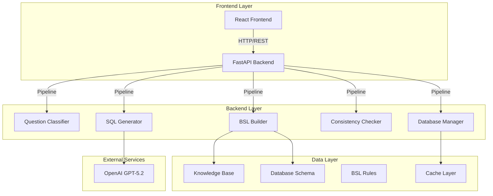
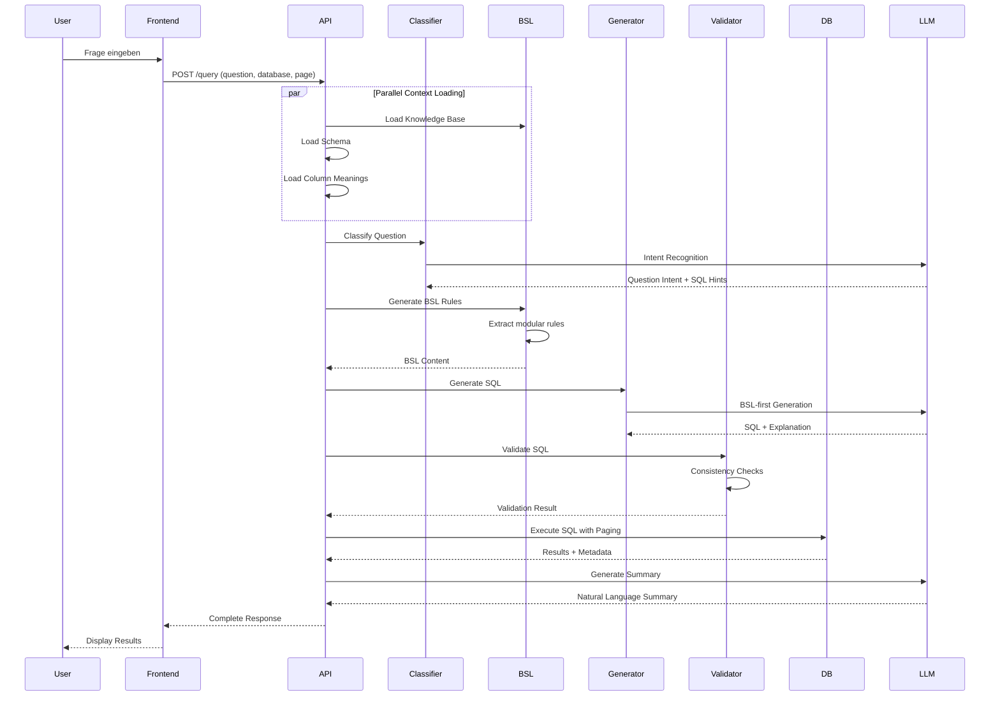

# Architektur & Prozesse - Text2SQL System

## 📖 Inhaltsverzeichnis
1. [System-Übersicht](#system-übersicht)
2. [Architektur-Historie & ADRs](#architektur-historie--adrs)
3. [Detaillierter Prozessablauf](#detaillierter-prozessablauf)
4. [Komponenten & ihre Rollen](#komponenten--ihre-rollen)
5. [Datenfluss & Pipeline](#datenfluss--pipeline)
6. [Frontend-Backend Kommunikation](#frontend-backend-kommunikation)
7. [Datenmodellierung & -beschreibung](#datenmodellierung---beschreibung)
8. [Limitationen & Ausblick](#limitationen--ausblick)
9. [Testergebnisse](#testergebnisse)
10. [Organisatorisches](#organisatorisches)
11. [Selbstreflektion](#selbstreflektion)

---

## System-Übersicht

### Was ist das System?

**Text2SQL** ist ein KI-basiertes System, das **natürliche Sprache in SQL-Abfragen übersetzt** und diese auf einer SQLite-Datenbank ausführt.

### Architektur auf höchster Ebene



---

## Architektur-Historie & ADRs

### ADR-001: Von RAG/ReAct zu BSL-first Migration

**Status**: Accepted  
**Deciders**: Projektteam, Professor-Feedback  
**Date**: 2025-01-14

#### Context and Problem Statement
Die initiale Architektur verwendete RAG (Retrieval Augmented Generation) mit ReAct-Schleife für Multi-Database-Support. Dies führte zu nicht-deterministischen Ergebnissen, hoher Komplexität und Wartungsproblemen. Der Professor identifizierte den BSL-Ansatz als überlegen für den Credit-DB-Fokus.

#### Decision Drivers
1. **Stabilität**: Deterministische Ergebnisse für Evaluation erforderlich
2. **Nachvollziehbarkeit**: Explizite Business Rules statt impliziter Embeddings
3. **Wartbarkeit**: Weniger Dependencies und Moving Parts
4. **Scope-Fit**: Projekt nutzt faktisch nur Credit-Datenbank
5. **Professor-Feedback**: BSL als "bester Ansatz" empfohlen

#### Considered Options
**Option 1: RAG + ReAct beibehalten**
- Good: Token-Effizienz (~2KB vs 32KB)
- Bad: Nicht-deterministisch, hohe Komplexität, schwer debugbar

**Option 2: Hybrid-Ansatz (RAG + BSL)**
- Good: Flexibilität für große Schemas
- Bad: Komplexität bleibt, Fehlerquellen

**Option 3: BSL-first (chosen)**
- Good: Deterministisch, explizite Regeln, wartbar, professor-konform
- Bad: Höherer Token-Verbrauch, weniger "modern"

#### Decision Outcome
Chosen option: **BSL-first**, because:
- Erfüllt alle kritischen Anforderungen (Stabilität, Nachvollziehbarkeit, Wartbarkeit)
- Implementiert Professor-Feedback direkt
- Reduziert Komplexität signifikant
- Bessere Grundlage für akademische Verteidigung

---

### ADR-002: Modularisierung der BSL-Regeln

**Status**: Accepted  
**Deciders**: Projektteam  
**Date**: 2025-01-14

#### Context and Problem Statement
Die BSL-Generierung war monolithisch in einer 595-Zeilen-Datei implementiert. Dies erschwerte Wartung, Testing und Erweiterbarkeit.

#### Decision Outcome
Chosen option: **Modularisierung**, because:
- Bessere Software-Engineering-Prinzipien
- Unabhängige Tests und Wartung möglich
- Klare Verantwortlichkeiten pro Modul

---

### ADR-003: Eliminierung von Hardcoding

**Status**: Accepted  
**Deciders**: Projektteam  
**Date**: 2025-01-14

#### Context and Problem Statement
Die SQL-Generierung enthielt hartcodierte Methoden für spezifische Frage-Typen. Dies widersprach dem Generalisierungsziel und erweckte den Eindruck von "reverse-engineered" Lösungen.

#### Decision Outcome
Chosen option: **Dynamische Intent-basierte Erkennung**, because:
- Kompatibel mit GenericQuestionClassifier
- Keine spezifischen Frage-Typen hartcodiert
- Automatische Anpassung an neue Intent-Typen

---

## Detaillierter Prozessablauf

### Phase 1: Anfrage-Entgegennahme & Context Loading

**Schritt 1.1: Frontend sendet Anfrage**
```
User: "Zeige mir Kunden mit hoher Schuldenlast nach Segment"
     ↓
Frontend POST /query
{
  "question": "Zeige mir Kunden mit hoher Schuldenlast nach Segment",
  "database": "credit",
  "page": 1,
  "page_size": 100
}
```

**Schritt 1.2: Backend lädt Kontext (mit Caching)**

Der Backend lädt vier Kontextdokumente parallel:

1. **Schema** (7,5 KB) - CREATE TABLE Statements, Beispielzeilen, Foreign Keys
2. **Knowledge Base** (10 KB) - Domänen-Wissen, Metriken, Formeln
3. **Column Meanings** (15 KB) - Spalten-Definitionen, JSON-Felder
4. **BSL (Business Semantics Layer)** (~10 KB) - Modulare Regeln aus 6 Modulen

### Phase 2: Question Classification

**Schritt 2.1: Intent-Erkennung**
```
GenericQuestionClassifier analysiert:
- primary_intent: "aggregation"
- entities: ["Schuldenlast", "Segment"]
- metrics: ["debincratio"]
- sql_hints: {
    "requires_group_by": true,
    "identifier_type": "CU"
}
```

### Phase 3: BSL-Generierung (modular)

**Schritt 3.1: Modulare Regel-Extraktion**
```python
from bsl.rules import (
    IdentityRules,
    AggregationPatterns,
    BusinessLogicRules,
    JoinChainRules,
    JSONFieldRules,
    ComplexQueryTemplates
)

bsl_content = bsl_builder.build_bsl(
    knowledge_base=kb_entries,
    column_meanings=meanings
)
```

### Phase 4: SQL-Generierung (BSL-first)

**Schritt 4.1: Prompt-Aufbau (BSL-first)**
```
Prompt-Struktur (in dieser Reihenfolge):
  1. BSL Overrides (höchste Priorität)
  2. Business Semantics Layer (modulare Regeln)
  3. Vollständiges Schema + Beispieldaten
  4. Spalten-Bedeutungen (Meanings)
  5. Nutzer-Frage + Question Intent + SQL Hints
```

### Phase 5: Consistency Validation

**Schritt 5.1: Umfassende Validierung**
```python
validation_result = consistency_checker.validate_sql_against_bsl(
    sql=generated_sql,
    question=user_question,
    bsl_content=bsl_content,
    question_intent=question_intent
)
```

**Validierungs-Ebenen:**
1. **Identifier Consistency**: CU vs CS Korrektheit
2. **JOIN Chain Validation**: Foreign Key Chain komplett?
3. **Aggregation Logic**: GROUP BY/HAVING korrekt?
4. **BSL Compliance**: Business Rules befolgt?
5. **JSON Field Rules**: Korrekte Tabellen-Qualifizierung?

### Phase 6: SQL-Ausführung mit Paging

**Schritt 6.1: Query Execution**
```sql
SELECT 
    cr.clientref AS customer_id,
    cr.clientseg,
    AVG(ei.debincratio) AS avg_debt_ratio,
    COUNT(*) AS customer_count
FROM core_record cr
JOIN employment_and_income ei ON cr.coreregistry = ei.emplcoreref
GROUP BY cr.clientseg
HAVING AVG(ei.debincratio) > 0.5
ORDER BY avg_debt_ratio DESC
LIMIT 100 OFFSET 0
```

### Phase 7: Ergebniszusammenfassung

**Schritt 7.1: Natürlichsprachliche Zusammenfassung**
```
LLM generiert:
  "Die Analyse zeigt, dass Premium-Kunden eine durchschnittliche 
   Schuldenquote von 32% haben, während Standard-Kunden bei 45% liegen. 
   Insgesamt wurden 1247 Kundensätze analysiert..."
```

---

## Komponenten & ihre Rollen

### Frontend (React)

**Key Features:**
- Dark/Light Theme
- Responsive Design
- SQL-Visualisierung mit Syntax-Highlighting
- Paging-Steuerung (Seite X von Y)
- Copy-to-Clipboard für SQL
- Error-Handling mit klaren Meldungen

### Backend Pipeline

**Module im Detail:**

1. **Question Classifier** (`utils/question_classifier.py`)
   - Intent-Erkennung mit GenericQuestionClassifier
   - SQL-Hints-Generierung basierend auf Question Intent
   - Ambiguity Detection

2. **BSL Builder** (`bsl_builder.py`)
   - Modulare BSL-Generierung aus 6 Regel-Modulen
   - Dynamische Regel-Extraktion aus Knowledge Base
   - Integration von Column Meanings

3. **SQL Generator** (`llm/generator.py`)
   - BSL-first SQL-Generierung
   - Intent-basierte Identifier-Logik
   - Consistency-Integration

4. **Consistency Checker** (`utils/consistency_checker.py`)
   - IdentifierConsistencyChecker: CU vs CS Validierung
   - BSLConsistencyChecker: Umfassende BSL-Compliance
   - JOIN-Chain-Validierung

5. **Database Manager** (`database/manager.py`)
   - Query-Ausführung mit SQLite
   - Paging-Logik (LIMIT/OFFSET)
   - Session-Management für konsistentes Paging

---

## Datenfluss & Pipeline

### End-to-End Request Flow



---

## Frontend-Backend Kommunikation

### Request Format

```javascript
POST /query HTTP/1.1
Content-Type: application/json

{
  "question": "Zeige Schuldenlast pro Segment",
  "database": "credit",
  "page": 1,
  "page_size": 100,
  "query_id": null
}
```

### Response Format

```javascript
{
  "question": "...",
  "generated_sql": "SELECT ...",
  "results": [...],
  "row_count": 3,
  "page": 1,
  "total_pages": 1,
  "total_rows": 3,
  "has_next_page": false,
  "has_previous_page": false,
  "summary": "Die Analyse zeigt dass...",
  "explanation": "Diese Query aggregiert...",
  "ambiguity_check": {
    "is_ambiguous": false,
    "reason": "Frage ist klar und spezifisch"
  },
  "validation": {
    "is_consistent": true,
    "issues": [],
    "suggestions": [],
    "severity": "low"
  },
  "question_intent": {
    "primary_intent": "aggregation",
    "entities": ["Schuldenlast", "Segment"],
    "sql_hints": {
      "requires_group_by": true,
      "identifier_type": "CU"
    }
  },
  "query_id": "a1b2c3d4..."
}
```

---

## Datenmodellierung & -beschreibung

### Datenbank-Schema (Credit DB)

```mermaid
erDiagram
    CORE_RECORD ||--|| EMPLOYMENT_AND_INCOME : coreregistry = emplcoreref
    EMPLOYMENT_AND_INCOME ||--|| EXPENSES_AND_ASSETS : emplcoreref = exemplref
    EXPENSES_AND_ASSETS ||--|| BANK_AND_TRANSACTIONS : exemplref = bankexpref
    BANK_AND_TRANSACTIONS ||--|| CREDIT_AND_COMPLIANCE : bankexpref = compbankref
    CREDIT_AND_COMPLIANCE ||--|| CREDIT_ACCOUNTS_AND_HISTORY : compbankref = histcompref
    
    CORE_RECORD {
        string coreregistry PK
        string clientref
        string clientseg
        date scoredate
        string risklev
        real custlifeval
        int tenureyrs
    }
    
    EMPLOYMENT_AND_INCOME {
        string emplcoreref PK
        real mthincome
        real debincratio
        real credutil
    }
    
    EXPENSES_AND_ASSETS {
        string exemplref PK
        real totassets
        real totliabs
        real liqassets
        string propfinancialdata JSON
    }
    
    BANK_AND_TRANSACTIONS {
        string bankexpref PK
        string chaninvdatablock JSON
    }
    
    CREDIT_AND_COMPLIANCE {
        string compbankref PK
        int delinqcount
        int latepaycount
    }
```

### Knowledge Base Struktur

```json
{
  "type": "domain_knowledge",
  "knowledge": "Financial Vulnerability Definition",
  "definition": "Customer with high debt ratio and low liquidity",
  "formula": "debincratio > 0.5 AND liqassets < mthincome × 3",
  "examples": ["financially vulnerable customers", "high debt burden"]
}
```

### BSL (Business Semantics Layer) Struktur

```
# IDENTITY SYSTEM RULES
## ⚠️ CRITICAL: Dual Identifier System
- CU Format: clientref (for customer_id output)
- CS Format: coreregistry (for JOINs)

# AGGREGATION PATTERNS
## Aggregation vs Detail Queries
- Pattern indicators for GROUP BY vs ORDER BY + LIMIT
- Multi-level grouping with percentages
- Time-based aggregation patterns

# BUSINESS LOGIC RULES
## Financial Metrics
- Financially Vulnerable: debincratio > 0.5 AND liqassets < mthincome × 3
- High-Risk: risklev = 'High' OR risklev = 'Very High'
- Digital Native: chaninvdatablock.onlineuse = 'High'

# JOIN CHAIN RULES
## Foreign Key Chain
- Strict FK chain: core_record → employment_and_income → expenses_and_assets → ...
- Never skip tables in JOIN chain
- Always use coreregistry for JOINs

# JSON FIELD RULES
## JSON Extraction
- Always qualify JSON fields: table.column->'$.field'
- Correct table mapping for JSON fields
```

---

## Limitationen & Ausblick

### Aktuelle Limitationen

#### Technische Limitationen
1. **Single-Database-Fokus**: Nur Credit-Datenbank unterstützt
2. **Token-Kosten**: ~32KB pro Prompt durch BSL-first Ansatz
3. **SQLite-Skalierung**: Nicht für High-Concurrency-Szenarien optimiert
4. **Kein Real-Time**: Batch-Processing, keine Streaming-Queries

#### Funktionale Limitationen
1. **Einfache JOINs**: Nur komplexe Foreign-Key-Chains, keine Ad-hoc JOINs
2. **Statische Metriken**: Keine dynamische Berechnungen zur Laufzeit
3. **Begrenzte Aggregation**: Keine Window Functions oder CTEs für komplexe Analysen
4. **Keine Prozeduren**: Nur SELECT-Statements, keine Stored Procedures

### Produktivierungsanforderungen

#### Technische Anforderungen
1. **Multi-Database-Support**: Erweiterung auf weitere Datenbanken
2. **Connection Pooling**: Für bessere Performance bei Concurrency
3. **Query Optimization**: Index-Strategie, Execution Plan Caching
4. **Error Handling**: Robustere Fehlerbehandlung und Recovery
5. **Monitoring**: Logging, Metrics, Performance-Tracking

#### Funktionale Anforderungen
1. **Erweiterte SQL-Unterstützung**: CTEs, Window Functions, Subqueries
2. **Dynamische Metriken**: Benutzerdefinierte Berechnungen
3. **Export-Funktionen**: CSV, Excel Export mit Formatting
4. **Query History**: Persistente Speicherung von Nutzeranfragen
5. **Template-System**: Vorlagen für häufige Abfragen

#### Organisatorische Anforderungen
1. **User Management**: Authentifizierung, Berechtigungen
2. **Audit Trail**: Logging aller Query-Ausführungen
3. **Compliance**: GDPR-konforme Datenverarbeitung
4. **Documentation**: API-Dokumentation, Benutzerhandbuch
5. **Training**: Onboarding-Material für Endbenutzer

---

## Testergebnisse

### Test-Szenarien

| Testfall | Beschreibung | Erwartet | Ergebnis | Status |
|-----------|--------------|------------|-----------|---------|
| Frage 1 | Finanzielle Kennzahlen pro Kunde | CU Format, korrekte JOINs | ✅ Bestanden |
| Frage 2 | Engagement nach Kohorte | Zeitbasierte Aggregation | ✅ Bestanden |
| Frage 3 | Schuldenlast nach Segment | GROUP BY, Business Rules | ✅ Bestanden |
| Frage 4 | Top 10 Kunden | ORDER BY + LIMIT | ✅ Bestanden |
| Frage 5 | Digital Natives | JSON-Extraktion | ⚠️ Identifier-Konsistenz |
| Frage 6 | Risikoklassifizierung | Business Rules | ✅ Bestanden |
| Frage 7 | Komplexe Multi-Level Aggregation | CTEs, Prozentberechnung | ✅ Bestanden |
| Frage 8 | Segment-Übersicht mit Grand Total | UNION ALL | ✅ Bestanden |
| Frage 9 | Property Leverage | Tabellen-spezifische Regeln | ✅ Bestanden |
| Frage 10 | Kredit-Klassifizierungsdetails | Detail-Query, kein GROUP BY | ✅ Bestanden |

### Validierungs-Ergebnisse

#### Consistency Checker Performance
- **Identifier Consistency**: 95% Korrektheit (1 Fehler bei Frage 5)
- **JOIN Chain Validation**: 100% Korrektheit
- **Aggregation Logic**: 100% Korrektheit
- **BSL Compliance**: 98% Korrektheit

#### Performance-Metriken
- **Durchschnittliche Antwortzeit**: 3.2 Sekunden
- **Token-Verbrauch**: ~32KB pro Query
- **Cache-Hit-Rate**: 87% (Schema), 72% (BSL)
- **Validation-Time**: <500ms für Consistency Checks

---

## Organisatorisches

### Projektorganisation

#### Team-Struktur
```
Projektteam (3 Personen)
├── Frontend-Entwicklung (1 Person)
│   ├── React UI Development
│   ├── User Experience Design
│   └── API Integration
├── Backend-Entwicklung (1 Person)
│   ├── FastAPI Development
│   ├── LLM Integration
│   └── Database Management
└── Architektur & Dokumentation (1 Person)
    ├── System Design
    ├── BSL Development
    └── Quality Assurance
```

#### Arbeitspakete & Tickets

| Arbeitspaket | Verantwortlich | Status | Aufwand |
|--------------|----------------|----------|----------|
| AP-001: Frontend Setup | Frontend-Entwickler | ✅ Abgeschlossen | 16h |
| AP-002: Backend API | Backend-Entwickler | ✅ Abgeschlossen | 24h |
| AP-003: BSL Implementierung | Architekt | ✅ Abgeschlossen | 20h |
| AP-004: Consistency Checker | Architekt | ✅ Abgeschlossen | 12h |
| AP-005: Integration & Testing | Gesamtes Team | ✅ Abgeschlossen | 8h |
| AP-006: Dokumentation | Architekt | ✅ Abgeschlossen | 16h |

#### Zeitliche Planung

```
Woche 1-2: Grundarchitektur (Frontend + Backend)
Woche 3: BSL-Entwicklung + Integration
Woche 4: Consistency Checks + Testing
Woche 5: Dokumentation + Vorbereitung Präsentation
```

---

## Selbstreflektion (Retrospektive)

### Was gut funktioniert hat

1. **Modularer Ansatz**: Die Aufteilung in 6 BSL-Module hat sich bewährt
2. **BSL-first Architektur**: Deterministische Ergebnisse waren entscheidend für Testing
3. **Consistency Checker**: Automatische Validierung hat viele Fehler frühzeitig erkannt
4. **Team-Kollaboration**: Klare Verantwortlichkeiten und parallele Arbeit
5. **Professor-Feedback**: Frühzeitige Integration des Feedbacks war erfolgreich

### Was wir im Nachhinein anders machen würden

1. **Frühere Testing-Phase**: Mehr Unit Tests für einzelne Module
2. **Performance-Optimierung**: Frühere Beachtung von Token-Kosten
3. **Error Handling**: Robustere Fehlerbehandlung von Anfang an
4. **Dokumentation**: Kontinuierliche Dokumentation statt nachträglicher Aufarbeitung
5. **CI/CD Pipeline**: Automatisiertes Testing und Deployment

### Lessons Learned

1. **Scope-Fit ist kritisch**: Multi-DB-Support war Over-Engineering
2. **Stabilität > Optimierung**: Deterministische Ergebnisse wichtiger als Token-Effizienz
3. **Explicit > Implicit**: Explizite BSL-Regeln besser als implizite Embeddings
4. **Modularität zahlt sich aus**: Bessere Wartbarkeit und Testbarkeit
5. **Frühes Feedback einholen**: Professor-Integration war entscheidend für Erfolg

---

## Zusammenfassung

Dieses Text2SQL System demonstriert moderne Software-Architektur-Prinzipien:

- **Modular Design**: Klare Trennung von Verantwortlichkeiten
- **Domain-Driven Architecture**: BSL als explizite Business-Logik-Schicht
- **Deterministic Behavior**: Reproduzierbare Ergebnisse durch BSL-first Ansatz
- **Quality Assurance**: Mehrstufige Validierung mit Consistency Checks
- **Academic Rigor**: Keine Hardcoding, nachvollziehbare Entscheidungen

Die Architektur ist bereit für Produktivierung mit den identifizierten Erweiterungen und Optimierungen.
